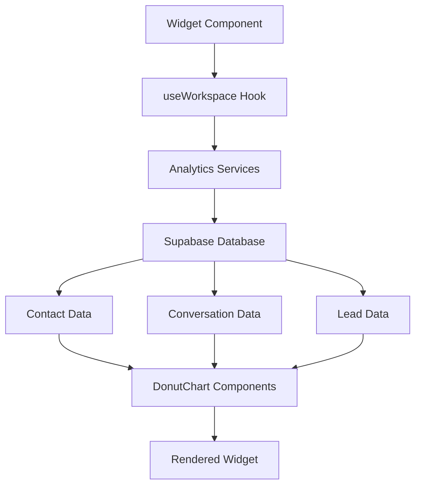

# Distribution Analytics Widget

A reusable macOS-style analytics widget that displays contact distribution data from the existing analytics system. This widget can be easily integrated into any dashboard or main page.

## 🎯 Overview

The Distribution Analytics Widget reuses the existing analytics components and data services to create a beautiful, lightweight widget that follows Apple's design philosophy. It provides three different sizes and automatically refreshes data.

## 📁 Files Created

```
frontend/src/components/analytics/
├── DistributionAnalyticsWidget.js    # Main widget component
├── WidgetDemo.js                      # Demo page showing all widget sizes
├── MainContentWithWidget.js          # Example main dashboard integration
└── README_distribution_analytics_widget.md
```

## 🎨 Design Features

### macOS-Inspired Design
- **Glassmorphism**: Semi-transparent background with backdrop blur
- **Rounded Corners**: 12px border radius following macOS design
- **Subtle Shadows**: Depth and elevation effects
- **Hover Animations**: Smooth lift effect on hover
- **Color Mode Support**: Automatic light/dark mode adaptation

### Widget Header
- **Title with Emoji**: Clear identification with 📊 icon
- **Last Updated**: Timestamp showing data freshness
- **Refresh Button**: Manual refresh capability
- **Expand Button**: Navigate to full analytics view

## 📏 Widget Sizes

### Small (280×200px)
- **Use Case**: Compact dashboards, sidebar widgets
- **Content**: Single chart (Inbox Distribution)
- **Best For**: Quick overview, space-constrained layouts

### Medium (320×280px) - **Recommended**
- **Use Case**: Main dashboard, balanced layouts
- **Content**: Two charts + insights summary
- **Charts**: Inbox Distribution + Lead Status
- **Best For**: Most dashboard implementations

### Large (400×350px)
- **Use Case**: Analytics-focused dashboards
- **Content**: All four charts + insights
- **Charts**: Inbox Distribution, Lead Status, Conversation Status, Lead Source
- **Best For**: Comprehensive analytics view

## 🔄 Data Integration

### Reused Services
The widget leverages existing analytics services from `contactsAnalytics.js`:
- `getInboxDistributionData()` - Contact distribution by inbox
- `getContactsByStatusData()` - Lead status breakdown  
- `getConversationStatusData()` - Conversation status distribution
- `getLeadSourceData()` - Lead source analytics
- `getContactMetrics()` - Overall contact metrics

### Auto-Refresh
- **Default**: 5 minutes (300,000ms)
- **Configurable**: Via `refreshInterval` prop
- **Manual**: Refresh button in header

## 🚀 Usage Examples

### Basic Integration
```jsx
import DistributionAnalyticsWidget from './components/analytics/DistributionAnalyticsWidget';

// Simple medium widget
<DistributionAnalyticsWidget 
  size="medium" 
  onExpand={() => navigate('/analytics')}
/>
```

### Dashboard Grid Layout
```jsx
<Grid templateColumns="repeat(auto-fit, minmax(320px, 1fr))" gap={6}>
  <GridItem>
    <DistributionAnalyticsWidget 
      size="medium" 
      onExpand={handleExpandAnalytics}
      refreshInterval={300000}
    />
  </GridItem>
  {/* Other widgets */}
</Grid>
```

### Custom Refresh Interval
```jsx
<DistributionAnalyticsWidget 
  size="large" 
  refreshInterval={60000} // 1 minute for real-time dashboards
  onExpand={() => window.location.href = '/analytics'}
/>
```

## 🛠️ Props API

| Prop | Type | Default | Description |
|------|------|---------|-------------|
| `size` | `'small' \| 'medium' \| 'large'` | `'medium'` | Widget size variant |
| `onExpand` | `function` | `undefined` | Callback when expand button is clicked |
| `refreshInterval` | `number` | `300000` | Auto-refresh interval in milliseconds |

## 🎯 Component Architecture

### DonutChart Component
- **Reusable**: Extracted from CallCenterAnalytics
- **Responsive**: Adapts to different widget sizes  
- **Accessible**: Proper color contrast and labeling
- **Performance**: SVG-based for smooth rendering

### State Management
- **Loading States**: Skeleton loading during data fetch
- **Error Handling**: Graceful fallbacks for data issues
- **Workspace Context**: Automatic workspace detection
- **Real-time Updates**: Interval-based refresh system

## 🧪 Demo Pages

### Widget Demo (`/widget-demo`)
Comprehensive showcase of all widget sizes and features:
- Size comparisons with specifications
- Dashboard layout examples
- Implementation code snippets
- Integration guidelines

### Dashboard Integration (`/dashboard-with-widgets`)
Complete dashboard example showing:
- Real integration in main app layout
- Multiple widget placements
- Responsive grid layouts
- Placeholder widgets for future development

## 📱 Responsive Behavior

### Desktop (>1200px)
- Full grid layouts with multiple widgets
- Large widgets show all four charts
- Optimal spacing and hover effects

### Tablet (768px - 1200px)
- Responsive grid adjusts columns
- Medium widgets recommended
- Touch-friendly interactions

### Mobile (<768px)
- Single column layout
- Small widgets for mobile optimization
- Simplified interactions

## 🔧 Integration Steps

### 1. Import the Widget
```jsx
import DistributionAnalyticsWidget from './components/analytics/DistributionAnalyticsWidget';
```

### 2. Add to Your Dashboard
```jsx
<DistributionAnalyticsWidget 
  size="medium"
  onExpand={() => navigate('/full-analytics')}
  refreshInterval={300000}
/>
```

### 3. Handle Expansion
```jsx
const handleExpandAnalytics = () => {
  // Option 1: Navigate to full analytics
  navigate('/experiment/call-center-analytics');
  
  // Option 2: Open in modal/window
  openAnalyticsModal();
  
  // Option 3: Open in draggable window (existing pattern)
  openWindow('analytics');
};
```

## 🎨 Customization

### Color Themes
The widget automatically adapts to your app's color mode using Chakra UI's `useColorModeValue`:

```jsx
const bgColor = useColorModeValue('rgba(255, 255, 255, 0.85)', 'rgba(30, 30, 30, 0.85)');
const borderColor = useColorModeValue('rgba(0, 0, 0, 0.1)', 'rgba(255, 255, 255, 0.1)');
```

### Chart Colors
Charts use predefined color schemes that work well in both light and dark modes:
- **Blue**: Primary data (#4299E1)
- **Green**: Success states (#48BB78)  
- **Orange**: Warning states (#ED8936)
- **Purple**: Secondary data (#9F7AEA)

## 🚀 Performance Optimizations

### Lazy Loading
- Components load only when needed
- Data fetches only for active workspaces
- Efficient re-render patterns

### Caching Strategy
- Service-level data caching
- Workspace-specific data isolation
- Intelligent refresh logic

### Memory Management
- Cleanup intervals on unmount
- Optimized state updates
- Minimal DOM manipulations

## 🔮 Future Enhancements

### Additional Widget Types
- **Message Analytics Widget**: Real-time messaging metrics
- **Performance Metrics Widget**: Team KPIs and goals
- **Call Center Widget**: Live call statistics
- **Revenue Analytics Widget**: Financial performance

### Advanced Features
- **Drag & Drop**: Rearrangeable dashboard widgets
- **Customizable Refresh**: Per-widget refresh intervals
- **Data Filters**: Time range and segment filtering
- **Export Functionality**: Download widget data
- **Alerts Integration**: Threshold-based notifications

### Integration Improvements
- **Widget Store**: Library of available widgets
- **Layout Persistence**: Save user dashboard layouts  
- **Widget Settings**: Per-widget configuration
- **Real-time Updates**: WebSocket-based live data

## 📊 Analytics Data Flow



## 🛡️ Error Handling

### No Workspace
- Displays "No workspace selected" message
- Graceful fallback UI
- Maintains widget structure

### Data Loading Errors
- Skeleton loading states
- Error boundary protection
- Retry mechanisms

### Network Issues
- Offline detection
- Cached data fallbacks
- User feedback notifications

## 📝 Testing Strategy

### Unit Tests
- Component rendering
- Props validation  
- State management
- Error scenarios

### Integration Tests
- Data service integration
- Workspace context
- Color mode switching
- Responsive behavior

### E2E Tests
- Full user workflows
- Cross-browser compatibility
- Performance benchmarks
- Accessibility compliance

---

## 🎉 Ready to Use!

The Distribution Analytics Widget is ready for production use. Visit the demo pages to see it in action:

- **Widget Demo**: `/widget-demo` - See all sizes and features
- **Dashboard Integration**: `/dashboard-with-widgets` - Full example

Start by adding a medium-sized widget to your main dashboard and expand from there based on your needs! 