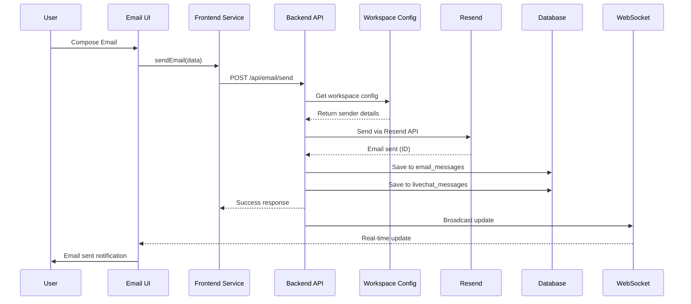
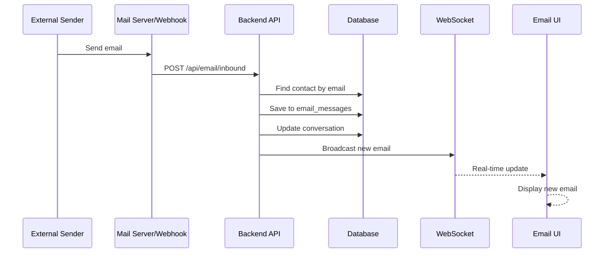

# Email Functionality Documentation
## Complete Technical Guide for Email System Implementation

---

## Table of Contents
1. [Executive Summary](#executive-summary)
2. [Email Platform & Service Provider](#email-platform--service-provider)
3. [System Architecture](#system-architecture)
4. [Data Flow Diagrams](#data-flow-diagrams)
5. [Database Schema](#database-schema)
6. [Email Sending Process](#email-sending-process)
7. [Email Receiving Process](#email-receiving-process)
8. [Workspace Email Configuration](#workspace-email-configuration)
9. [Current System Status](#current-system-status)
10. [Implementation Details](#implementation-details)
11. [API Endpoints](#api-endpoints)
12. [Troubleshooting Guide](#troubleshooting-guide)

---

## Executive Summary

The email system in this LiveChat application is a comprehensive email management solution integrated with CRM functionality. It uses **Resend** as the primary email service provider and stores all email data in **Supabase** (PostgreSQL) with real-time capabilities.

### Key Features:
- ✅ Multi-workspace email support
- ✅ Customizable sender addresses per workspace
- ✅ Email threading and conversation management
- ✅ Attachment support
- ✅ Email scheduling
- ✅ Integration with contact management
- ✅ Real-time email updates via Socket.IO
- ⚠️ Inbound email receiving (partially implemented)

---

## Email Platform & Service Provider

### Primary Email Service: **Resend**
- **Provider**: [Resend](https://resend.com/)
- **Purpose**: Transactional email sending
- **API Integration**: REST API with Node.js SDK
- **Authentication**: API key-based (stored per workspace)
- **Default API Key**: `re_Cq1JnYTU_CahwLyvctsSrZVqp4LWiSHV1` (fallback)

### Key Characteristics:
```javascript
// Service initialization
import { Resend } from 'resend'
const resend = new Resend(workspace.resend_api_key)
```

---

## System Architecture

```mermaid
graph TB
    subgraph "Frontend (React)"
        UI[Email Inbox UI]
        ES[Email Service Client]
        WS[WebSocket Client]
    end
    
    subgraph "Backend (Node.js/Express)"
        API[Email API Routes]
        ESB[Email Service Backend]
        RSN[Resend Integration]
        SIO[Socket.IO Server]
    end
    
    subgraph "Database (Supabase)"
        EM[email_messages]
        EA[email_accounts]
        WEC[workspace_email_config]
        LM[livechat_messages]
        C[contacts]
    end
    
    subgraph "External Services"
        RSD[Resend API]
        IB[Inbound Email<br/>(Future)]
    end
    
    UI --> ES
    ES --> API
    API --> ESB
    ESB --> RSN
    RSN --> RSD
    ESB --> EM
    ESB --> LM
    ESB --> WEC
    EM --> C
    SIO --> WS
    IB -.-> API
```

---

## Data Flow Diagrams

### Email Sending Flow



### Email Receiving Flow (Planned)



---

## Database Schema

### Core Email Tables

#### 1. **workspace_email_config**
Stores email configuration per workspace.

| Column | Type | Description |
|--------|------|-------------|
| workspace_id | TEXT (PK) | Unique workspace identifier |
| from_email | TEXT | Sender email address |
| from_name | TEXT | Sender display name |
| reply_to | TEXT | Reply-to address (optional) |
| resend_api_key | TEXT | Resend API key for this workspace |
| is_active | BOOLEAN | Whether email is enabled |
| created_at | TIMESTAMP | Configuration creation time |
| updated_at | TIMESTAMP | Last update time |

**Example Data:**
```sql
workspace_id: "66338"
from_email: "hello@customerconnects.app"
from_name: "LiveChat"
resend_api_key: "re_xxxxxx"
is_active: true
```

#### 2. **email_messages**
Main table for email storage and display.

| Column | Type | Description |
|--------|------|-------------|
| id | UUID (PK) | Unique email identifier |
| workspace_id | TEXT | Workspace this email belongs to |
| user_id | UUID | User who sent/received |
| email_account_id | UUID | Associated email account |
| contact_id | UUID | Related contact |
| thread_id | UUID | Email thread identifier |
| subject | TEXT | Email subject |
| body_html | TEXT | HTML content |
| body_text | TEXT | Plain text content |
| sender_email | TEXT | Sender's email address |
| sender_name | TEXT | Sender's display name |
| to_recipients | JSONB | Array of recipients |
| cc_recipients | JSONB | CC recipients |
| bcc_recipients | JSONB | BCC recipients |
| folder | TEXT | Email folder (inbox/sent/etc) |
| is_read | BOOLEAN | Read status |
| is_starred | BOOLEAN | Starred status |
| is_outgoing | BOOLEAN | Direction indicator |
| sent_at | TIMESTAMP | When email was sent |
| received_at | TIMESTAMP | When email was received |

#### 3. **email_accounts** (Optional/Future)
For managing multiple email accounts per workspace.

| Column | Type | Description |
|--------|------|-------------|
| id | UUID (PK) | Account identifier |
| workspace_id | TEXT | Workspace owner |
| email_address | VARCHAR | Email address |
| display_name | VARCHAR | Display name |
| account_type | VARCHAR | Type (smtp/imap/oauth) |
| smtp_* | Various | SMTP configuration |
| imap_* | Various | IMAP configuration |
| oauth_* | Various | OAuth tokens |
| is_active | BOOLEAN | Account status |
| is_default | BOOLEAN | Default account flag |

#### 4. **livechat_messages**
Unified message storage for all communication types.

| Column | Type | Description |
|--------|------|-------------|
| id | UUID (PK) | Message identifier |
| workspace_id | TEXT | Workspace identifier |
| contact_id | UUID | Related contact |
| sender | TEXT | Sender identifier |
| subject | TEXT | Email subject (for emails) |
| body | TEXT | Message content |
| msg_type | TEXT | Type (EMAIL/SMS/etc) |
| direction | TEXT | inbound/outbound |
| status | TEXT | sent/delivered/failed |
| metadata | JSONB | Additional data |

---

## Email Sending Process

### Step-by-Step Workflow

1. **User Composes Email**
   - Frontend: `EmailInboxWindow.js` → `ComposeModal.js`
   - Collects: recipient, subject, body, attachments

2. **Frontend Processing**
   ```javascript
   // frontend/src/services/emailService.js
   async sendEmail(emailData) {
     const requestBody = {
       contactId: contactId,
       subject: emailData.subject,
       content: emailData.html,
       workspaceId: emailData.workspaceId,
       cc: emailData.cc,
       attachments: emailData.attachments
     };
     
     const response = await fetch(`${API_URL}/api/email/send`, {
       method: 'POST',
       headers: { 'X-Workspace-Id': workspaceId },
       body: JSON.stringify(requestBody)
     });
   }
   ```

3. **Backend Processing**
   ```javascript
   // backend/src/routes/email.js
   router.post('/send', workspaceAuth, async (req, res) => {
     // Get workspace configuration
     const config = await emailService.getWorkspaceConfig(workspaceId);
     
     // Send via Resend
     const result = await emailService.sendFromChat(workspaceId, contactId, {
       subject,
       content,
       attachments
     });
   });
   ```

4. **Workspace Configuration Lookup**
   ```javascript
   // backend/src/services/emailService.js
   async getWorkspaceConfig(workspaceId) {
     const { data } = await supabase
       .from('workspace_email_config')
       .select('*')
       .eq('workspace_id', workspaceId)
       .single();
     
     return data || this.createDefaultConfig(workspaceId);
   }
   ```

5. **Email Sending via Resend**
   ```javascript
   const emailOptions = {
     from: `${config.from_name} <${config.from_email}>`,
     to: [contact.email],
     subject: emailData.subject,
     html: emailData.content,
     replyTo: config.reply_to || config.from_email,
     attachments: processedAttachments
   };
   
   const { data, error } = await this.resend.emails.send(emailOptions);
   ```

6. **Database Storage**
   - Saves to `email_messages` table (folder: 'sent')
   - Saves to `livechat_messages` table (msg_type: 'EMAIL')
   - Updates contact's last interaction

7. **Real-time Updates**
   - Broadcasts via Socket.IO to all connected clients
   - Updates UI without refresh

### Sender Email Address

**The sender email is determined by:**

1. **Primary Source**: `workspace_email_config` table
   - Each workspace has its own configuration
   - Default: `hello@customerconnects.app`
   - Can be customized per workspace (e.g., `scalematchsolutions@customerconnects.app`)

2. **Fallback Chain**:
   ```javascript
   sender = config.from_email 
         || 'hello@customerconnects.app'  // Default fallback
   ```

3. **Display Name**:
   ```javascript
   from = `${config.from_name || 'LiveChat'} <${sender}>`
   ```

---

## Email Receiving Process

### Current Status: ⚠️ **Partially Implemented**

The system has infrastructure for receiving emails but requires additional setup:

1. **Planned Webhook Endpoint**
   ```javascript
   // backend/src/routes/email.js (planned)
   router.post('/inbound', async (req, res) => {
     // Parse incoming email webhook
     // Find or create contact
     // Save to email_messages (folder: 'inbox')
     // Broadcast via Socket.IO
   });
   ```

2. **Required Setup**:
   - Configure Resend or email provider webhooks
   - Point webhooks to: `https://cc.automate8.com/api/email/inbound`
   - Parse webhook payload format
   - Map to internal email structure

3. **Email Matching Logic**:
   ```javascript
   // Find contact by email
   const contact = await supabase
     .from('contacts')
     .select('*')
     .eq('email', senderEmail)
     .eq('workspace_id', workspaceId)
     .single();
   
   // Create email record
   await supabase
     .from('email_messages')
     .insert({
       workspace_id,
       contact_id: contact?.id,
       sender_email: senderEmail,
       folder: 'inbox',
       is_outgoing: false,
       // ... other fields
     });
   ```

---

## Workspace Email Configuration

### Automatic Setup

When a new workspace is created:

1. **Default Configuration Created**:
   ```javascript
   {
     workspace_id: newWorkspaceId,
     from_email: 'hello@customerconnects.app',
     from_name: 'LiveChat',
     reply_to: null,
     resend_api_key: process.env.RESEND_API_KEY,
     is_active: true
   }
   ```

2. **Customization Options**:
   - Admin can update via settings
   - Custom domain emails supported
   - Requires Resend domain verification

3. **Per-Workspace Isolation**:
   - Each workspace has independent configuration
   - No cross-workspace email access
   - RLS policies enforce isolation

---

## Current System Status

### ✅ **Working Features**

1. **Email Sending**
   - Fully functional via Resend API
   - Supports HTML content
   - Attachment support
   - CC/BCC recipients
   - Email scheduling

2. **Email Storage**
   - Saves to both `email_messages` and `livechat_messages`
   - Proper folder organization (sent/inbox/etc)
   - Contact association

3. **UI Components**
   - Email inbox interface
   - Compose modal
   - Email viewer
   - Folder navigation
   - Search functionality

4. **Real-time Updates**
   - Socket.IO integration
   - Live email status updates
   - Instant UI refresh

### ⚠️ **Partially Implemented**

1. **Inbound Email Receiving**
   - Database structure ready
   - API endpoints planned
   - Webhook integration needed

2. **Email Threading**
   - Thread ID support in database
   - UI for threaded conversations needed

3. **Multiple Email Accounts**
   - Database structure exists
   - UI for account management needed

### ❌ **Not Implemented**

1. **IMAP/SMTP Direct Integration**
   - Tables exist but not used
   - Would allow direct mailbox access

2. **OAuth Email Integration**
   - Google/Microsoft OAuth planned
   - Token storage structure ready

---

## Implementation Details

### Frontend Components

```
frontend/src/components/email-inbox/
├── EmailInboxWindow.js       # Main container
├── components/
│   ├── ComposeModal.js       # Email composition
│   ├── EmailList.js          # Email list display
│   ├── EmailSidebar.js       # Folder navigation
│   └── EmailViewer.js        # Email content viewer
```

### Backend Services

```
backend/src/
├── routes/
│   └── email.js              # Email API endpoints
├── services/
│   └── emailService.js       # Email business logic
```

### Key Service Methods

```javascript
class EmailService {
  // Get workspace-specific configuration
  async getWorkspaceConfig(workspaceId)
  
  // Initialize Resend with workspace API key
  async initResend(workspaceId)
  
  // Send email from chat interface
  async sendFromChat(workspaceId, contactId, emailData)
  
  // Send scheduled email
  async sendScheduledEmail(emailData)
  
  // Process attachments
  async processAttachments(attachments)
  
  // Fetch file from URL for attachments
  async fetchFileFromUrl(url)
}
```

---

## API Endpoints

### Email Operations

| Method | Endpoint | Description | Required Fields |
|--------|----------|-------------|-----------------|
| POST | `/api/email/send` | Send email immediately | contactId, subject, content, workspaceId |
| GET | `/api/email/list` | Get emails for folder | folder (query param), X-Workspace-Id (header) |
| POST | `/api/email/schedule` | Schedule email | contactId, subject, content, scheduledFor |
| GET | `/api/email/thread/:id` | Get email thread | threadId (param) |
| PUT | `/api/email/:id/read` | Mark as read | emailId (param) |
| PUT | `/api/email/:id/star` | Toggle star | emailId (param) |
| DELETE | `/api/email/:id` | Move to trash | emailId (param) |

### Request Headers

```javascript
{
  'Content-Type': 'application/json',
  'X-Workspace-Id': 'workspace_12345'  // Required for all requests
}
```

### Example Request

```javascript
// Send Email
POST /api/email/send
{
  "contactId": "uuid-contact-id",
  "subject": "Follow up on our discussion",
  "content": "<html><body>Hello...</body></html>",
  "workspaceId": "66338",
  "cc": ["cc@example.com"],
  "attachments": [
    {
      "name": "document.pdf",
      "url": "https://storage.example.com/doc.pdf",
      "type": "application/pdf"
    }
  ]
}

// Response
{
  "success": true,
  "message_id": "resend_abc123",
  "status": "sent"
}
```

---

## Troubleshooting Guide

### Common Issues & Solutions

#### 1. **Emails Not Sending**

**Symptoms**: Email stays in "sending" state or fails
**Check**:
- Workspace has valid `resend_api_key` in `workspace_email_config`
- Contact has valid email address
- Network connectivity to Resend API

**Debug SQL**:
```sql
SELECT * FROM workspace_email_config 
WHERE workspace_id = 'YOUR_WORKSPACE_ID';
```

#### 2. **Emails Not Appearing in UI**

**Symptoms**: Sent emails don't show in interface
**Check**:
- Emails saved to `email_messages` table
- Correct `workspace_id` and `folder` values
- WebSocket connection active

**Debug SQL**:
```sql
SELECT id, subject, folder, created_at 
FROM email_messages 
WHERE workspace_id = 'YOUR_WORKSPACE_ID'
ORDER BY created_at DESC
LIMIT 10;
```

#### 3. **Wrong Sender Address**

**Symptoms**: Emails show incorrect "from" address
**Solution**:
- Update `workspace_email_config` table
- Ensure domain is verified in Resend

**Update SQL**:
```sql
UPDATE workspace_email_config 
SET from_email = 'new@example.com',
    from_name = 'New Name'
WHERE workspace_id = 'YOUR_WORKSPACE_ID';
```

#### 4. **Attachments Not Working**

**Symptoms**: Attachments fail to send
**Check**:
- File URL is accessible
- File size within limits (25MB for Resend)
- Correct MIME type

---

## Security Considerations

1. **API Key Storage**
   - Stored encrypted in database
   - Never exposed to frontend
   - Per-workspace isolation

2. **Email Content**
   - XSS prevention in HTML rendering
   - Content sanitization
   - CSRF protection on endpoints

3. **Access Control**
   - Workspace-based isolation
   - RLS policies on all tables
   - Authentication required

---

## Future Enhancements

### Planned Features

1. **Full Inbound Email Support**
   - Webhook integration completion
   - Email parsing and threading
   - Auto-reply capabilities

2. **Advanced Email Features**
   - Email templates
   - Bulk email sending
   - Email campaigns
   - Analytics and tracking

3. **Integration Improvements**
   - Gmail/Outlook OAuth
   - IMAP/SMTP for any provider
   - Email signatures per user

4. **UI Enhancements**
   - Rich text editor
   - Drag-and-drop attachments
   - Email templates library
   - Keyboard shortcuts

---

## Developer Quick Start

### Setting Up Email for New Developer

1. **Environment Variables**
   ```bash
   # Backend .env
   RESEND_API_KEY=re_xxxxx
   SUPABASE_URL=https://xxx.supabase.co
   SUPABASE_SERVICE_KEY=xxx
   ```

2. **Database Setup**
   ```sql
   -- Ensure workspace has email config
   INSERT INTO workspace_email_config (
     workspace_id, from_email, from_name, 
     resend_api_key, is_active
   ) VALUES (
     'test_workspace',
     'test@example.com',
     'Test Sender',
     'your_resend_api_key',
     true
   );
   ```

3. **Test Email Sending**
   ```javascript
   // Quick test script
   const emailService = require('./src/services/emailService');
   
   await emailService.sendFromChat('workspace_id', 'contact_id', {
     subject: 'Test Email',
     content: '<p>This is a test</p>'
   });
   ```

4. **Monitor Logs**
   - Check backend console for email operations
   - Look for `📧` emoji markers in logs
   - Database queries for verification

---

## Conclusion

The email system is a robust, workspace-isolated email management solution integrated with the CRM. While email sending is fully functional via Resend, inbound email receiving requires additional webhook configuration. The system is designed for scalability with per-workspace configuration and real-time updates.

For questions or issues, check the troubleshooting guide or review the implementation code in the referenced files.

---

*Documentation created: ${new Date().toISOString()}*
*Last updated: Check git history*
*Author: System Documentation Generator*