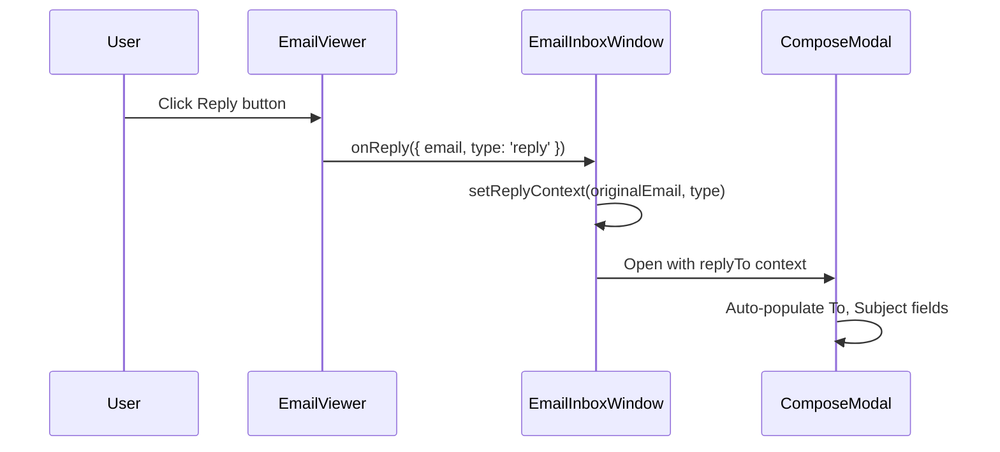
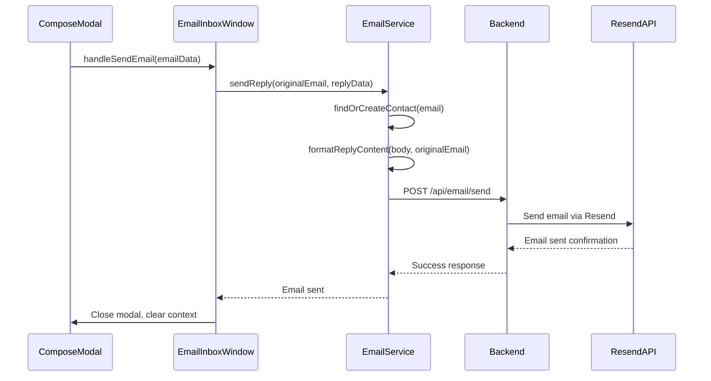

# Email Reply Integration Documentation

## Overview

This document details the integration between the frontend email inbox reply functionality and the existing backend API endpoints. The implementation connects the Reply, Reply All, and Forward buttons in the email inbox interface with the backend's Resend email service.

## Architecture

### Frontend Components

#### 1. EmailInboxWindow (`frontend/src/components/email-inbox/EmailInboxWindow.js`)
- **Main container** managing email interface state
- **Key Functions:**
  - `handleReply()` - Processes reply button clicks and opens compose modal
  - `handleSendEmail()` - Orchestrates email sending via backend API
  - Manages reply context (original email, reply type)

#### 2. EmailViewer (`frontend/src/components/email-inbox/components/EmailViewer.js`)
- **Email display component** with action buttons
- **Reply Actions:**
  - Reply button: `onReply({ email, type: 'reply' })`
  - Reply All button: `onReply({ email, type: 'replyAll' })`
  - Forward button: `onReply({ email, type: 'forward' })`

#### 3. ComposeModal (`frontend/src/components/email-inbox/components/ComposeModal.js`)
- **Email composition interface**
- **Auto-populates fields** when replying:
  - To: Original sender's email
  - Subject: "Re: " + original subject
  - Preserves thread context

#### 4. EmailService (`frontend/src/services/emailService.js`)
- **API integration layer** connecting to backend endpoints
- **Key Methods:**
  - `sendReply()` - Send reply with threading
  - `sendReplyAll()` - Send reply to all recipients
  - `forwardEmail()` - Forward email with proper formatting
  - `formatReplyContent()` - Formats email with quoted original

### Backend Integration

#### Existing Endpoints Used

**Primary Endpoint: `/api/email/send`**
```javascript
POST /api/email/send
Headers: {
  'Content-Type': 'application/json',
  'x-workspace-id': workspaceId
}
Body: {
  contactId: string,
  subject: string,
  content: string,
  workspaceId: string,
  cc?: string,
  bcc?: string,
  attachments?: Array
}
```

**Secondary Endpoint: `/api/schedule-email`**
```javascript
POST /api/schedule-email
Body: {
  to: string,
  subject: string,
  html: string,
  contactId: string,
  workspaceId: string,
  scheduledAt: ISO string,
  metadata: Object
}
```

## Implementation Flow

### 1. User Clicks Reply Button



### 2. User Sends Reply



## Key Features

### 1. **Thread Preservation**
- Proper "Re: " subject prefixing
- Original email quoted in reply body
- Maintains conversation context

### 2. **Contact Integration**
- Auto-finds existing contacts by email
- Creates new contacts if not found
- Links emails to CRM system

### 3. **Workspace Isolation**
- All operations scoped to current workspace
- Proper workspace headers in API calls
- Workspace-aware contact management

### 4. **Error Handling**
- Network error recovery
- User feedback on success/failure
- Graceful fallbacks for contact creation

### 5. **Rich Content Formatting**
- HTML-formatted reply content
- Professional email templates
- Proper quoted text styling

## Email Content Formatting

### Reply Content Structure
```html
<div style="font-family: -apple-system, BlinkMacSystemFont, 'Segoe UI', Roboto, Arial, sans-serif; line-height: 1.6;">
  <div style="margin-bottom: 20px;">
    <!-- User's reply content -->
  </div>
  
  <div style="border-top: 1px solid #e5e5e5; padding-top: 15px; margin-top: 20px;">
    <div style="color: #666; font-size: 12px; margin-bottom: 10px;">
      On [date], [sender] wrote:
    </div>
    <div style="border-left: 3px solid #e5e5e5; padding-left: 15px; color: #666;">
      <!-- Original email content -->
    </div>
  </div>
</div>
```

### Forward Content Structure
```html
<div style="font-family: -apple-system, BlinkMacSystemFont, 'Segoe UI', Roboto, Arial, sans-serif; line-height: 1.6;">
  <div style="margin-bottom: 20px;">
    <!-- User's forward message -->
  </div>
  
  <div style="border-top: 1px solid #e5e5e5; padding-top: 15px; margin-top: 20px;">
    <div style="color: #666; font-size: 12px; margin-bottom: 10px;">
      ---------- Forwarded message ----------<br/>
      From: [sender]<br/>
      Date: [date]<br/>
      Subject: [subject]
    </div>
    <div style="margin-top: 15px;">
      <!-- Original email content -->
    </div>
  </div>
</div>
```

## Testing Guide

### 1. **Basic Reply Test**
```javascript
// In browser console:
// 1. Open email inbox
// 2. Select an email
// 3. Click Reply button
// 4. Verify compose modal opens with:
//    - To field populated with sender email
//    - Subject prefixed with "Re: "
//    - Empty body ready for input
```

### 2. **Reply All Test**
```javascript
// Similar to reply test but:
// - Click "Reply All" button
// - Verify CC field shows additional recipients
// - Subject still prefixed with "Re: "
```

### 3. **Forward Test**
```javascript
// Click Forward button and verify:
// - To field is empty (user must fill)
// - Subject prefixed with "Fwd: "
// - Body contains forward header and original content
```

### 4. **Backend Integration Test**
```javascript
// Check network tab for API calls:
// 1. Verify POST to /api/email/send
// 2. Check request headers include x-workspace-id
// 3. Verify request body matches expected format
// 4. Confirm success response
```

## Environment Variables

### Frontend (`.env`)
```bash
REACT_APP_BACKEND_URL=https://cc.automate8.com
# or
REACT_APP_BACKEND_URL=https://api.customerconnects.app
```

### Backend Configuration
- Resend API key properly configured
- CORS enabled for both domains:
  - `cc.automate8.com`
  - `api.customerconnects.app`

## Error Scenarios & Handling

### 1. **Network Errors**
- Shows user-friendly error message
- Preserves compose modal content
- Allows retry without data loss

### 2. **Invalid Email Addresses**
- Validates email format client-side
- Backend validation for security
- Clear error messages for users

### 3. **Missing Contact Creation**
- Graceful fallback if contact API fails
- Email still sends with null contactId
- Background contact creation retry

### 4. **Workspace Permissions**
- Proper workspace scope validation
- Error handling for unauthorized access
- Clear permission error messages

## Future Enhancements

### 1. **Email Threading**
- Thread ID preservation
- Visual thread grouping
- Thread-aware replies

### 2. **Attachment Support**
- File upload integration
- Attachment forwarding
- Size validation

### 3. **Rich Text Editor**
- HTML composition
- Text formatting options
- Signature support

### 4. **Draft Auto-Save**
- Periodic draft saving
- Recovery on page refresh
- Draft management interface

### 5. **Email Templates**
- Pre-defined reply templates
- Dynamic template variables
- Template management

## Dependencies

### Frontend
```json
{
  "@chakra-ui/react": "^2.x",
  "framer-motion": "^6.x",
  "lucide-react": "^0.x",
  "react": "^18.x"
}
```

### Backend
- Resend API integration
- Express.js server
- Supabase database
- Workspace authentication

## Troubleshooting

### Common Issues

1. **Reply button not working**
   - Check console for JavaScript errors
   - Verify onReply prop passed to EmailViewer
   - Confirm EmailInboxWindow handles reply context

2. **Emails not sending**
   - Verify backend API endpoints accessible
   - Check network tab for failed requests
   - Confirm workspace ID in localStorage

3. **Form not pre-populating**
   - Check replyTo prop in ComposeModal
   - Verify useEffect dependencies
   - Confirm email object structure

4. **Contact creation failing**
   - Check contact API endpoints
   - Verify workspace permissions
   - Review backend logs for errors

### Debug Tools

```javascript
// Enable debug logging in EmailService
localStorage.setItem('emailDebug', 'true');

// Check current workspace
console.log('Workspace:', localStorage.getItem('workspaceId'));

// Test API connectivity
fetch('/api/health').then(r => console.log('API Status:', r.status));
```

## Conclusion

The email reply integration successfully connects the frontend email inbox interface with the existing backend Resend API, providing a seamless email communication experience within the CRM system. The implementation maintains proper threading, contact integration, and workspace isolation while providing robust error handling and user feedback. 