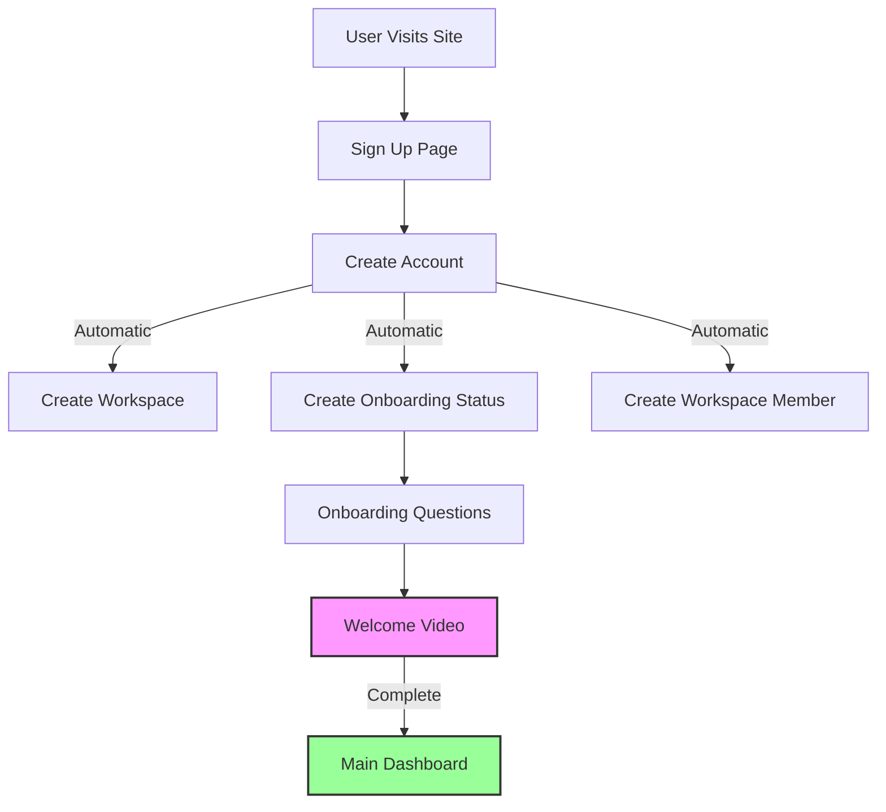

# LiveChat Application Onboarding Flow Documentation

## Overview
This document details the complete user onboarding flow in the LiveChat application, from initial signup to workspace access. It includes database relationships, automatic table creation, and the complete user journey.

## User Journey Flow



## Database Tables and Relationships

### 1. Workspaces Table
```sql
Table: workspaces
- id (text, NOT NULL)
- name (text, NOT NULL)
- created_at (timestamp with time zone, NOT NULL)
- updated_at (timestamp with time zone, NOT NULL)
- is_default (boolean, NOT NULL)
- settings (jsonb, NOT NULL)
- workspace_code (text, NOT NULL)
- timezone (character varying, NOT NULL)
```

### 2. Onboarding Status Table
```sql
Table: onboarding_status
- id (uuid, NOT NULL)
- user_id (uuid, NULLABLE)
- workspace_id (text, NULLABLE)
- is_completed (boolean, NULLABLE)
- created_at (timestamp with time zone, NOT NULL)
- updated_at (timestamp with time zone, NOT NULL)
```

### 3. Workspace Members Table
```sql
Table: workspace_members
- id (uuid, NOT NULL)
- workspace_id (text, NULLABLE)
- user_id (uuid, NULLABLE)
- role (text, NOT NULL)
- created_at (timestamp with time zone, NOT NULL)
- updated_at (timestamp with time zone, NOT NULL)
```

## Key Files and Components

### Authentication Components
Location: `/frontend/src/components/auth/`
- Handles user registration and login
- Uses Supabase built-in authentication
- Triggers automatic table creation upon successful signup

### Onboarding Components
Location: `/frontend/src/components/onboarding/`
- Manages the onboarding questionnaire flow
- `WelcomeVideo.js`: Final step that marks onboarding completion

## Detailed Process Flow

1. **User Registration**
   - User fills out signup form (email, password)
   - Upon successful registration:
     - Supabase creates user account
     - Triggers automatic creation of workspace
     - Creates onboarding status record (is_completed = false)
     - Creates workspace member record

2. **Automatic Table Population**
   - Workspaces: New workspace created for user
   - Onboarding Status: Created with is_completed = false
   - Workspace Members: User added as workspace member

3. **Onboarding Flow**
   - User redirected to `/onboarding`
   - Must complete questionnaire steps
   - Final step: WelcomeVideo.js
     - Marks onboarding as complete (is_completed = true)
     - Redirects to main dashboard

## Table Relationships

1. **User → Workspaces**
   - One-to-Many: User can have multiple workspaces
   - Primary workspace marked with is_default = true

2. **User → Onboarding Status**
   - One-to-One: Each user has one onboarding status
   - Tracks completion of onboarding process

3. **User → Workspace Members**
   - Many-to-Many: Users can be members of multiple workspaces
   - Includes role information for each membership

4. **Workspace → Workspace Members**
   - One-to-Many: Each workspace can have multiple members
   - Tracks all members and their roles within workspace

## Security Considerations

- All database operations are protected by Supabase RLS policies
- Workspace access requires completed onboarding
- Authentication state is maintained via Supabase session

## Common Issues and Troubleshooting

1. **Incomplete Onboarding**
   - Check onboarding_status.is_completed
   - Verify all required fields in workspace settings

2. **Access Issues**
   - Verify workspace_members entry exists
   - Check user role permissions

3. **Redirect Problems**
   - Ensure authentication state is maintained
   - Verify onboarding completion status

## Onboarding Process Implementation

The onboarding process is implemented through a single database trigger that runs when a new user is created:

```
┌─────────────┐                 ┌──────────────────────┐
│ User Signup │─────────────────► Auth User Created    │
└─────────────┘                 └──────────┬───────────┘
                                           │
                                           ▼
                          ┌─────────────────────────────────┐
                          │ create_default_workspace_trigger│
                          └─────────────────┬───────────────┘
                                           │
                                           ▼
                      ┌────────────────────────────────────────┐
                      │ create_default_workspace_and_onboarding │
                      └───────────────┬────────────────────────┘
                                      │
                 ┌──────────────────┬─┴────────────┬───────────────┐
                 │                  │              │               │
                 ▼                  ▼              ▼               ▼
        ┌─────────────────┐ ┌────────────┐ ┌─────────────┐ ┌────────────────┐
        │ Create          │ │ Create     │ │ Create      │ │ Create Lead    │
        │ User Profile    │ │ Workspace  │ │ Workspace   │ │ Status         │
        └────────┬────────┘ └─────┬──────┘ │ Member      │ │ Categories     │
                 │                │        └─────┬───────┘ └────────┬───────┘
                 │                │              │                  │
                 └────────────────┴──────────────┴──────────┬──────┘
                                                           │
                                                           ▼
                                             ┌─────────────────────────┐
                                             │ Redirect to Onboarding  │
                                             └────────────┬────────────┘
                                                          │
                                                          ▼
                                             ┌─────────────────────────┐
                                             │ User Completes          │
                                             │ Onboarding Questions    │
                                             └────────────┬────────────┘
                                                          │
                                                          ▼
                                             ┌─────────────────────────┐
                                             │ Mark is_completed=true  │
                                             │ in onboarding_status    │
                                             └────────────┬────────────┘
                                                          │
                                                          ▼
                                             ┌─────────────────────────┐
                                             │ Redirect to Dashboard   │
                                             └─────────────────────────┘
```

## Fixing Infinite Recursion Issues

If you encounter an "infinite recursion detected in policy for relation 'workspace_members'" error during onboarding, the following fixes should be applied:

### 1. Consolidate Triggers

Multiple triggers on auth.users table can cause conflicts. Consolidate to a single trigger:

```sql
-- Keep only this trigger and drop others
CREATE TRIGGER create_default_workspace_trigger
AFTER INSERT ON auth.users
FOR EACH ROW EXECUTE FUNCTION create_default_workspace_and_onboarding();
```

### 2. Fix Workspace Members Function

Add SECURITY DEFINER to bypass RLS in functions that access workspace_members:

```sql
CREATE OR REPLACE FUNCTION public.check_single_workspace_membership()
RETURNS trigger
LANGUAGE plpgsql
SECURITY DEFINER -- Add this to bypass RLS
AS $function$
BEGIN
  -- Function body...
END;
$function$;
```

### 3. Simplify RLS Policies

Keep policies simple to avoid circular dependencies:

```sql
-- Service role policy for system operations
CREATE POLICY "Service role can manage all workspace members" 
ON public.workspace_members 
FOR ALL 
TO service_role
USING (true)
WITH CHECK (true);

-- User policy for managing their own memberships
CREATE POLICY "Users can manage their own membership" 
ON public.workspace_members 
FOR ALL 
TO authenticated
USING (user_id = auth.uid())
WITH CHECK (user_id = auth.uid());
```

These changes ensure the onboarding process works reliably without triggering infinite recursion errors.

## Detailed Changelog of Fixes

Here's a detailed list of every change made to fix the onboarding flow infinite recursion issue:

### Database Triggers Changed

1. **Dropped Multiple Redundant Triggers**
   ```sql
   DROP TRIGGER IF EXISTS create_workspace_on_user_creation ON auth.users;
   DROP TRIGGER IF EXISTS on_auth_user_created ON auth.users;
   DROP TRIGGER IF EXISTS on_auth_user_created_profile ON auth.users;
   ```
   - These triggers were causing conflicts during user creation
   - Each trigger was executing separate but overlapping functions
   - We kept only the main trigger: `create_default_workspace_trigger`

### Database Functions Modified

1. **Modified: `public.create_default_workspace_and_onboarding()`**
   ```sql
   CREATE OR REPLACE FUNCTION public.create_default_workspace_and_onboarding()
   RETURNS trigger
   LANGUAGE plpgsql
   SECURITY DEFINER
   AS $function$
   ... function body with user profile creation added ...
   $function$;
   ```
   - Added SECURITY DEFINER to bypass RLS during execution
   - Consolidated user profile creation (previously in `handle_new_user()`)
   - Added better error handling
   
2. **Modified: `public.check_single_workspace_membership()`**
   ```sql
   CREATE OR REPLACE FUNCTION public.check_single_workspace_membership()
   RETURNS trigger
   LANGUAGE plpgsql
   SECURITY DEFINER
   AS $function$
   ... optimized function body ...
   $function$;
   ```
   - Added SECURITY DEFINER to bypass RLS during execution
   - Modified the recursive queries to be more efficient
   - Added exclusion of the current record being inserted to avoid false positives

### RLS Policies Simplified

1. **Dropped Problematic Policies**
   ```sql
   DROP POLICY IF EXISTS "Users can view workspace members" ON public.workspace_members;
   DROP POLICY IF EXISTS "Admins can manage workspace members" ON public.workspace_members;
   ```
   - These policies had complex circular dependencies
   - "Users can view workspace members" was causing infinite recursion by checking membership inside a membership check
   
2. **Kept Only Necessary Simple Policies**
   - Maintained "Service role can manage all workspace members" for backend operations
   - Maintained "Users can manage their own membership" for user-level access

### Database Schema Design Insights

1. **Workspace Members Table**
   - The circular dependency arose because policies were trying to check if a user is a member of a workspace by looking up the same table
   - Solution: Simplified policies to use direct user_id checks rather than nested workspace membership lookups
   
2. **Onboarding Flow**
   - No changes were needed to the actual onboarding flow, just to the initialization process
   - The flow from user creation to workspace creation to onboarding remains the same

### Frontend Components

1. **No Frontend Changes Required**
   - The issue was purely in the database logic
   - After fixing the database issues, the frontend components work as designed
   - The Profile.js component continues to read from user_profiles_with_workspace view

### Verification Tests

To verify the fix works:
1. Create a new user account
2. The account should automatically create a workspace, workspace membership, and user profile
3. You should be redirected to the onboarding flow without any 500 errors
4. The console should be free of infinite recursion errors

## Aligning Frontend with Database Fixes

After fixing the database-level issues with RLS policies and triggers, we need to ensure the frontend code properly aligns with our changes. Here's how the frontend components interact with the database:

### Frontend Component Overview

1. **SignupForm.js**
   - Handles user registration UI
   - Calls `signUpWithEmail` from supabaseUnified.js
   - Redirects to onboarding after successful signup

2. **supabaseUnified.js**
   - Contains the `signUpWithEmail` function that:
     - Creates user via Supabase auth
     - Attempts to create workspace/memberships (redundant with our trigger)

3. **OnboardingFlow.js**
   - Manages the multi-step onboarding process
   - Uses OnboardingContext to check if onboarding is complete
   - Handles state for each step of the onboarding flow

4. **WelcomeVideo.js**
   - Final step in the onboarding process
   - Marks onboarding as complete in the database
   - Uses multiple methods to update onboarding status

5. **OnboardingContext.js**
   - Tracks onboarding completion status
   - Uses both localStorage and database checks
   - Redirects users based on completion status

### Identified Issues

1. **Redundant Workspace Creation**: Both the database trigger and frontend code try to create workspaces
2. **Multiple Completion Methods**: Several approaches to marking onboarding complete
3. **Unreliable Error Handling**: Some frontend components don't handle backend errors well

### Frontend Changes Needed

#### 1. Simplify signUpWithEmail in supabaseUnified.js

```javascript
export const signUpWithEmail = async (email, password) => {
  try {
    console.log('Attempting to sign up user with email:', email);
    
    // Use the regular client for signup - let the database trigger handle the rest
    const { data, error } = await supabase.auth.signUp({
      email,
      password,
    });
    
    if (error) {
      console.error('Signup error:', error);
      return { error };
    }
    
    // The database trigger create_default_workspace_trigger will handle:
    // 1. Creating user profile
    // 2. Creating workspace
    // 3. Adding user as workspace member
    // 4. Creating onboarding status
    if (data?.user) {
      console.log('User signed up successfully, user ID:', data.user.id);
      console.log('Workspace creation handled by database trigger');
    }
    
    return { data, error: null };
  } catch (unexpectedError) {
    console.error('Unexpected error during signup:', unexpectedError);
    return { data: null, error: unexpectedError };
  }
};
```

#### 2. Simplify WelcomeVideo.js completion logic

```javascript
const handleComplete = async () => {
  setIsLoading(true);
  setIsSubmitting(true);
  
  try {
    // Mark onboarding as complete in the database with a simple direct update
    if (user?.id && currentWorkspace?.id) {
      const { error: updateError } = await supabase
        .from('onboarding_status')
        .update({ 
          is_completed: true,
          updated_at: new Date().toISOString()
        })
        .match({ 
          user_id: user.id, 
          workspace_id: currentWorkspace.id 
        });
        
      if (updateError) {
        console.error('Error updating onboarding status:', updateError);
        // Continue even if this fails
      } else {
        console.log('Successfully marked onboarding as complete');
      }
      
      // Set in localStorage as fallback
      localStorage.setItem('onboardingComplete', 'true');
    }
    
    // Then call the provided onComplete function
    await onComplete({ watched_intro: true }, true);
    
    toast({
      title: 'Welcome aboard!',
      description: 'Your account is now ready to use.',
      status: 'success',
      duration: 3000,
      isClosable: true,
    });

    // Redirect to main app
    window.location.href = window.location.origin;
  } catch (error) {
    console.error('Error completing onboarding:', error);
    
    // Show error but still try to proceed
    toast({
      title: 'Error completing onboarding',
      description: 'There was an issue completing your onboarding. Redirecting anyway.',
      status: 'warning',
      duration: 5000,
      isClosable: true,
    });
    
    // Set localStorage as fallback
    localStorage.setItem('onboardingComplete', 'true');
    
    // Still redirect to main app
    window.location.href = window.location.origin;
  } finally {
    setIsLoading(false);
    setIsSubmitting(false);
  }
};
```

### Testing Frontend Changes

After implementing these changes, test the complete user flow:

1. **Signup Test**
   - Create a new user via the signup form
   - Verify in the database that a workspace, workspace_member, user_profile, and onboarding_status are created
   - Check the Supabase logs for any errors

2. **Onboarding Test**
   - Complete the onboarding steps
   - Verify the WelcomeVideo.js component successfully marks onboarding as complete
   - Check the onboarding_status.is_completed field is updated to true

3. **Access Test**
   - Verify redirection to main app after completing onboarding
   - Confirm user has proper access to their workspace and features

### Final User Flow

With these changes, the user flow will be:

1. **User Signup**
   - User fills out signup form
   - Frontend creates user account via Supabase auth
   - Database trigger automatically:
     - Creates user profile
     - Creates workspace
     - Adds user as workspace member
     - Creates onboarding status (is_completed = false)

2. **Onboarding Process**
   - User is redirected to onboarding flow
   - User completes each step in the flow
   - On final step, frontend updates onboarding_status.is_completed to true
   - User is redirected to main app

3. **Application Access**
   - OnboardingContext verifies completion status
   - User gains access to all app features
   - Workspace is fully configured and ready to use


the fixed is at @frontend_fixes.md