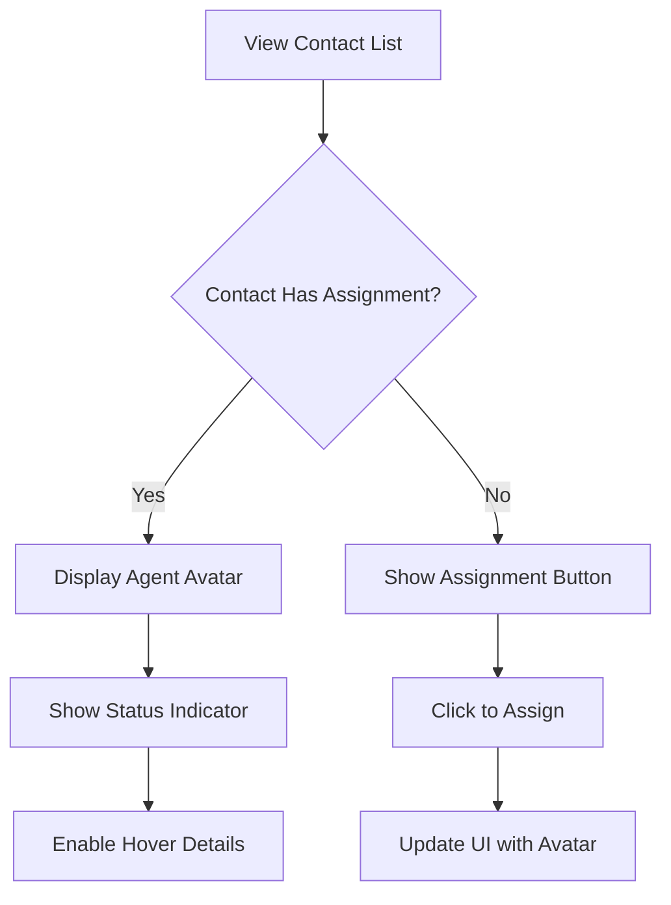
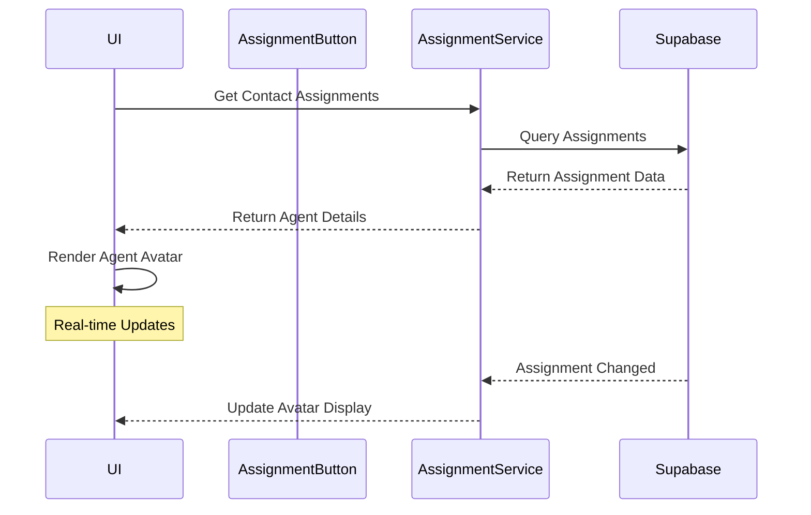

# Agent Assignment Avatar Indicator Implementation

## 1. Overview

### Purpose & Scope
- Add visual avatar indicators to clearly show which agents are assigned to a contact
- Improve UX by making agent assignments immediately visible
- Follow macOS design philosophy with clean, minimal indicators

### Stakeholders
- Agents: Need clear visual feedback of assignments
- Admins: Better oversight of agent-contact relationships
- Support Teams: Improved collaboration awareness

## 2. What It Does (Capabilities)

- Displays agent avatars in the contact list for assigned contacts
- Shows avatar with online/offline status indicator
- Supports multiple agent assignments (if enabled)
- Provides tooltip with agent name on hover
- Maintains consistency with macOS design patterns

## 3. User Flow



ASCII Version:
```
Contact List
    |
    +-> Has Assignment? --Yes--> Show Avatar + Status
    |                            |
    |                            +-> Show Details on Hover
    |
    +-> No --> Show Assign Button --> Update UI on Click
```

## 4. Front-end & Back-end Flow



## 5. File Structure

```
frontend/
├── components/
│   └── livechat2/
│       ├── AssignmentButton.js     # Updated with avatar display
│       ├── AgentAvatar.js         # New component for agent avatar
│       └── AssignmentIndicator.js # New component for status dots
├── hooks/
│   └── useAssignmentDisplay.js    # New hook for avatar logic
└── styles/
    └── assignment.css             # New styles for avatars
```

## 6. Data & Logic Artifacts

### Database Views

```sql
-- Update existing view to include avatar information
CREATE OR REPLACE VIEW livechat_contact_assignments_with_details AS
SELECT 
    a.*,
    u.full_name as agent_name,
    u.avatar_url,
    u.online_status
FROM livechat_contact_assignments a
JOIN user_profiles u ON a.user_id = u.id;
```

### Component Logic

```javascript
// AgentAvatar.js
const AgentAvatar = ({ agent, size = 'sm' }) => {
  return (
    <div className={`agent-avatar ${size}`}>
      
      <span className={`status-dot ${agent.online_status}`} />
    </div>
  );
};

// AssignmentButton.js update
const AssignmentButton = ({ contact, workspaceId }) => {
  const [assignments, setAssignments] = useState([]);
  // ... existing logic ...
  
  return (
    <div className="assignment-container">
      {assignments.map(assignment => (
        <AgentAvatar key={assignment.id} agent={assignment.agent} />
      ))}
      {/* ... existing button ... */}
    </div>
  );
};
```

## 7. User Stories

1. As an agent, I want to see avatars of assigned agents so I know who's handling each contact
2. As an admin, I want to see agent assignments at a glance for better oversight
3. As an agent, I want to see online/offline status of assigned agents
4. As a user, I want tooltips showing agent names on hover
5. As an agent, I want to see my own avatar when I'm assigned
6. As an admin, I want to see multiple assigned agents if applicable
7. As a user, I want the avatar display to be consistent with macOS design
8. As an agent, I want real-time updates when assignments change
9. As a user, I want graceful fallbacks for missing avatar images
10. As an admin, I want to distinguish between active and inactive assignments

## 8. Implementation Stages

### Phase 1: MVP
- Basic avatar display for single agent
- Integration with existing assignment system
- Simple online/offline indicator
Effort: 2-3 days

### Phase 2: Enhanced Features
- Multiple agent avatar support
- Tooltips and hover states
- Improved status indicators
Effort: 2-3 days

### Phase 3: Polish
- Animation refinements
- Edge case handling
- Performance optimization
Effort: 1-2 days

## 9. Future Roadmap

- Add agent grouping/filtering by assignment
- Implement avatar stacking for multiple assignments
- Add assignment history timeline
- Consider caching avatar images
- Add drag-and-drop assignment capability

## References
- [MacOS Human Interface Guidelines](https://developer.apple.com/design/human-interface-guidelines/macos)
- [Avatar Best Practices](https://uxdesign.cc/avatar-user-profile-picture-best-practices-8b99b661a150)
