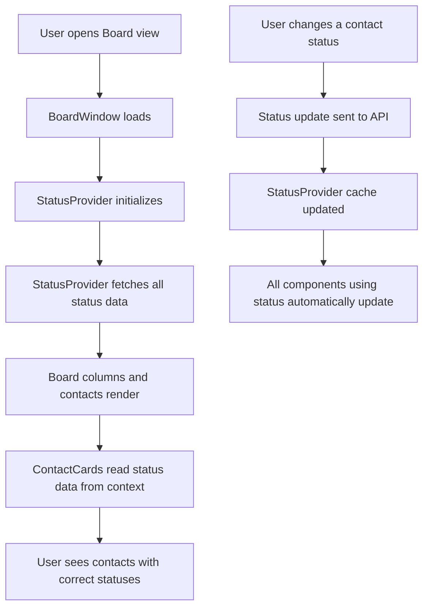
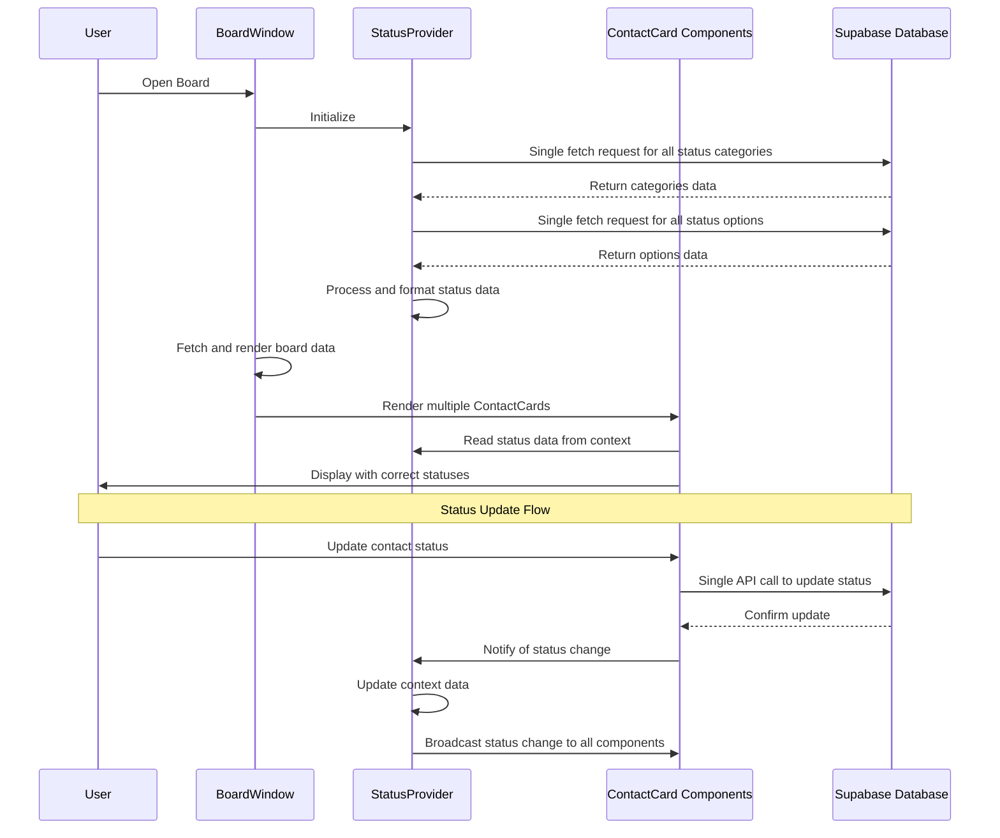

# Centralized Status Management Implementation

## 1. Overview

### Purpose & Scope
This implementation addresses the `net::ERR_INSUFFICIENT_RESOURCES` and "Failed to fetch status options: TypeError: Failed to fetch" errors that occur when board views with many contacts are loaded. The current architecture causes each ContactCard component to independently fetch status data, resulting in dozens of parallel Supabase requests that exhaust browser connection limits.

The solution centralizes all status data fetching in a shared context, eliminating redundant API calls and ensuring efficient data access patterns.

### Stakeholders
- Users: Experience faster, more reliable board loading without connection errors
- Developers: Simpler code with clear separation of concerns and reduced debugging complexity
- Operations: Lower Supabase connection counts and reduced resource consumption

## 2. What It Does (Capabilities)

* Prefetches all workspace status data once during initial board load
* Provides status information via context rather than per-component API calls
* Maintains an efficient caching layer with proper invalidation
* Handles loading, error, and refresh states gracefully
* Preserves backward compatibility with existing UI components
* Reduces Supabase connection count by up to 95% during board loads
* Falls back to default status values if API fails

## 3. User Flow



```
+---------------------+     +---------------------+     +---------------------+
| User opens          |     | StatusProvider      |     | ContactCards        |
| Board view          |---->| fetches all         |---->| read from           |
|                     |     | status data once    |     | context (no API)    |
+---------------------+     +---------------------+     +---------------------+
                                     |
                                     v
+---------------------+     +---------------------+
| Status updates      |     | Context updated     |
| propagate to all    |<----| automatically on    |
| components          |     | any status change   |
+---------------------+     +---------------------+
```

## 4. Front-end & Back-end Flow



```
User        BoardWindow       StatusProvider        ContactCards      Supabase
 |               |                   |                    |               |
 |--Open Board-->|                   |                    |               |
 |               |---Initialize----->|                    |               |
 |               |                   |---Fetch Categories--------------->|
 |               |                   |<--Return Categories---------------|
 |               |                   |---Fetch Options----------------->|
 |               |                   |<--Return Options-----------------|
 |               |                   |----Process Data----|               |
 |               |---Render Board-->|                    |               |
 |               |                   |                    |               |
 |               |----------------Render ContactCards--->|               |
 |               |                   |<---Read Status Data From Context--|
 |<-----------------------------------------Display Cards------------|
 |               |                   |                    |               |
 |--Update Status-------------------------->|               |
 |               |                   |                    |---API Call-->|
 |               |                   |                    |<--Confirm----|
 |               |                   |<--Notify Change----|               |
 |               |                   |---Update Context-->|               |
 |               |                   |---Broadcast Change--------------->|
 |<-----------------------------------------Display Updated----------|
```

## 5. File Structure

```
frontend/src/
├── contexts/
│   ├── StatusContext.js       # Enhanced context for centralized status management
│   └── WorkspaceContext.js    # Existing context (no changes needed)
├── services/
│   └── statusService.js       # Simplified service without duplicate fetching logic
├── components/
│   ├── board/
│   │   ├── BoardWindow.js     # Modified to use StatusProvider without prefetching
│   │   └── components/
│   │       └── ContactCard.js  # Simplified to read status from context
│   └── common/
│       └── StatusIndicator.js  # New reusable component for status display
└── hooks/
    └── useStatus.js           # New custom hook for accessing status data
```

## 6. Data & Logic Artifacts

### Status Context State Structure
```javascript
{
  isLoading: boolean,           // Status data loading state
  error: Error | null,          // Any errors from fetching status data
  statusCategories: {           // Map of all status categories by ID
    [categoryId]: {
      id: number,
      name: string,
      workspace_id: string,
      created_at: string,
      // Other category fields
    }
  },
  statusOptions: {              // Map of all status options by ID
    [optionId]: {
      id: number,
      name: string,
      color: string,
      category_id: number,
      // Other option fields
    }
  },
  statusMapByCategory: {        // Organized status data by category
    [categoryName]: {
      [statusKey]: {
        label: string,
        color: string,
        optionId: number
      }
    }
  },
  refreshStatusData: Function,  // Function to manually refresh all status data
  updateStatusOption: Function, // Function to update a specific status option
  // Other helper functions
}
```

### Key Functions

| Name | Location | Purpose | Inputs/Outputs | Ownership |
|------|----------|---------|---------------|-----------|
| `useStatus` | hooks/useStatus.js | Provides easy access to status data | Input: none, Output: StatusContext | StatusContext |
| `fetchAllStatusData` | contexts/StatusContext.js | Fetches all status data at once | Input: workspaceId, Output: Promise<StatusData> | StatusContext |
| `processStatusData` | contexts/StatusContext.js | Organizes raw status data | Input: categories, options, Output: maps | StatusContext |
| `getStatusForContact` | contexts/StatusContext.js | Gets appropriate status for a contact | Input: contact, type, Output: StatusInfo | StatusContext |
| `updateContactStatus` | services/statusService.js | Updates a contact's status | Input: contactId, statusId, Output: Promise<void> | statusService |

## 7. User Stories

1. **As a user**, I want board views with many contacts to load quickly, so that I can work efficiently without connection errors.
2. **As a user**, I want contact statuses to be visually consistent across the application, so that I have a unified experience.
3. **As a user**, I want to see the correct status for each contact immediately upon loading, so that I can identify priorities without waiting.
4. **As a user**, I want status changes to apply immediately across all views, so that I maintain a consistent understanding of contact states.
5. **As a user**, I want the application to handle temporary connection issues gracefully, so that I can continue working even with network fluctuations.
6. **As a developer**, I want a clear, single source of truth for status data, so that I can maintain and debug the codebase more easily.
7. **As a developer**, I want to reduce API calls to Supabase, so that I can stay within service limits and improve performance.
8. **As a system administrator**, I want reduced database connection overhead, so that the system remains responsive under load.
9. **As a product manager**, I want consistent status behavior across the application, so that users have a coherent experience.
10. **As a new team member**, I want clear status management patterns, so that I can quickly understand and contribute to the codebase.

## 8. Implementation Stages

### Phase 1: MVP - Basic Centralization
- Create enhanced StatusContext with state for all status categories and options
- Implement fetchAllStatusData to retrieve all data in optimized requests
- Modify ContactCard to read from context instead of making API calls
- Add basic error handling and loading states
- Ensure backward compatibility with existing consumers

### Phase 2: Refined Context and Consumer Experience
- Add useStatus custom hook for cleaner component integration
- Implement optimistic updates for status changes
- Add proper cache invalidation and refresh mechanisms
- Create StatusIndicator reusable component
- Add websocket subscription for real-time status updates

### Phase 3: Performance Optimization
- Implement smarter data fetching for large workspaces
- Add pagination support for workspaces with many status options
- Optimize re-render patterns using memoization
- Add metric tracking for status data lifecycle
- Implement background refresh strategies

## 9. Future Roadmap

### Short-term Improvements
- Add detailed performance metrics for status data fetching
- Implement proper retry and backoff strategies for failed fetches
- Create specialized views for status management

### Long-term Considerations
- Consider implementing a normalized Redux store for more complex state management
- Evaluate using React Query for more robust data fetching
- Explore offline support with persistent caching
- Build performance visualization tools for monitoring status data flow
- Consider implementing GraphQL to reduce overfetching
