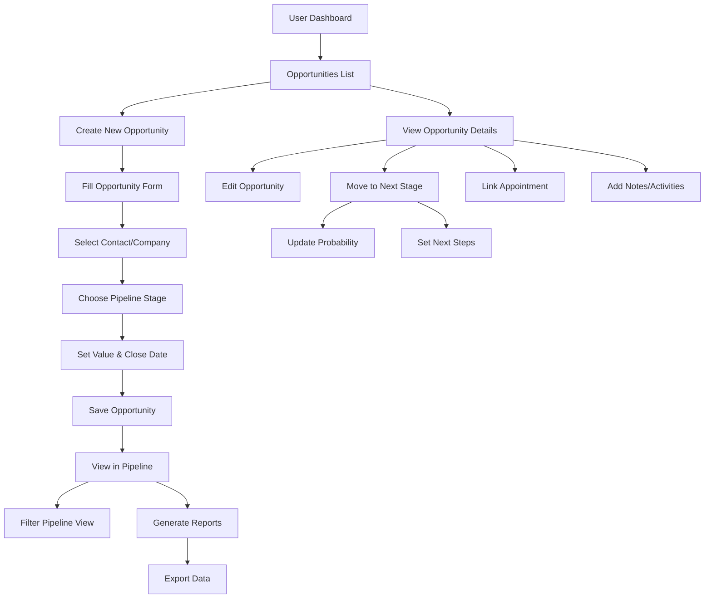
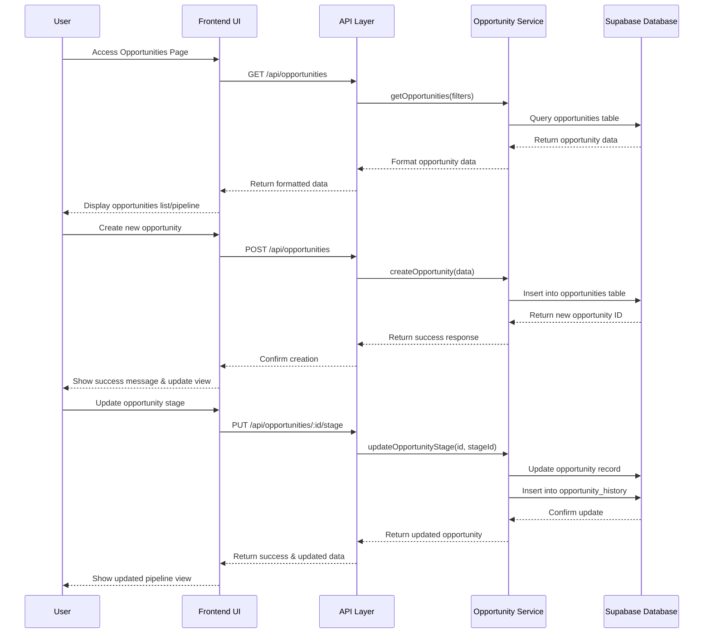

# Opportunities Management Implementation

## 1. Overview

### Purpose & Scope
The Opportunities Management feature extends the CRM capabilities by adding sales pipeline tracking, opportunity management, and forecasting. It allows users to track potential deals from initial contact through qualification, proposal, negotiation, and closing stages. This feature integrates with existing contacts and appointments to provide a complete view of the sales process.

**Implementation Status: ✅ BACKEND & FRONTEND API INTEGRATION COMPLETE**
- ✅ Database schema and tables created (opportunities, opportunity_stages, opportunity_history)
- ✅ Backend API endpoints deployed to Railway (https://cc.automate8.com)
- ✅ Authentication and authorization implemented
- ✅ Frontend API integration complete with consistent data sources
- ✅ Opportunity details sidebar working with backend API
- ✅ Opportunities list working with backend API
- ⏳ Pipeline visualization (Kanban board) pending implementation
- ⏳ Full UI components and reporting dashboard pending

**Key Goals:**
- ✅ Track potential sales opportunities with detailed information (backend + frontend ready)
- ⏳ Visualize sales pipeline with customizable stages (API ready, frontend pending)
- ✅ Link opportunities to contacts and appointments (working via API)
- ✅ Enable accurate sales forecasting and reporting (metrics endpoints ready)
- ⏳ Support team collaboration on opportunities (frontend pending)

**Non-Goals:**
- Complex enterprise-level sales automation
- Replacing existing contact management functionality
- Implementing a full ERP system

### Stakeholders
- **Sales Teams:** Primary users who will manage opportunities daily
- **Sales Managers:** Need visibility into pipeline and forecasting
- **Business Owners:** Require reporting and business intelligence
- **Administrators:** Will configure the system and manage permissions

## 2. What It Does (Capabilities) - ✅ API ENDPOINTS + FRONTEND INTEGRATION COMPLETE

- **Opportunity Creation and Management** ✅ FULLY IMPLEMENTED
  - ✅ Create, edit, and delete sales opportunities (`/api/pipeline/opportunities`)
  - ✅ Associate opportunities with contacts and companies
  - ✅ Track opportunity details (value, probability, expected close date)
  - ✅ Move opportunities through customizable pipeline stages
  - ✅ Frontend service integration with consistent API data sources

- **Opportunity Details Display** ✅ IMPLEMENTED
  - ✅ Individual opportunity details retrieval (`/api/pipeline/opportunities/:id`)
  - ✅ Sidebar detail view working with backend API
  - ✅ Complete opportunity data including stage, contact, company, activities

- **Pipeline Visualization** ✅ BACKEND READY, ⏳ FRONTEND KANBAN PENDING
  - ✅ API endpoints for pipeline data (`/api/pipeline/stages`)
  - ✅ Frontend API integration for stages
  - ⏳ Frontend Kanban-style pipeline board (pending)
  - ✅ Filter and sort opportunities by various criteria (API supports)
  - ⏳ Drag and drop opportunities between stages (frontend pending)
  - ✅ Pipeline health metrics and analytics (`/api/pipeline/metrics`)

- **Forecasting and Reporting** ✅ BACKEND IMPLEMENTED, ⏳ FRONTEND DASHBOARD PENDING
  - ✅ Generate sales forecasts based on opportunity data
  - ✅ View reports on pipeline metrics (conversion rates, average deal size)
  - ✅ Track team and individual performance
  - ⏳ Export opportunity data for external analysis (frontend pending)

- **Integration with Existing Features** ✅ BACKEND + API INTEGRATION READY
  - ✅ Link opportunities to contacts and appointments (database relationships + API)
  - ✅ Frontend service integration with consistent authentication
  - ⏳ Track communication history related to opportunities (frontend pending)
  - ⏳ Schedule follow-up activities directly from opportunities (frontend pending)
  - ⏳ Receive notifications for opportunity updates and deadlines (frontend pending)

### Available API Endpoints (Base URL: https://cc.automate8.com) - ✅ ALL TESTED & WORKING

#### Opportunities Management
- ✅ `GET /api/pipeline/opportunities` - Retrieve opportunities with filtering and pagination
- ✅ `GET /api/pipeline/opportunities/:id` - Retrieve individual opportunity with full details
- ✅ `POST /api/pipeline/opportunities` - Create new opportunities with validation
- ✅ `PUT /api/pipeline/opportunities/:id` - Update existing opportunities
- ✅ `DELETE /api/pipeline/opportunities/:id` - Archive opportunities (soft delete)
- ✅ `PUT /api/pipeline/opportunities/:id/move` - Move opportunities between stages

#### Pipeline Stages Management
- ✅ `GET /api/pipeline/stages` - Retrieve pipeline stages with ordering
- ✅ `POST /api/pipeline/stages` - Create new stages with position management
- ✅ `PUT /api/pipeline/stages/:id` - Update stage properties and reordering
- ✅ `DELETE /api/pipeline/stages/:id` - Remove stages with opportunity migration

#### Metrics & Analytics
- ✅ `GET /api/pipeline/metrics` - Pipeline overview metrics with comprehensive analytics

### Authentication - ✅ IMPLEMENTED & TESTED
- **JWT Authentication**: For frontend users - ✅ Working
- **API Key Authentication**: For external integrations - ✅ Working
- **Rate Limiting**: 100/min for JWT, 50/min for API keys - ✅ Implemented

### Frontend Integration Status - ✅ CORE INTEGRATION COMPLETE
- ✅ OpportunityService API integration complete
- ✅ Consistent data sources between list and detail views
- ✅ Authentication flow working with backend API
- ✅ Error handling and logging implemented
- ✅ Opportunity details sidebar functional
- ⏳ Pipeline Kanban board implementation pending
- ⏳ Full reporting dashboard pending

## 3. User Flow



```
+----------------+     +-------------------+     +----------------------+
| User Dashboard |---->| Opportunities List|---->| Create New Opportunity|
+----------------+     +-------------------+     +----------------------+
                        |                         |
                        v                         v
              +-----------------+        +-------------------+
              |View Opportunity |        | Fill Opportunity  |
              |    Details      |        |      Form         |
              +-----------------+        +-------------------+
                |      |     |                    |
                |      |     |                    v
                v      v     v            +-------------------+
     +--------+ +-----+ +-------+         | Select Contact/   |
     |  Edit  | |Move | | Link  |         |     Company      |
     |Opport. | |Stage| | Appt. |         +-------------------+
     +--------+ +-----+ +-------+                 |
                  |                               v
                  v                      +-------------------+
           +------------+                | Choose Pipeline   |
           |   Update   |                |      Stage        |
           | Probability |               +-------------------+
           +------------+                        |
                  |                              v
                  v                      +-------------------+
           +------------+                | Set Value &       |
           | Set Next   |                |   Close Date      |
           |   Steps    |                +-------------------+
           +------------+                        |
                                                 v
                                        +-------------------+
                                        |  Save Opportunity |
                                        +-------------------+
                                                 |
                                                 v
                                        +-------------------+
                                        | View in Pipeline  |
                                        +-------------------+
                                           |           |
                                           v           v
                                   +-------------+ +-------------+
                                   |    Filter   | |  Generate   |
                                   | Pipeline View| |   Reports   |
                                   +-------------+ +-------------+
                                                      |
                                                      v
                                                +-------------+
                                                | Export Data |
                                                +-------------+
```

## 4. Front-end & Back-end Flow



```
User        Frontend UI       API Layer        Opportunity Service     Database
 |              |                |                    |                    |
 |--Access Opportunities Page--->|                    |                    |
 |              |--GET /api/opportunities-->|         |                    |
 |              |                |--getOpportunities(filters)-->|          |
 |              |                |                    |--Query opportunities table-->|
 |              |                |                    |<--Return opportunity data----|
 |              |                |<--Format opportunity data--|                      |
 |              |<--Return formatted data--|                  |                      |
 |<--Display opportunities list/pipeline--|                   |                      |
 |              |                |                    |                    |
 |--Create new opportunity-->|   |                    |                    |
 |              |--POST /api/opportunities-->|        |                    |
 |              |                |--createOpportunity(data)-->|            |
 |              |                |                    |--Insert into opportunities table-->|
 |              |                |                    |<--Return new opportunity ID--|
 |              |                |<--Return success response--|                      |
 |              |<--Confirm creation--|                       |                      |
 |<--Show success message & update view--|                    |                      |
 |              |                |                    |                    |
 |--Update opportunity stage-->| |                    |                    |
 |              |--PUT /api/opportunities/:id/stage-->|                    |
 |              |                |--updateOpportunityStage(id, stageId)-->||
 |              |                |                    |--Update opportunity record-->|
 |              |                |                    |--Insert into opportunity_history-->|
 |              |                |                    |<--Confirm update--|
 |              |                |<--Return updated opportunity--|        |
 |              |<--Return success & updated data--|                      |
 |<--Show updated pipeline view--|                                        |
```

## 5. File Structure

```
/opportunities/
├── components/
│   ├── OpportunityList.jsx           # List view of opportunities
│   ├── OpportunityDetails.jsx        # Detailed view of a single opportunity
│   ├── OpportunityForm.jsx           # Form for creating/editing opportunities
│   ├── PipelineView.jsx              # Kanban-style pipeline visualization
│   ├── PipelineStage.jsx             # Individual stage column in pipeline
│   ├── OpportunityCard.jsx           # Card representing opportunity in pipeline
│   ├── OpportunityStats.jsx          # Statistics and metrics component
│   ├── OpportunityFilters.jsx        # Filtering options for opportunities
│   └── OpportunityReports.jsx        # Reporting and forecasting component
├── hooks/
│   ├── useOpportunities.js           # Hook for opportunity data management
│   ├── usePipeline.js                # Hook for pipeline operations
│   └── useOpportunityReports.js      # Hook for reporting functionality
├── services/
│   ├── opportunityService.js         # API service for opportunities
│   └── pipelineService.js            # API service for pipeline management
├── utils/
│   ├── opportunityHelpers.js         # Helper functions for opportunities
│   └── forecastingUtils.js           # Utilities for sales forecasting
├── pages/
│   ├── OpportunitiesPage.jsx         # Main opportunities page
│   ├── OpportunityDetailsPage.jsx    # Single opportunity view page
│   └── PipelinePage.jsx              # Pipeline visualization page
└── state/
    └── opportunityState.js           # State management for opportunities
```

## 6. Data & Logic Artifacts

### Database Tables

1. **opportunities**
   - **Purpose:** Store core opportunity data
   - **Location:** Supabase public schema
   - **Fields:**
     - id (UUID, PK)
     - title (VARCHAR)
     - description (TEXT)
     - contact_id (UUID, FK to contacts)
     - company_id (UUID, FK to companies)
     - workspace_id (TEXT)
     - stage_id (UUID, FK to opportunity_stages)
     - amount (DECIMAL)
     - currency (VARCHAR)
     - probability (INTEGER)
     - expected_close_date (TIMESTAMP)
     - created_by (UUID, FK to auth.users)
     - updated_by (UUID, FK to auth.users)
     - created_at (TIMESTAMP)
     - updated_at (TIMESTAMP)
     - closed_at (TIMESTAMP)
     - is_closed (BOOLEAN)
     - is_won (BOOLEAN)

2. **opportunity_stages**
   - **Purpose:** Define customizable pipeline stages
   - **Location:** Supabase public schema
   - **Fields:**
     - id (UUID, PK)
     - workspace_id (TEXT)
     - name (VARCHAR)
     - description (TEXT)
     - position (INTEGER)
     - color (VARCHAR)
     - default_probability (INTEGER)
     - is_won_stage (BOOLEAN)
     - is_lost_stage (BOOLEAN)
     - created_at (TIMESTAMP)
     - updated_at (TIMESTAMP)

3. **opportunity_history**
   - **Purpose:** Track changes to opportunities over time
   - **Location:** Supabase public schema
   - **Fields:**
     - id (UUID, PK)
     - opportunity_id (UUID, FK to opportunities)
     - field_name (VARCHAR)
     - old_value (TEXT)
     - new_value (TEXT)
     - changed_by (UUID, FK to auth.users)
     - changed_at (TIMESTAMP)

4. **opportunity_appointments**
   - **Purpose:** Link opportunities to appointments
   - **Location:** Supabase public schema
   - **Fields:**
     - id (UUID, PK)
     - opportunity_id (UUID, FK to opportunities)
     - appointment_id (UUID, FK to appointments)
     - created_by (UUID, FK to auth.users)
     - created_at (TIMESTAMP)

5. **opportunity_activities**
   - **Purpose:** Track activities related to opportunities
   - **Location:** Supabase public schema
   - **Fields:**
     - id (UUID, PK)
     - opportunity_id (UUID, FK to opportunities)
     - activity_type (VARCHAR)
     - description (TEXT)
     - due_date (TIMESTAMP)
     - is_completed (BOOLEAN)
     - completed_at (TIMESTAMP)
     - assigned_to (UUID, FK to auth.users)
     - created_by (UUID, FK to auth.users)
     - created_at (TIMESTAMP)
     - updated_at (TIMESTAMP)

### Functions and Services

1. **opportunityService.js**
   - **Purpose:** Handle opportunity CRUD operations
   - **Location:** /frontend/src/services/
   - **Key Functions:**
     - getOpportunities(filters)
     - getOpportunityById(id)
     - createOpportunity(data)
     - updateOpportunity(id, data)
     - deleteOpportunity(id)
     - moveOpportunityStage(id, stageId)

2. **pipelineService.js**
   - **Purpose:** Manage pipeline configuration and operations
   - **Location:** /frontend/src/services/
   - **Key Functions:**
     - getPipelineStages(workspaceId)
     - createPipelineStage(data)
     - updatePipelineStage(id, data)
     - reorderPipelineStages(stageIds)

3. **opportunityReportService.js**
   - **Purpose:** Generate reports and forecasts
   - **Location:** /frontend/src/services/
   - **Key Functions:**
     - getForecast(timeframe)
     - getPipelineMetrics(filters)
     - getConversionRates(stageIds)
     - exportOpportunityData(filters, format)

## 7. User Stories

1. **As a sales rep, I want to create a new opportunity from a contact record, so that I can track potential deals without duplicate data entry.**

2. **As a sales manager, I want to view the entire sales pipeline, so that I can understand the overall health of our sales process.**

3. **As a sales rep, I want to move opportunities between pipeline stages via drag and drop, so that I can quickly update status during my weekly review.**

4. **As a business owner, I want to see a forecast of expected revenue by month, so that I can make informed business decisions.**

5. **As a sales manager, I want to filter the pipeline by owner, value, or expected close date, so that I can focus on specific segments of our business.**

6. **As a sales rep, I want to link appointments to opportunities, so that I can maintain context for my customer interactions.**

7. **As a sales manager, I want to see conversion rates between pipeline stages, so that I can identify bottlenecks in our sales process.**

8. **As a sales rep, I want to receive notifications when an opportunity is nearing its expected close date, so that I don't miss follow-up actions.**

9. **As an administrator, I want to customize pipeline stages for different types of sales processes, so that the system matches our business workflow.**

10. **As a sales rep, I want to see the history of changes to an opportunity, so that I can understand how it has progressed over time.**

## 8. Implementation Stages

### Phase 1: Database and Core Backend (1-2 weeks)
- Create database tables for opportunities, stages, and related entities
- Implement basic API endpoints for CRUD operations
- Set up relationships between opportunities, contacts, and appointments
- Implement opportunity history tracking

**Dependencies:**
- Existing contacts and appointments systems
- Supabase database access

### Phase 2: Basic UI Components (2-3 weeks)
- Develop opportunity list and detail views
- Create opportunity creation and editing forms
- Implement basic pipeline visualization
- Add filtering and sorting capabilities

**Dependencies:**
- Phase 1 completion
- Chakra UI components
- Frontend routing

### Phase 3: Advanced Features (2-3 weeks)
- Implement drag-and-drop pipeline management
- Add reporting and forecasting capabilities
- Create notification system for opportunity updates
- Develop data export functionality

**Dependencies:**
- Phase 2 completion
- Charting libraries for reporting
- Drag-and-drop library integration

### Phase 4: Testing and Refinement (1-2 weeks)
- Perform user acceptance testing
- Optimize performance for large datasets
- Refine UI/UX based on feedback
- Fix bugs and edge cases

**Dependencies:**
- Phase 3 completion
- User testing group

## 9. Future Roadmap

### Potential Enhancements
- **AI-Powered Opportunity Scoring:** Implement machine learning to predict win probability based on historical data
- **Advanced Forecasting:** Add scenario planning and "what-if" analysis for sales forecasting
- **Team Collaboration:** Add commenting, @mentions, and real-time collaboration on opportunities
- **Custom Fields:** Allow users to define custom fields for opportunities based on their business needs
- **Mobile Optimization:** Enhance mobile experience for field sales teams

### Performance Optimizations
- Implement pagination and virtual scrolling for large opportunity datasets
- Add caching layer for frequently accessed pipeline data
- Optimize database queries with proper indexing
- Implement batch operations for bulk updates

### Scaling Considerations
- Design for multi-region deployment with data replication
- Implement rate limiting for API endpoints
- Add background processing for report generation
- Consider sharding strategy for very large workspaces

## References
- [Salesforce Sales Cloud Documentation](https://help.salesforce.com/s/articleView?id=sf.sales_core.htm)
- [HubSpot CRM Pipeline Management](https://knowledge.hubspot.com/deals/create-and-edit-deal-pipelines)
- [Supabase Documentation](https://supabase.io/docs)
- [Chakra UI Component Library](https://chakra-ui.com/docs/components)
- [React DnD for Drag and Drop](https://react-dnd.github.io/react-dnd/about)
