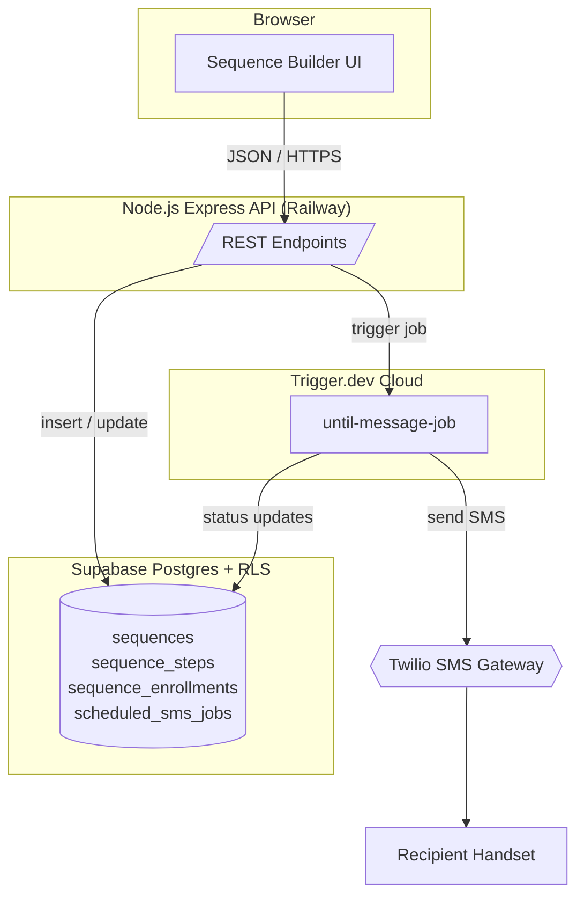
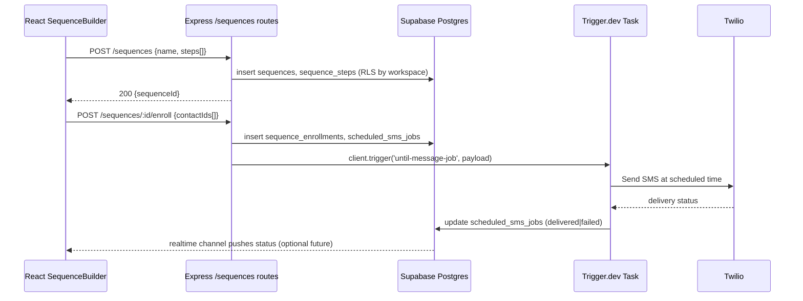

## 1. Overview

### Purpose & Scope
* Provide automated, multi-step SMS “Sequences” (a.k.a. drip campaigns).
* UI already exists (see screenshots); this plan covers server data model, API endpoints, Trigger.dev jobs, and wiring to the React components.
* **Non-goals**: Email support, advanced branching, analytics (see §9).

### Stakeholders
| Role | Interest |
|------|----------|
| End-User | Can create / edit / launch Sequences to contacts |
| Product | Feature completeness & UX consistency |
| Back-end Eng | Reliable message scheduling, tenant isolation |
| Front-end Eng | Clean hooks / services to persist & fetch data |
| DevOps | Observability, cost control on Trigger.dev |

---

## 2. What It Does (Capabilities)
- Create / update / archive a Sequence (name, status, workspace-scoped)
- Add N ordered message steps (body, delay X {minutes|hours|days|weeks})
- Enroll contacts → generates individual *scheduled_sms_jobs* rows
- Pause / resume enrollment (updates *status*)
- Success criteria: messages send on time, RLS respected, UI reflects statuses
- Errors: invalid workspace, Twilio creds missing, exceeding SMS credits, bad delay (<1m) – surfaced via toast & logged.

---

## 3. User Flow

```mermaid
flowchart LR
    A(User opens Sequences page) --> B(Taps "+ Sequence")
    B --> C(Fills name & steps)
    C --> D(Clicks Save)
    D --> E(POST /sequences)
    E --> F[Supabase inserts\n sequence + steps]
    F --> G(Enroll contacts?)
    G -->|Yes| H(POST /sequences/:id/enroll)
    H --> I[scheduleTriggerJobs()]
    I --> J(Trigger.dev until-message-job)
    J --> K(Twilio SMS)
    K --> L(Contact receives msg)
```

ASCII equivalent:
```
User -> [+ Sequence] -> Fills Form -> [Save]
        \-> POST /sequences -> Supabase rows
        \-> (optional) Enroll API -> Trigger.dev jobs -> Twilio -> Phone
```

### High-Level Architecture



---

## 4. Front-end ⇄ Back-end Flow


ASCII:
```
FE -> API -> DB (rows) -> TG (job) -> TW (SMS) -> TG -> DB
```

---

## 5. File Structure (new/changed only)
```
backend/
  routes/
    sequences.js        # REST endpoints
  models/
    sequenceService.js  # DB helpers
  trigger/
    sequenceTasks.js    # Wrapper to call until-message-job per step
frontend/src/components/flow-builder/sequences/
  hooks/
    useSequencesApi.js  # CRUD + enroll
  context/
    SequenceContext.js  # local state, optimistic updates
  ...existing UI files remain
migrations/
  20250524_sequences.sql
```

---

## 6. Data & Logic Artifacts
| Name | Module / Table | Purpose | In | Out |
|------|----------------|---------|----|-----|
| sequences | `tbl_sequences` | Drip campaign header | name, status, workspace_id | id |
| sequence_steps | `tbl_sequence_steps` | Ordered messages | seq_id, idx, delay_unit, delay_value, body, media_url | id |
| sequence_enrollments | `tbl_sequence_enrollments` | Contact x Sequence linkage | seq_id, contact_id, started_at | id |
| scheduled_sms_jobs (existing)| trigger service relies | One row per message instance | to_phone, body, send_at | status |
| RLS policies | db | Ensure workspace isolation | — | — |
| `POST /sequences` | routes | create / update | JSON | 200/4xx |
| `POST /sequences/:id/enroll` | routes | bulk enroll | JSON | 202 Accepted |
| `sequenceTasks.scheduleSteps()` | trigger side | iterate steps, call wait.until | enrollment row | job handles |

---

## 7. User Stories
1. As a **manager** I want to create a Sequence so that I can automate follow-up SMS.
2. As a **user** I want to preview each SMS step to ensure content is correct.
3. As a **user** I want steps delayed in **minutes/hours/days/weeks** so timing is flexible.
4. As a **user** I want to enroll **multiple contacts** simultaneously so I save time.
5. As a **user** I want to see if a Sequence is **active/paused** so I know its status.
6. As a **manager** I want RLS enforced so contacts in other workspaces are not affected.
7. As a **user** I want errors (e.g. Twilio auth) surfaced clearly so I can fix them.
8. As a **developer** I want jobs retried up to 3× so transient failures self-heal.
9. As a **support** I want audit logs of every SMS sent so we can troubleshoot disputes.
10. As a **manager** I want to archive a Sequence to stop future sends without deleting history.

---

## 8. Implementation Stages
| Phase | Deliverables | Effort |
|-------|--------------|--------|
| 1. DB Migration | tables + RLS + indexes | 2d |
| 2. API Layer | `routes/sequences.js`, service tests | 2d |
| 3. Trigger Tasks | `sequenceTasks.scheduleSteps` util | 1d |
| 4. FE Hooks | `useSequencesApi` for CRUD & enroll | 1d |
| 5. UI Wire-up | call hooks from existing components | 1d |
| 6. E2E Test | Cypress happy path + failure | 1d |
| 7. Beta Feedback | bugfixes, perf checks | 2d |

---

## 9. Future Roadmap
- Conditional branching (if contact replies, stop sequence)
- Email + voice drop channel support (multi-medium)
- Analytics dashboard (open / reply rates)
- Sequence templates & import/export
- Bulkhead pattern to throttle sends per workspace
- Horizontal scaling: use Trigger.dev queue sharding, Supabase read replicas
- GDPR delete: cascade delete enrollment + jobs

---

### References
* Trigger.dev docs – wait.until examples
* Twilio Messaging API best practices
* Postgres RLS official guide
* Martin Fowler – Retry pattern
