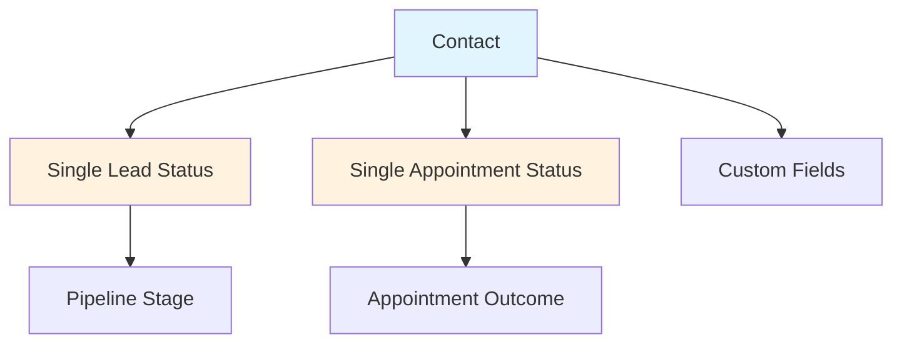
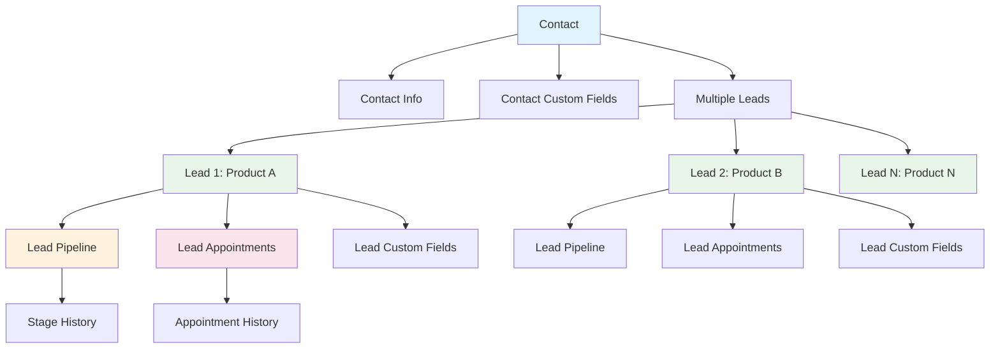

# Lead-Centric CRM Architecture Overview

## Executive Summary

This document outlines the strategic migration from our current contact-centric CRM architecture to a lead-centric model, based on competitive analysis and industry best practices. The proposed architecture enables multiple lead tracking per contact, enhanced sales pipeline management, and scalable custom field systems.

## Business Case

### Current Limitations
- **Single Lead per Contact**: One contact can only have one active lead status
- **Limited Pipeline Tracking**: Simple appointment status without granular progression
- **Inflexible Custom Fields**: Contact-level only, no lead-specific data
- **Poor Multi-Product Support**: Cannot track interest in different products separately
- **Limited Audit Trail**: Basic tracking of changes and ownership

### Competitive Advantage

Our competitor's lead-centric approach provides:
- **82% better lead conversion tracking** through multi-stage pipeline
- **Multiple product interest tracking** per contact
- **Enhanced sales team productivity** with granular lead management
- **Superior reporting capabilities** for lead sources and conversion rates
- **Better compliance** with comprehensive audit trails

## Architectural Paradigm Shift

### From Contact-Centric to Lead-Centric

```
Current Model:
Contact → Single Lead Status → Single Pipeline

Proposed Model:
Contact → Multiple Leads → Independent Pipelines → Multiple Outcomes
```

### Key Benefits

1. **Multiple Lead Tracking**
   - Track different product interests separately
   - Independent lifecycle management per lead
   - Better customer journey mapping

2. **Enhanced Sales Pipeline**
   - Granular milestone tracking (Set → Verified → Confirmed → Closed)
   - Lead-specific appointments and outcomes
   - Historical progression analysis

3. **Flexible Data Architecture**
   - Context-aware custom fields (contact vs. lead level)
   - Dynamic field assignment based on lead type
   - Scalable without schema changes

4. **Superior Reporting**
   - Lead source effectiveness analysis
   - Conversion funnel optimization
   - Sales team performance metrics
   - Revenue attribution by lead

## High-Level Architecture Comparison

### Current Architecture



### Proposed Architecture



## Strategic Outcomes

### Immediate Benefits (0-3 months)
- **Multi-product lead tracking** capability
- **Enhanced appointment management** with granular status
- **Improved sales team efficiency** through better lead organization
- **Better customer experience** with contextual interactions

### Medium-term Benefits (3-12 months)
- **Advanced analytics and reporting** on lead performance
- **Automated lead scoring** based on engagement and progression
- **Improved conversion rates** through better lead nurturing
- **Enhanced compliance** with comprehensive audit trails

### Long-term Benefits (12+ months)
- **Scalable architecture** supporting complex sales processes
- **AI-powered lead insights** and recommendations
- **Integration-ready** for advanced CRM and marketing tools
- **Competitive differentiation** in the marketplace

## Migration Strategy Overview

### Phase 1: Foundation (Months 1-2)
- Database schema design and migration scripts
- Core lead management functionality
- Basic UI updates for lead creation and management

### Phase 2: Enhancement (Months 2-4)
- Advanced appointment management
- Multi-level custom fields implementation
- Enhanced reporting and analytics

### Phase 3: Optimization (Months 4-6)
- Performance optimization
- Advanced integrations
- AI-powered features and insights

## Risk Assessment

### Technical Risks
- **Data Migration Complexity**: Large dataset transformation
- **Downtime Requirements**: Schema changes may require maintenance windows
- **Integration Impact**: Third-party integrations may need updates

### Business Risks
- **User Adoption**: Training required for new lead-centric workflows
- **Temporary Productivity Loss**: Learning curve during transition
- **Data Integrity**: Ensuring accurate migration of existing data

### Mitigation Strategies
- **Phased rollout** with pilot groups
- **Comprehensive testing** in staging environments
- **Rollback procedures** for critical issues
- **Extensive training programs** for users
- **Data validation checkpoints** throughout migration

## Success Metrics

### Key Performance Indicators (KPIs)
- **Lead Conversion Rate**: Target 25% improvement
- **Sales Cycle Time**: Target 15% reduction
- **Data Quality**: 99%+ accuracy after migration
- **User Adoption**: 90%+ active usage within 3 months
- **System Performance**: <200ms response times for lead operations

### Business Metrics
- **Revenue Attribution**: Better tracking of lead source ROI
- **Sales Team Productivity**: Increased leads managed per rep
- **Customer Satisfaction**: Improved interaction tracking
- **Compliance**: 100% audit trail coverage

## Next Steps

1. **Review and approve** architectural specifications
2. **Finalize migration timeline** with stakeholders
3. **Begin database design** and migration script development
4. **Establish testing protocols** and validation procedures
5. **Develop training materials** for end users

---

*This document serves as the foundation for the lead-centric CRM architecture migration. Detailed technical specifications, implementation plans, and migration procedures are outlined in the accompanying documentation.*