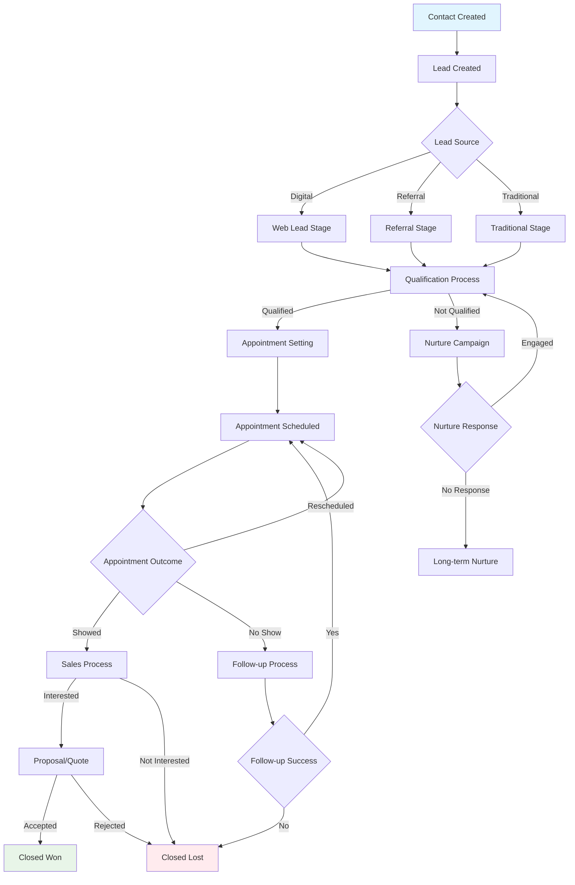
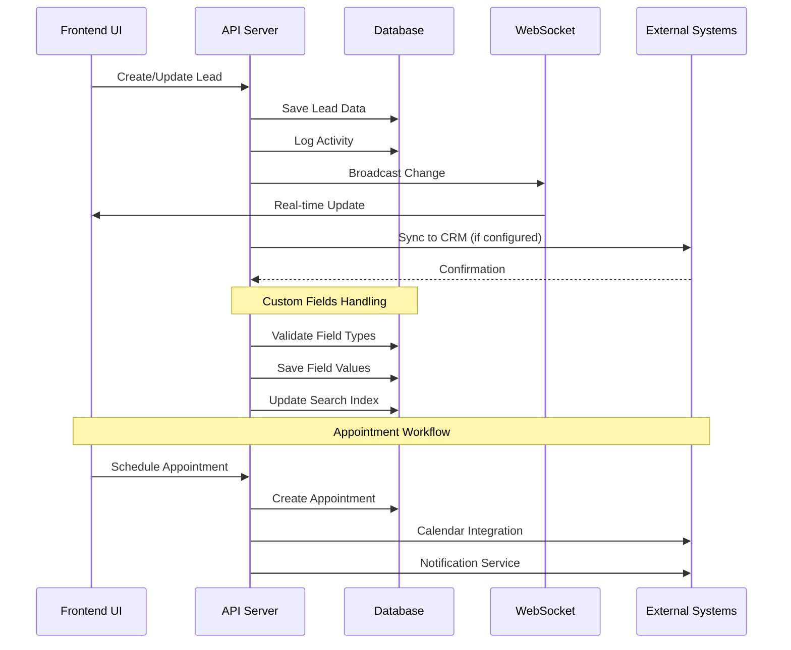

# Lead-Centric CRM Technical Specification

## Overview

This document provides the complete technical specification for implementing the lead-centric CRM architecture, including database schema design, API specifications, migration procedures, and system requirements.

## Database Schema Design

### Entity Relationship Diagram

```
┌─────────────────────────────────────────────────────────────────────────────┐
│                    DATABASE ENTITY RELATIONSHIPS                            │
└─────────────────────────────────────────────────────────────────────────────┘

                              ┌──────────────┐
                              │  WORKSPACES  │
                              └───────┬──────┘
                                      │
        ┌─────────────────────────────┼─────────────────────────────┐
        │                             │                             │
        │ (1:N)                       │ (1:N)                       │ (1:N)
        ▼                             ▼                             ▼
┌───────────────┐            ┌────────────────┐          ┌──────────────────┐
│   CONTACTS    │            │     LEADS      │          │ PIPELINE_STAGES  │
├───────────────┤            ├────────────────┤          ├──────────────────┤
│ • id (PK)     │───────────>│ • id (PK)      │<─────────│ • id (PK)        │
│ • workspace   │   (1:N)    │ • contact_id   │  (N:1)   │ • workspace_id   │
│ • firstname   │            │ • workspace_id │          │ • name           │
│ • lastname    │            │ • product      │          │ • category       │
│ • email       │            │ • stage_id     │          │ • display_order  │
│ • phone       │            │ • source_id    │          └──────────────────┘
│ • address     │            │ • disposition  │
│ • metadata    │            │ • value        │
└───────┬───────┘            │ • owner_id     │
        │                    └────────┬───────┘
        │                             │
        │ (1:N)                       │ (1:N)
        ▼                             ▼
┌───────────────────┐      ┌──────────────────────┐
│ CONTACT_CUSTOM_   │      │ LEAD_APPOINTMENTS    │
│ FIELDS            │      ├──────────────────────┤
├───────────────────┤      │ • id (PK)            │
│ • contact_id (FK) │      │ • lead_id (FK)       │
│ • field_id (FK)   │      │ • appointment_date   │
│ • value           │      │ • status             │
└───────────────────┘      │ • outcome            │
                           │ • set_by (FK→users)  │
        │                  │ • verified_by (FK)   │
        │ (1:N)            │ • confirmed_by (FK)  │
        ▼                  └──────────────────────┘
┌───────────────────┐
│ CONTACT_          │              │ (1:N)
│ ACTIVITIES        │              ▼
├───────────────────┤      ┌──────────────────────┐
│ • id (PK)         │      │ LEAD_CUSTOM_FIELDS   │
│ • contact_id (FK) │      ├──────────────────────┤
│ • activity_type   │      │ • lead_id (FK)       │
│ • description     │      │ • field_id (FK)      │
└───────────────────┘      │ • value              │
                           └──────────────────────┘
        │ (1:N)
        ▼                          │ (1:N)
┌───────────────────┐              ▼
│ CONTACT_          │      ┌──────────────────────┐
│ ASSIGNMENTS       │      │ LEAD_ACTIVITIES      │
├───────────────────┤      ├──────────────────────┤
│ • contact_id (FK) │      │ • id (PK)            │
│ • user_id (FK)    │      │ • lead_id (FK)       │
│ • assigned_at     │      │ • activity_type      │
└───────────────────┘      │ • description        │
                           └──────────────────────┘

                                   │ (1:N)
                                   ▼
                           ┌──────────────────────┐
                           │ LEAD_STAGE_HISTORY   │
                           ├──────────────────────┤
                           │ • id (PK)            │
                           │ • lead_id (FK)       │
                           │ • from_stage_id (FK) │
                           │ • to_stage_id (FK)   │
                           │ • changed_at         │
                           │ • changed_by (FK)    │
                           └──────────────────────┘

                                   │ (1:N)
                                   ▼
                           ┌──────────────────────┐
                           │ LEAD_JOBS            │
                           ├──────────────────────┤
                           │ • id (PK)            │
                           │ • lead_id (FK)       │
                           │ • job_details        │
                           └──────────────────────┘


┌────────────────────────────┐         ┌──────────────────────┐
│ CUSTOM_FIELD_DEFINITIONS   │────────>│ LEAD_SOURCES         │
├────────────────────────────┤  (1:N)  ├──────────────────────┤
│ • id (PK)                  │         │ • id (PK)            │
│ • workspace_id (FK)        │         │ • workspace_id (FK)  │
│ • name                     │         │ • name               │
│ • field_type               │         │ • category           │
│ • context (contact/lead)   │         │ • is_active          │
│ • configuration            │         └──────────────────────┘
│ • is_required              │
└────────────┬───────────────┘
             │
             │ (1:N)
             ├───────────────────────────────┐
             │                               │
             ▼                               ▼
    ┌────────────────────┐         ┌────────────────────┐
    │ CONTACT_CUSTOM_    │         │ LEAD_CUSTOM_       │
    │ FIELDS             │         │ FIELDS             │
    └────────────────────┘         └────────────────────┘


KEY RELATIONSHIPS:
═══════════════════════════════════════════════════════════════
• WORKSPACES (1) ──────> (N) CONTACTS
• WORKSPACES (1) ──────> (N) LEADS
• WORKSPACES (1) ──────> (N) PIPELINE_STAGES
• WORKSPACES (1) ──────> (N) CUSTOM_FIELD_DEFINITIONS
• WORKSPACES (1) ──────> (N) LEAD_SOURCES

• CONTACTS (1) ────────> (N) LEADS
• CONTACTS (1) ────────> (N) CONTACT_CUSTOM_FIELDS
• CONTACTS (1) ────────> (N) CONTACT_ACTIVITIES
• CONTACTS (1) ────────> (N) CONTACT_ASSIGNMENTS

• LEADS (1) ───────────> (N) LEAD_APPOINTMENTS
• LEADS (1) ───────────> (N) LEAD_CUSTOM_FIELDS
• LEADS (1) ───────────> (N) LEAD_ACTIVITIES
• LEADS (1) ───────────> (N) LEAD_STAGE_HISTORY
• LEADS (1) ───────────> (N) LEAD_JOBS

• PIPELINE_STAGES (1) ─> (N) LEADS (current_stage)
• LEAD_SOURCES (1) ────> (N) LEADS (source)
• USERS (1) ───────────> (N) CONTACT_ASSIGNMENTS
• USERS (1) ───────────> (N) LEAD_APPOINTMENTS

CARDINALITY NOTATION:
═══════════════════════════════════════════════════════════════
(1) ──> (N) = One-to-Many relationship
(N) ──> (1) = Many-to-One relationship


DETAILED FIELD SPECIFICATIONS:
═══════════════════════════════════════════════════════════════

    CONTACTS {
        uuid id PK
        text workspace_id FK
        varchar firstname
        varchar lastname
        varchar email
        varchar phone_number
        varchar address_1
        varchar address_2
        varchar city
        varchar state
        varchar zip_code
        jsonb metadata
        text notes
        jsonb tags
        boolean is_favorite
        boolean is_archived
        text priority
        timestamp created_at
        timestamp updated_at
        uuid created_by FK
        uuid updated_by FK
    }
    
    LEADS {
        uuid id PK
        uuid contact_id FK
        text workspace_id FK
        varchar product_interest
        uuid lead_source_id FK
        uuid current_stage_id FK
        varchar disposition
        text notes
        boolean is_active
        boolean is_qualified
        boolean is_closed_won
        boolean is_closed_lost
        decimal lead_value
        date expected_close_date
        timestamp last_activity_at
        uuid owner_id FK
        timestamp created_at
        timestamp updated_at
        uuid created_by FK
        uuid updated_by FK
    }
    
    LEAD_APPOINTMENTS {
        uuid id PK
        uuid lead_id FK
        timestamp appointment_date
        varchar status
        varchar outcome
        text notes
        uuid set_by FK
        uuid verified_by FK
        uuid confirmed_by FK
        timestamp set_date
        timestamp verified_date
        timestamp confirmed_date
        timestamp created_at
        timestamp updated_at
        uuid created_by FK
        uuid updated_by FK
    }
    
    PIPELINE_STAGES {
        uuid id PK
        text workspace_id FK
        varchar name
        varchar category
        integer display_order
        boolean is_active
        boolean is_completed
        varchar stage_type
        jsonb configuration
        timestamp created_at
        timestamp updated_at
        uuid created_by FK
    }
    
    LEAD_STAGE_HISTORY {
        uuid id PK
        uuid lead_id FK
        uuid from_stage_id FK
        uuid to_stage_id FK
        text reason
        text notes
        timestamp changed_at
        uuid changed_by FK
    }
    
    CUSTOM_FIELD_DEFINITIONS {
        uuid id PK
        text workspace_id FK
        varchar name
        varchar label
        varchar field_type
        varchar context
        jsonb configuration
        boolean is_required
        boolean is_active
        text description
        integer display_order
        timestamp created_at
        timestamp updated_at
        uuid created_by FK
    }
    
    CONTACT_CUSTOM_FIELDS {
        uuid contact_id FK
        uuid field_id FK
        jsonb value
        timestamp created_at
        timestamp updated_at
        uuid created_by FK
        uuid updated_by FK
    }
    
    LEAD_CUSTOM_FIELDS {
        uuid lead_id FK
        uuid field_id FK
        jsonb value
        timestamp created_at
        timestamp updated_at
        uuid created_by FK
        uuid updated_by FK
    }
    
    LEAD_SOURCES {
        uuid id PK
        text workspace_id FK
        varchar name
        varchar category
        text description
        boolean is_active
        timestamp created_at
        timestamp updated_at
        uuid created_by FK
    }
```

### Core Table Specifications

#### 1. Contacts Table (Enhanced)

```sql
CREATE TABLE contacts (
    id UUID PRIMARY KEY DEFAULT gen_random_uuid(),
    workspace_id TEXT NOT NULL REFERENCES workspaces(id),
    
    -- Basic Information
    firstname VARCHAR(255) NOT NULL,
    lastname VARCHAR(255) NOT NULL,
    email VARCHAR(255),
    phone_number VARCHAR(50),
    
    -- Address Information
    address_1 VARCHAR(255),
    address_2 VARCHAR(255),
    city VARCHAR(100),
    state VARCHAR(50),
    zip_code VARCHAR(20),
    
    -- Metadata and Notes
    metadata JSONB,
    notes TEXT,
    tags JSONB DEFAULT '[]'::jsonb,
    
    -- Status Flags
    is_favorite BOOLEAN DEFAULT FALSE,
    is_archived BOOLEAN DEFAULT FALSE,
    priority TEXT CHECK (priority IN ('low', 'medium', 'high')),
    
    -- Audit Fields
    created_at TIMESTAMP WITH TIME ZONE DEFAULT NOW(),
    updated_at TIMESTAMP WITH TIME ZONE DEFAULT NOW(),
    created_by UUID REFERENCES users(id),
    updated_by UUID REFERENCES users(id),
    
    -- Indexes
    CONSTRAINT contacts_workspace_email_unique UNIQUE (workspace_id, email),
    CONSTRAINT contacts_workspace_phone_unique UNIQUE (workspace_id, phone_number)
);

-- Indexes for performance
CREATE INDEX idx_contacts_workspace_id ON contacts(workspace_id);
CREATE INDEX idx_contacts_created_at ON contacts(created_at DESC);
CREATE INDEX idx_contacts_updated_at ON contacts(updated_at DESC);
CREATE INDEX idx_contacts_name ON contacts(firstname, lastname);
CREATE INDEX idx_contacts_email ON contacts(email) WHERE email IS NOT NULL;
CREATE INDEX idx_contacts_phone ON contacts(phone_number) WHERE phone_number IS NOT NULL;
CREATE INDEX idx_contacts_is_archived ON contacts(is_archived) WHERE is_archived = FALSE;
```

#### 2. Leads Table (New)

```sql
CREATE TABLE leads (
    id UUID PRIMARY KEY DEFAULT gen_random_uuid(),
    contact_id UUID NOT NULL REFERENCES contacts(id) ON DELETE CASCADE,
    workspace_id TEXT NOT NULL REFERENCES workspaces(id),
    
    -- Lead Information
    product_interest VARCHAR(255),
    lead_source_id UUID REFERENCES lead_sources(id),
    current_stage_id UUID REFERENCES pipeline_stages(id),
    disposition VARCHAR(100),
    notes TEXT,
    
    -- Status Tracking
    is_active BOOLEAN DEFAULT TRUE,
    is_qualified BOOLEAN DEFAULT FALSE,
    is_closed_won BOOLEAN DEFAULT FALSE,
    is_closed_lost BOOLEAN DEFAULT FALSE,
    
    -- Business Information
    lead_value DECIMAL(12,2),
    expected_close_date DATE,
    last_activity_at TIMESTAMP WITH TIME ZONE,
    
    -- Assignment
    owner_id UUID REFERENCES users(id),
    
    -- Audit Fields
    created_at TIMESTAMP WITH TIME ZONE DEFAULT NOW(),
    updated_at TIMESTAMP WITH TIME ZONE DEFAULT NOW(),
    created_by UUID REFERENCES users(id),
    updated_by UUID REFERENCES users(id),
    
    -- Constraints
    CONSTRAINT leads_valid_status CHECK (
        (is_closed_won = TRUE AND is_closed_lost = FALSE) OR
        (is_closed_won = FALSE AND is_closed_lost = TRUE) OR
        (is_closed_won = FALSE AND is_closed_lost = FALSE)
    )
);

-- Indexes for performance
CREATE INDEX idx_leads_contact_id ON leads(contact_id);
CREATE INDEX idx_leads_workspace_id ON leads(workspace_id);
CREATE INDEX idx_leads_current_stage_id ON leads(current_stage_id);
CREATE INDEX idx_leads_owner_id ON leads(owner_id);
CREATE INDEX idx_leads_is_active ON leads(is_active) WHERE is_active = TRUE;
CREATE INDEX idx_leads_created_at ON leads(created_at DESC);
CREATE INDEX idx_leads_last_activity_at ON leads(last_activity_at DESC NULLS LAST);
CREATE INDEX idx_leads_expected_close_date ON leads(expected_close_date) WHERE expected_close_date IS NOT NULL;
```

#### 3. Lead Appointments Table (New)

```sql
CREATE TABLE lead_appointments (
    id UUID PRIMARY KEY DEFAULT gen_random_uuid(),
    lead_id UUID NOT NULL REFERENCES leads(id) ON DELETE CASCADE,
    
    -- Appointment Information
    appointment_date TIMESTAMP WITH TIME ZONE,
    status VARCHAR(50) NOT NULL DEFAULT 'scheduled', -- scheduled, set, verified, confirmed, completed, cancelled
    outcome VARCHAR(100), -- showed, no_show, rescheduled, cancelled, sold, etc.
    notes TEXT,
    
    -- Workflow Tracking
    set_by UUID REFERENCES users(id),
    verified_by UUID REFERENCES users(id),
    confirmed_by UUID REFERENCES users(id),
    
    -- Workflow Timestamps
    set_date TIMESTAMP WITH TIME ZONE,
    verified_date TIMESTAMP WITH TIME ZONE,
    confirmed_date TIMESTAMP WITH TIME ZONE,
    
    -- Audit Fields
    created_at TIMESTAMP WITH TIME ZONE DEFAULT NOW(),
    updated_at TIMESTAMP WITH TIME ZONE DEFAULT NOW(),
    created_by UUID REFERENCES users(id),
    updated_by UUID REFERENCES users(id),
    
    -- Constraints
    CONSTRAINT appointments_valid_status CHECK (status IN ('scheduled', 'set', 'verified', 'confirmed', 'completed', 'cancelled'))
);

-- Indexes for performance
CREATE INDEX idx_appointments_lead_id ON lead_appointments(lead_id);
CREATE INDEX idx_appointments_appointment_date ON lead_appointments(appointment_date);
CREATE INDEX idx_appointments_status ON lead_appointments(status);
CREATE INDEX idx_appointments_set_by ON lead_appointments(set_by);
CREATE INDEX idx_appointments_created_at ON lead_appointments(created_at DESC);
```

#### 4. Pipeline Stages Table (Enhanced)

```sql
CREATE TABLE pipeline_stages (
    id UUID PRIMARY KEY DEFAULT gen_random_uuid(),
    workspace_id TEXT NOT NULL REFERENCES workspaces(id),
    
    -- Stage Information
    name VARCHAR(255) NOT NULL,
    category VARCHAR(100), -- lead_status, appointment_status, result_status
    display_order INTEGER NOT NULL DEFAULT 0,
    
    -- Stage Properties
    is_active BOOLEAN DEFAULT TRUE,
    is_completed BOOLEAN DEFAULT FALSE,
    stage_type VARCHAR(50), -- milestone, process, outcome
    
    -- Configuration
    configuration JSONB DEFAULT '{}'::jsonb,
    
    -- Audit Fields
    created_at TIMESTAMP WITH TIME ZONE DEFAULT NOW(),
    updated_at TIMESTAMP WITH TIME ZONE DEFAULT NOW(),
    created_by UUID REFERENCES users(id),
    
    -- Constraints
    CONSTRAINT stages_workspace_name_unique UNIQUE (workspace_id, name, category)
);

-- Indexes for performance
CREATE INDEX idx_stages_workspace_id ON pipeline_stages(workspace_id);
CREATE INDEX idx_stages_category ON pipeline_stages(category);
CREATE INDEX idx_stages_display_order ON pipeline_stages(display_order);
CREATE INDEX idx_stages_is_active ON pipeline_stages(is_active) WHERE is_active = TRUE;
```

#### 5. Lead Stage History Table (New)

```sql
CREATE TABLE lead_stage_history (
    id UUID PRIMARY KEY DEFAULT gen_random_uuid(),
    lead_id UUID NOT NULL REFERENCES leads(id) ON DELETE CASCADE,
    
    -- Stage Change Information
    from_stage_id UUID REFERENCES pipeline_stages(id),
    to_stage_id UUID NOT NULL REFERENCES pipeline_stages(id),
    reason TEXT,
    notes TEXT,
    
    -- Change Information
    changed_at TIMESTAMP WITH TIME ZONE DEFAULT NOW(),
    changed_by UUID REFERENCES users(id)
);

-- Indexes for performance
CREATE INDEX idx_stage_history_lead_id ON lead_stage_history(lead_id);
CREATE INDEX idx_stage_history_changed_at ON lead_stage_history(changed_at DESC);
CREATE INDEX idx_stage_history_to_stage_id ON lead_stage_history(to_stage_id);
```

#### 6. Custom Field Definitions Table (Enhanced)

```sql
CREATE TABLE custom_field_definitions (
    id UUID PRIMARY KEY DEFAULT gen_random_uuid(),
    workspace_id TEXT NOT NULL REFERENCES workspaces(id),
    
    -- Field Definition
    name VARCHAR(255) NOT NULL,
    label VARCHAR(255) NOT NULL,
    field_type VARCHAR(50) NOT NULL, -- text, number, date, boolean, select, multi_select
    context VARCHAR(50) NOT NULL, -- contact, lead
    
    -- Field Configuration
    configuration JSONB DEFAULT '{}'::jsonb, -- options, validation rules, etc.
    is_required BOOLEAN DEFAULT FALSE,
    is_active BOOLEAN DEFAULT TRUE,
    description TEXT,
    display_order INTEGER DEFAULT 0,
    
    -- Audit Fields
    created_at TIMESTAMP WITH TIME ZONE DEFAULT NOW(),
    updated_at TIMESTAMP WITH TIME ZONE DEFAULT NOW(),
    created_by UUID REFERENCES users(id),
    
    -- Constraints
    CONSTRAINT custom_fields_workspace_name_context_unique UNIQUE (workspace_id, name, context),
    CONSTRAINT custom_fields_valid_field_type CHECK (field_type IN ('text', 'number', 'date', 'boolean', 'select', 'multi_select')),
    CONSTRAINT custom_fields_valid_context CHECK (context IN ('contact', 'lead'))
);

-- Indexes for performance
CREATE INDEX idx_custom_fields_workspace_id ON custom_field_definitions(workspace_id);
CREATE INDEX idx_custom_fields_context ON custom_field_definitions(context);
CREATE INDEX idx_custom_fields_is_active ON custom_field_definitions(is_active) WHERE is_active = TRUE;
CREATE INDEX idx_custom_fields_display_order ON custom_field_definitions(display_order);
```

#### 7. Lead Custom Fields Table (New)

```sql
CREATE TABLE lead_custom_fields (
    lead_id UUID NOT NULL REFERENCES leads(id) ON DELETE CASCADE,
    field_id UUID NOT NULL REFERENCES custom_field_definitions(id) ON DELETE CASCADE,
    value JSONB NOT NULL,
    
    -- Audit Fields
    created_at TIMESTAMP WITH TIME ZONE DEFAULT NOW(),
    updated_at TIMESTAMP WITH TIME ZONE DEFAULT NOW(),
    created_by UUID REFERENCES users(id),
    updated_by UUID REFERENCES users(id),
    
    -- Constraints
    PRIMARY KEY (lead_id, field_id)
);

-- Indexes for performance
CREATE INDEX idx_lead_custom_fields_lead_id ON lead_custom_fields(lead_id);
CREATE INDEX idx_lead_custom_fields_field_id ON lead_custom_fields(field_id);
CREATE INDEX idx_lead_custom_fields_value ON lead_custom_fields USING GIN (value);
```

#### 8. Lead Sources Table (New)

```sql
CREATE TABLE lead_sources (
    id UUID PRIMARY KEY DEFAULT gen_random_uuid(),
    workspace_id TEXT NOT NULL REFERENCES workspaces(id),
    
    -- Source Information
    name VARCHAR(255) NOT NULL,
    category VARCHAR(100), -- digital, traditional, referral, etc.
    description TEXT,
    
    -- Status
    is_active BOOLEAN DEFAULT TRUE,
    
    -- Audit Fields
    created_at TIMESTAMP WITH TIME ZONE DEFAULT NOW(),
    updated_at TIMESTAMP WITH TIME ZONE DEFAULT NOW(),
    created_by UUID REFERENCES users(id),
    
    -- Constraints
    CONSTRAINT lead_sources_workspace_name_unique UNIQUE (workspace_id, name)
);

-- Indexes for performance
CREATE INDEX idx_lead_sources_workspace_id ON lead_sources(workspace_id);
CREATE INDEX idx_lead_sources_category ON lead_sources(category);
CREATE INDEX idx_lead_sources_is_active ON lead_sources(is_active) WHERE is_active = TRUE;
```

## API Specifications

### REST API Endpoints

#### Contact Management

```typescript
// Get contact with leads
GET /api/v2/contacts/{contactId}
Response: {
  id: string;
  workspace_id: string;
  firstname: string;
  lastname: string;
  email: string;
  phone_number: string;
  address_1: string;
  city: string;
  state: string;
  zip_code: string;
  is_favorite: boolean;
  priority: 'low' | 'medium' | 'high';
  tags: string[];
  leads: Lead[];
  custom_fields: ContactCustomField[];
  created_at: string;
  updated_at: string;
}

// Update contact
PUT /api/v2/contacts/{contactId}
Request: {
  firstname?: string;
  lastname?: string;
  email?: string;
  phone_number?: string;
  address_1?: string;
  city?: string;
  state?: string;
  zip_code?: string;
  is_favorite?: boolean;
  priority?: 'low' | 'medium' | 'high';
  tags?: string[];
}
```

#### Lead Management

```typescript
// Create new lead
POST /api/v2/leads
Request: {
  contact_id: string;
  product_interest: string;
  lead_source_id: string;
  current_stage_id: string;
  disposition?: string;
  notes?: string;
  lead_value?: number;
  expected_close_date?: string;
  owner_id?: string;
  custom_fields?: LeadCustomFieldInput[];
}

// Update lead
PUT /api/v2/leads/{leadId}
Request: {
  product_interest?: string;
  current_stage_id?: string;
  disposition?: string;
  notes?: string;
  lead_value?: number;
  expected_close_date?: string;
  owner_id?: string;
  is_qualified?: boolean;
  is_closed_won?: boolean;
  is_closed_lost?: boolean;
}

// Get lead details
GET /api/v2/leads/{leadId}
Response: {
  id: string;
  contact_id: string;
  workspace_id: string;
  product_interest: string;
  lead_source: LeadSource;
  current_stage: PipelineStage;
  disposition: string;
  notes: string;
  is_active: boolean;
  is_qualified: boolean;
  is_closed_won: boolean;
  is_closed_lost: boolean;
  lead_value: number;
  expected_close_date: string;
  last_activity_at: string;
  owner: User;
  appointments: LeadAppointment[];
  custom_fields: LeadCustomField[];
  stage_history: LeadStageHistory[];
  created_at: string;
  updated_at: string;
}

// List leads with filters
GET /api/v2/leads?workspace_id={workspaceId}&stage_id={stageId}&owner_id={ownerId}&is_active={boolean}
Response: {
  leads: Lead[];
  pagination: PaginationInfo;
  filters: FilterInfo;
}
```

#### Appointment Management

```typescript
// Create appointment
POST /api/v2/leads/{leadId}/appointments
Request: {
  appointment_date: string;
  notes?: string;
  set_by?: string;
}

// Update appointment status
PUT /api/v2/appointments/{appointmentId}
Request: {
  status: 'scheduled' | 'set' | 'verified' | 'confirmed' | 'completed' | 'cancelled';
  outcome?: string;
  notes?: string;
  appointment_date?: string;
  verified_by?: string;
  confirmed_by?: string;
}

// Get appointment details
GET /api/v2/appointments/{appointmentId}
Response: {
  id: string;
  lead_id: string;
  appointment_date: string;
  status: string;
  outcome: string;
  notes: string;
  set_by: User;
  verified_by: User;
  confirmed_by: User;
  set_date: string;
  verified_date: string;
  confirmed_date: string;
  created_at: string;
  updated_at: string;
}
```

#### Custom Fields Management

```typescript
// Get custom field definitions
GET /api/v2/custom-fields?workspace_id={workspaceId}&context={context}
Response: {
  fields: CustomFieldDefinition[];
}

// Create custom field definition
POST /api/v2/custom-fields
Request: {
  workspace_id: string;
  name: string;
  label: string;
  field_type: 'text' | 'number' | 'date' | 'boolean' | 'select' | 'multi_select';
  context: 'contact' | 'lead';
  configuration: any;
  is_required: boolean;
  description?: string;
  display_order?: number;
}

// Update custom field value
PUT /api/v2/leads/{leadId}/custom-fields/{fieldId}
Request: {
  value: any;
}

PUT /api/v2/contacts/{contactId}/custom-fields/{fieldId}
Request: {
  value: any;
}
```

## Data Flow Architecture

### Lead Lifecycle Flow



### Data Synchronization Flow



## System Architecture

### Application Layer Structure

```ascii
┌─────────────────────────────────────────────────────────────┐
│                    Frontend Layer                           │
├─────────────────────────────────────────────────────────────┤
│ React Components                                            │
│ ├── ContactDetailView (Enhanced with Leads)                │
│ ├── LeadManagement (New)                                   │
│ ├── AppointmentScheduler (Enhanced)                        │
│ ├── CustomFieldsManager (Enhanced)                         │
│ └── ReportsAndAnalytics (Enhanced)                         │
└─────────────────────────────────────────────────────────────┘
                                │
                                ▼
┌─────────────────────────────────────────────────────────────┐
│                     API Layer                               │
├─────────────────────────────────────────────────────────────┤
│ REST API Endpoints                                          │
│ ├── /api/v2/contacts/**                                    │
│ ├── /api/v2/leads/**                                       │
│ ├── /api/v2/appointments/**                                │
│ ├── /api/v2/custom-fields/**                              │
│ └── /api/v2/pipeline-stages/**                            │
│                                                             │
│ Business Logic Services                                     │
│ ├── ContactService                                         │
│ ├── LeadService (New)                                      │
│ ├── AppointmentService (Enhanced)                          │
│ ├── CustomFieldService (Enhanced)                          │
│ └── ReportingService (Enhanced)                            │
└─────────────────────────────────────────────────────────────┘
                                │
                                ▼
┌─────────────────────────────────────────────────────────────┐
│                  Data Access Layer                          │
├─────────────────────────────────────────────────────────────┤
│ Repository Pattern                                          │
│ ├── ContactRepository                                       │
│ ├── LeadRepository (New)                                   │
│ ├── AppointmentRepository (New)                            │
│ └── CustomFieldRepository (Enhanced)                       │
│                                                             │
│ Database Abstraction                                        │
│ ├── Connection Pool Management                             │
│ ├── Query Optimization                                     │
│ ├── Transaction Management                                 │
│ └── Caching Layer                                          │
└─────────────────────────────────────────────────────────────┘
                                │
                                ▼
┌─────────────────────────────────────────────────────────────┐
│                   Database Layer                            │
├─────────────────────────────────────────────────────────────┤
│ PostgreSQL Database                                         │
│ ├── Core Tables (contacts, leads, appointments)            │
│ ├── Configuration Tables (stages, sources, fields)         │
│ ├── Audit Tables (activities, history)                     │
│ └── Support Tables (users, workspaces)                     │
│                                                             │
│ Database Features                                           │
│ ├── Row Level Security (RLS)                              │
│ ├── Full Text Search                                       │
│ ├── JSONB Custom Fields                                    │
│ ├── Audit Triggers                                         │
│ └── Performance Indexes                                    │
└─────────────────────────────────────────────────────────────┘
```

### Caching Strategy

```ascii
┌─────────────────┐    ┌─────────────────┐    ┌─────────────────┐
│   Browser       │    │   API Server    │    │   Database      │
│   Cache         │    │   Cache         │    │   Query Cache   │
├─────────────────┤    ├─────────────────┤    ├─────────────────┤
│ • Contact Info  │    │ • Lead Details  │    │ • Complex       │
│ • UI State      │    │ • Custom Fields │    │   Aggregations  │
│ • Preferences   │    │ • Pipeline      │    │ • Reporting     │
│                 │    │   Stages        │    │   Data          │
│ TTL: 5min       │    │                 │    │                 │
│                 │    │ TTL: 15min      │    │ TTL: 30min      │
└─────────────────┘    └─────────────────┘    └─────────────────┘
        │                        │                        │
        └────────────────────────┼────────────────────────┘
                                 │
                    ┌─────────────────┐
                    │   Redis Cache   │
                    │   (Optional)    │
                    ├─────────────────┤
                    │ • Session Data  │
                    │ • Real-time     │
                    │   Updates       │
                    │ • Notifications │
                    │                 │
                    │ TTL: Variable   │
                    └─────────────────┘
```

## Performance Considerations

### Query Optimization

#### 1. **Efficient Lead Queries**

```sql
-- Optimized lead query with proper joins and indexes
SELECT 
  l.*,
  c.firstname, c.lastname, c.email,
  ps.name as current_stage_name,
  ls.name as lead_source_name,
  u.full_name as owner_name
FROM leads l
JOIN contacts c ON l.contact_id = c.id
LEFT JOIN pipeline_stages ps ON l.current_stage_id = ps.id
LEFT JOIN lead_sources ls ON l.lead_source_id = ls.id
LEFT JOIN users u ON l.owner_id = u.id
WHERE l.workspace_id = $1
  AND l.is_active = TRUE
ORDER BY l.last_activity_at DESC NULLS LAST
LIMIT 50 OFFSET $2;

-- Supporting indexes
CREATE INDEX idx_leads_workspace_active_activity 
ON leads(workspace_id, is_active, last_activity_at DESC NULLS LAST);
```

#### 2. **Custom Fields Query Optimization**

```sql
-- Efficient custom fields loading
WITH lead_fields AS (
  SELECT 
    lcf.lead_id,
    json_agg(
      json_build_object(
        'field_id', cfd.id,
        'name', cfd.name,
        'label', cfd.label,
        'field_type', cfd.field_type,
        'value', lcf.value
      ) ORDER BY cfd.display_order
    ) as custom_fields
  FROM lead_custom_fields lcf
  JOIN custom_field_definitions cfd ON lcf.field_id = cfd.id
  WHERE cfd.context = 'lead' AND cfd.is_active = TRUE
  GROUP BY lcf.lead_id
)
SELECT l.*, lf.custom_fields
FROM leads l
LEFT JOIN lead_fields lf ON l.id = lf.lead_id
WHERE l.id = $1;
```

#### 3. **Appointment History Queries**

```sql
-- Efficient appointment history with workflow tracking
SELECT 
  la.*,
  sb.full_name as set_by_name,
  vb.full_name as verified_by_name,
  cb.full_name as confirmed_by_name
FROM lead_appointments la
LEFT JOIN users sb ON la.set_by = sb.id
LEFT JOIN users vb ON la.verified_by = vb.id
LEFT JOIN users cb ON la.confirmed_by = cb.id
WHERE la.lead_id = $1
ORDER BY la.appointment_date DESC;

-- Supporting index
CREATE INDEX idx_appointments_lead_date 
ON lead_appointments(lead_id, appointment_date DESC);
```

### Scalability Planning

#### 1. **Database Partitioning Strategy**

```sql
-- Partition leads table by workspace for large datasets
CREATE TABLE leads_partitioned (LIKE leads INCLUDING ALL)
PARTITION BY HASH (workspace_id);

-- Create partitions
CREATE TABLE leads_p0 PARTITION OF leads_partitioned
FOR VALUES WITH (MODULUS 4, REMAINDER 0);

CREATE TABLE leads_p1 PARTITION OF leads_partitioned
FOR VALUES WITH (MODULUS 4, REMAINDER 1);

-- Continue for p2, p3...
```

#### 2. **Read Replica Strategy**

```sql
-- Configure read replicas for reporting queries
-- Primary: Write operations (leads, appointments, custom fields)
-- Replica: Read operations (reports, analytics, search)

-- Example read-only query routing
SELECT 
  COUNT(*) as total_leads,
  COUNT(*) FILTER (WHERE is_qualified = TRUE) as qualified_leads,
  AVG(lead_value) as average_value
FROM leads 
WHERE workspace_id = $1 
  AND created_at >= NOW() - INTERVAL '30 days';
```

## Security Specifications

### Row Level Security (RLS) Policies

```sql
-- Enable RLS on all tables
ALTER TABLE contacts ENABLE ROW LEVEL SECURITY;
ALTER TABLE leads ENABLE ROW LEVEL SECURITY;
ALTER TABLE lead_appointments ENABLE ROW LEVEL SECURITY;
ALTER TABLE custom_field_definitions ENABLE ROW LEVEL SECURITY;
ALTER TABLE lead_custom_fields ENABLE ROW LEVEL SECURITY;

-- Contact access policy
CREATE POLICY contacts_workspace_access ON contacts
FOR ALL TO authenticated
USING (
  workspace_id IN (
    SELECT workspace_id 
    FROM user_workspaces 
    WHERE user_id = auth.uid()
  )
);

-- Lead access policy
CREATE POLICY leads_workspace_access ON leads
FOR ALL TO authenticated
USING (
  workspace_id IN (
    SELECT workspace_id 
    FROM user_workspaces 
    WHERE user_id = auth.uid()
  )
);

-- Lead assignment policy (additional restriction)
CREATE POLICY leads_owner_access ON leads
FOR UPDATE TO authenticated
USING (
  owner_id = auth.uid() OR 
  workspace_id IN (
    SELECT workspace_id 
    FROM user_workspaces 
    WHERE user_id = auth.uid() 
    AND role IN ('admin', 'manager')
  )
);
```

### Data Validation

```sql
-- Create custom field validation function
CREATE OR REPLACE FUNCTION validate_custom_field_value(
  field_type VARCHAR,
  field_config JSONB,
  field_value JSONB
) RETURNS BOOLEAN AS $$
BEGIN
  CASE field_type
    WHEN 'number' THEN
      RETURN jsonb_typeof(field_value) = 'number';
    WHEN 'boolean' THEN
      RETURN jsonb_typeof(field_value) = 'boolean';
    WHEN 'date' THEN
      BEGIN
        PERFORM field_value::text::date;
        RETURN TRUE;
      EXCEPTION
        WHEN others THEN RETURN FALSE;
      END;
    WHEN 'select' THEN
      RETURN field_value->>'value' = ANY(
        SELECT jsonb_array_elements_text(field_config->'options')
      );
    ELSE
      RETURN TRUE;
  END CASE;
END;
$$ LANGUAGE plpgsql;

-- Add validation triggers
CREATE OR REPLACE FUNCTION validate_lead_custom_field()
RETURNS TRIGGER AS $$
DECLARE
  field_def RECORD;
BEGIN
  SELECT field_type, configuration INTO field_def
  FROM custom_field_definitions 
  WHERE id = NEW.field_id;
  
  IF NOT validate_custom_field_value(field_def.field_type, field_def.configuration, NEW.value) THEN
    RAISE EXCEPTION 'Invalid value for field type %', field_def.field_type;
  END IF;
  
  RETURN NEW;
END;
$$ LANGUAGE plpgsql;

CREATE TRIGGER validate_lead_custom_field_trigger
BEFORE INSERT OR UPDATE ON lead_custom_fields
FOR EACH ROW EXECUTE FUNCTION validate_lead_custom_field();
```

## Migration Procedures

### Pre-Migration Checklist

1. **Database Backup**
   - Full database backup
   - Schema backup
   - Custom data exports

2. **Environment Preparation**
   - Staging environment setup
   - Migration script testing
   - Rollback procedures

3. **Application Updates**
   - API endpoint updates
   - Frontend component updates
   - Integration testing

### Migration Scripts

#### Phase 1: Schema Creation

```sql
-- Create new tables
\i schema/01_create_leads_table.sql
\i schema/02_create_lead_appointments_table.sql
\i schema/03_create_lead_custom_fields_table.sql
\i schema/04_create_lead_sources_table.sql
\i schema/05_create_lead_stage_history_table.sql
\i schema/06_enhance_pipeline_stages_table.sql
\i schema/07_enhance_custom_field_definitions_table.sql
```

#### Phase 2: Data Migration

```sql
-- Migrate existing contact data to leads
INSERT INTO leads (
  contact_id,
  workspace_id,
  product_interest,
  current_stage_id,
  disposition,
  is_active,
  is_qualified,
  created_at,
  updated_at,
  created_by
)
SELECT 
  c.id,
  c.workspace_id,
  c.product,
  ps.id, -- Map lead_status to pipeline_stage
  c.lead_status,
  TRUE,
  CASE WHEN c.lead_status IN ('Qualified', 'Appointment Set') THEN TRUE ELSE FALSE END,
  c.created_at,
  c.updated_at,
  c.created_by
FROM contacts c
LEFT JOIN pipeline_stages ps ON ps.name = c.lead_status 
  AND ps.workspace_id = c.workspace_id
WHERE c.lead_status IS NOT NULL;

-- Migrate appointment data
INSERT INTO lead_appointments (
  lead_id,
  appointment_date,
  status,
  outcome,
  created_at,
  updated_at
)
SELECT 
  l.id,
  c.appointment_date,
  CASE 
    WHEN c.appointment_status_id IS NOT NULL THEN 'scheduled'
    ELSE 'completed'
  END,
  c.appointment_result,
  c.created_at,
  c.updated_at
FROM leads l
JOIN contacts c ON l.contact_id = c.id
WHERE c.appointment_date IS NOT NULL;
```

#### Phase 3: Custom Fields Migration

```sql
-- Update custom field definitions for context
UPDATE custom_field_definitions 
SET context = 'contact'
WHERE id IN (
  SELECT DISTINCT field_id 
  FROM contact_custom_fields
);

-- Create lead-specific custom field definitions
-- (Manual process based on business requirements)
```

#### Phase 4: Index Creation and Optimization

```sql
-- Create all performance indexes
\i indexes/01_leads_indexes.sql
\i indexes/02_appointments_indexes.sql
\i indexes/03_custom_fields_indexes.sql

-- Update statistics
ANALYZE contacts;
ANALYZE leads;
ANALYZE lead_appointments;
ANALYZE lead_custom_fields;
```

### Post-Migration Validation

```sql
-- Validation queries
SELECT 
  'contacts' as table_name,
  COUNT(*) as record_count
FROM contacts
UNION ALL
SELECT 
  'leads' as table_name,
  COUNT(*) as record_count
FROM leads
UNION ALL
SELECT 
  'lead_appointments' as table_name,
  COUNT(*) as record_count
FROM lead_appointments;

-- Data integrity checks
SELECT 
  l.id as lead_id,
  l.contact_id,
  c.id as contact_exists
FROM leads l
LEFT JOIN contacts c ON l.contact_id = c.id
WHERE c.id IS NULL;

-- Performance validation
EXPLAIN (ANALYZE, BUFFERS) 
SELECT * FROM leads 
WHERE workspace_id = 'sample_workspace' 
  AND is_active = TRUE 
ORDER BY last_activity_at DESC 
LIMIT 50;
```

---

*This technical specification provides the complete blueprint for implementing the lead-centric CRM architecture. The implementation roadmap and data migration procedures are detailed in the accompanying documentation.*