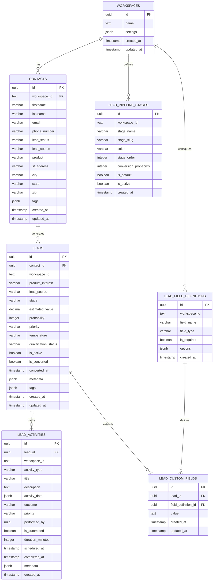
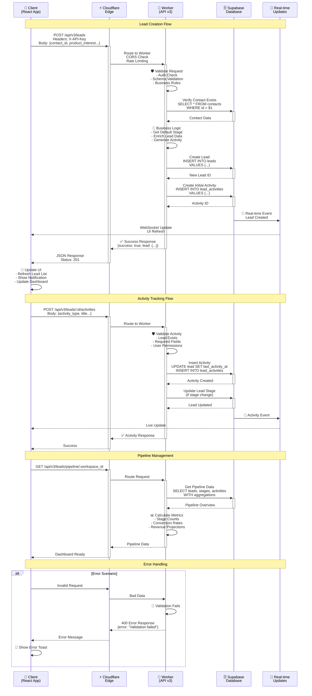
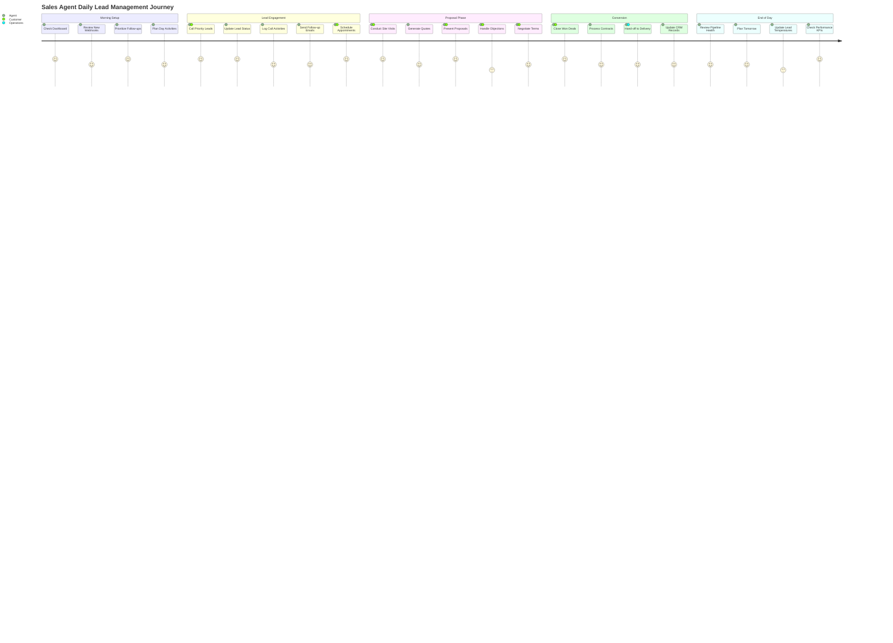
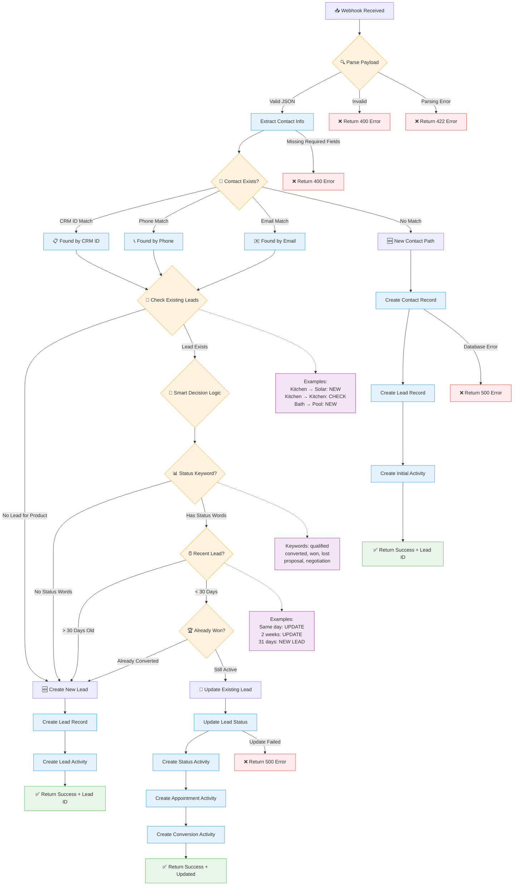

# 📖 User Stories & System Diagrams

**Lead-Centric Architecture: User Stories and Visual Documentation**  
*Version 1.0 | Updated: September 15, 2025*

---

## 🎭 **User Stories**

### **👨‍💼 Sales Agent - "Sarah"**

#### **Story 1: Multi-Product Lead Management**
```
As a Sales Agent for a home improvement company,
I want to track multiple leads for the same customer across different projects,
So that I can maximize revenue opportunities and provide better service.

Acceptance Criteria:
✅ I can see all leads for a customer in one view
✅ Each lead tracks a different product/service independently
✅ Lead histories don't interfere with each other
✅ I can update lead stages independently
✅ Activities are tracked per lead, not just per contact
```

**Sarah's Daily Workflow:**
```
08:00 - Check dashboard for today's follow-ups
08:30 - Call John Doe about Kitchen Remodel (Lead #1)
09:15 - Email John Doe quote for Solar Installation (Lead #2)
10:00 - Update Kitchen lead to "Proposal Sent"
10:30 - Schedule site visit for Solar lead
11:00 - Create activity notes for both interactions
```

#### **Story 2: Lead Activity Tracking**
```
As a Sales Agent,
I want to log detailed activities for each lead,
So that I have complete visibility into the sales process and can follow up effectively.

Acceptance Criteria:
✅ I can create different activity types (Call, Email, Meeting, Quote)
✅ Activities include outcome, duration, and next steps
✅ I can see a timeline of all lead interactions
✅ System automatically logs webhook-generated activities
✅ I can filter activities by type and outcome
```

### **🏠 Home Improvement Customer - "John Doe"**

#### **Story 3: Multi-Project Customer Journey**
```
As a Homeowner planning multiple improvement projects,
I want each project inquiry to be handled separately,
So that I can evaluate different contractors and timelines independently.

Customer Experience:
✅ Kitchen quote doesn't affect bathroom pricing
✅ Different sales reps can handle different projects
✅ Project timelines are managed independently
✅ Payment schedules are separate per project
✅ Communication history is organized by project
```

**John's Project Timeline:**
```
Month 1: Submits kitchen remodel inquiry → Lead #1 created
Month 2: Kitchen proposal received → Lead #1 moves to "Proposal"
Month 3: Inquires about solar panels → Lead #2 created
Month 4: Kitchen project approved → Lead #1 converts to "Won"
Month 5: Solar site assessment → Lead #2 moves to "Qualified"
Month 6: Solar installation scheduled → Lead #2 converts to "Won"
```

### **👩‍💻 Marketing Manager - "Lisa"**

#### **Story 4: Campaign Performance Tracking**
```
As a Marketing Manager,
I want to track lead generation and conversion across different campaigns,
So that I can optimize marketing spend and improve ROI.

Acceptance Criteria:
✅ I can see leads by traffic source (Google, Facebook, etc.)
✅ Conversion rates are tracked per product category
✅ Lead quality scores are calculated automatically
✅ Campaign attribution follows the entire lead lifecycle
✅ I can generate reports on lead performance
```

### **🔧 System Administrator - "Mike"**

#### **Story 5: Webhook Integration Management**
```
As a System Administrator,
I want to easily integrate external lead sources via webhooks,
So that leads flow automatically into our CRM without manual entry.

Acceptance Criteria:
✅ Webhook endpoints are reliable and scalable
✅ Lead creation logic handles duplicates intelligently
✅ System provides detailed logs for troubleshooting
✅ Integration works with multiple lead sources
✅ Failed webhooks are retried automatically
```

### **📊 Business Owner - "Robert"**

#### **Story 6: Business Intelligence & Reporting**
```
As a Business Owner,
I want comprehensive analytics on lead performance and sales conversion,
So that I can make data-driven decisions about business growth.

Acceptance Criteria:
✅ Dashboard shows lead pipeline health
✅ Conversion rates by product and sales rep
✅ Revenue forecasting based on lead stages
✅ Customer lifetime value across multiple projects
✅ Performance trends over time
```

#### **Story 7: Executive Dashboard & Strategic KPIs**
```
As a Business Owner,
I want a high-level executive dashboard with key performance indicators,
So that I can quickly assess business health and identify areas needing attention.

Acceptance Criteria:
✅ Real-time business health score with trend indicators
✅ Monthly recurring revenue (MRR) tracking and forecasting
✅ Customer acquisition cost (CAC) and lifetime value (LTV) metrics
✅ Pipeline velocity and conversion rate trends
✅ Team productivity and capacity utilization
✅ Competitive performance benchmarking
✅ Alert system for critical metrics falling below thresholds
```

**Robert's Daily 10-Minute Business Review:**
```
07:30 - Check business health score and overnight alerts
07:35 - Review yesterday's lead generation and conversion metrics
07:38 - Scan team performance and capacity indicators
07:40 - Identify any issues requiring immediate attention
```

### **👩‍💼 Supervisor - "Amanda"**

#### **Story 8: Agent Performance Management**
```
As a Sales Supervisor,
I want to monitor and manage my team's performance across all lead activities,
So that I can provide coaching, optimize assignments, and ensure targets are met.

Acceptance Criteria:
✅ I can see each agent's lead activity volume and quality metrics
✅ Response time tracking and follow-up compliance monitoring
✅ Conversion rates and pipeline progression by agent
✅ Activity logging completeness and data quality scores
✅ Workload distribution and capacity management
✅ Performance trends and coaching opportunity identification
✅ Individual and team goal tracking with progress indicators
```

**Amanda's Daily Team Management:**
```
08:00 - Review overnight lead assignments and agent availability
08:15 - Check yesterday's activity completion and response times
08:30 - Identify agents needing coaching or support
08:45 - Optimize today's lead distribution based on performance
09:00 - One-on-one coaching sessions with underperforming agents
10:00 - Team standup with performance highlights and goals
```

#### **Story 9: Real-Time Team Monitoring**
```
As a Sales Supervisor,
I want real-time visibility into my team's current activities and availability,
So that I can provide immediate support and redistribute workload as needed.

Acceptance Criteria:
✅ Live dashboard showing each agent's current status and activity
✅ Lead assignment queue with priority and aging indicators
✅ Real-time alerts for stuck leads or missed follow-ups
✅ Instant messaging and escalation system for urgent issues
✅ Team capacity view with availability and workload balance
✅ Performance anomaly detection with automatic notifications
```

### **🔧 System Administrator - "David"**

#### **Story 10: System Configuration & Integration Management**
```
As a System Administrator,
I want comprehensive control over system settings, integrations, and data flow,
So that I can ensure optimal performance, security, and reliability.

Acceptance Criteria:
✅ Centralized configuration management for all system components
✅ Integration health monitoring with automatic retry mechanisms
✅ Data flow visualization and bottleneck identification
✅ User access control and permission management
✅ System performance monitoring and alerting
✅ Backup and disaster recovery management
✅ API rate limiting and security configuration
```

#### **Story 11: Advanced Webhook & Automation Management**
```
As a System Administrator,
I want advanced webhook processing and automation rule management,
So that I can ensure reliable lead capture and intelligent routing.

Acceptance Criteria:
✅ Webhook performance analytics and error tracking
✅ Advanced duplicate detection and merge rules
✅ Custom field mapping and data transformation rules
✅ Automated lead scoring and assignment logic
✅ Integration failure recovery and manual intervention tools
✅ Audit logging and compliance reporting
✅ A/B testing for webhook processing algorithms
```

**David's Weekly System Health Review:**
```
Monday: Integration health and performance metrics review
Tuesday: User access audit and security assessment
Wednesday: Webhook analytics and optimization
Thursday: System performance and capacity planning
Friday: Backup verification and disaster recovery testing
```

### **📈 Marketing Director - "Christine"**

#### **Story 12: Multi-Channel Campaign Orchestration**
```
As a Marketing Director,
I want to orchestrate and optimize campaigns across multiple channels,
So that I can maximize lead generation while minimizing acquisition costs.

Acceptance Criteria:
✅ Unified campaign performance dashboard across all channels
✅ Cross-channel attribution and customer journey mapping
✅ Budget allocation optimization with ROI-based recommendations
✅ A/B testing framework for messaging and creative optimization
✅ Automated campaign scaling based on performance thresholds
✅ Competitor analysis and market positioning insights
✅ Lead quality scoring and source optimization
```

**Christine's Campaign Optimization Workflow:**
```
Week 1: Performance analysis and budget reallocation
Week 2: A/B testing setup and creative optimization
Week 3: Channel expansion and new opportunity exploration
Week 4: Strategy refinement and next month's planning
```

#### **Story 13: Advanced Marketing Analytics & Forecasting**
```
As a Marketing Director,
I want predictive analytics and advanced marketing intelligence,
So that I can anticipate market trends and optimize future campaigns.

Acceptance Criteria:
✅ Predictive lead volume forecasting based on historical patterns
✅ Seasonal trend analysis and campaign timing optimization
✅ Customer lifetime value prediction by acquisition channel
✅ Market saturation indicators and expansion opportunity identification
✅ Competitive intelligence and market share analysis
✅ Attribution modeling with customizable lookback windows
✅ Marketing mix modeling for optimal budget allocation
```

#### **Story 14: Brand & Content Performance Tracking**
```
As a Marketing Director,
I want to track brand awareness and content performance impact on lead generation,
So that I can optimize messaging and content strategy for maximum conversion.

Acceptance Criteria:
✅ Content engagement correlation with lead generation
✅ Brand mention tracking and sentiment analysis
✅ Message testing and optimization across all touchpoints
✅ Landing page performance and conversion optimization
✅ Email campaign effectiveness and list health monitoring
✅ Social media impact on lead generation and nurturing
✅ SEO performance and organic lead generation tracking
```

### **🏢 Enterprise Admin - "Michael"**

#### **Story 15: Multi-Workspace Enterprise Management**
```
As an Enterprise Administrator,
I want to manage multiple workspaces and maintain data governance,
So that I can ensure compliance, security, and optimal resource utilization.

Acceptance Criteria:
✅ Centralized user management across all workspaces
✅ Data governance and compliance reporting (GDPR, CCPA, etc.)
✅ Cross-workspace analytics and benchmarking
✅ Resource allocation and cost management per workspace
✅ Security policy enforcement and audit trails
✅ White-label customization and branding management
✅ API usage monitoring and rate limiting per workspace
```

#### **Story 16: Advanced Security & Compliance**
```
As an Enterprise Administrator,
I want comprehensive security controls and compliance monitoring,
So that I can protect sensitive data and meet regulatory requirements.

Acceptance Criteria:
✅ Role-based access control with granular permissions
✅ Data encryption in transit and at rest verification
✅ Audit logging with tamper-proof trail maintenance
✅ Automated compliance reporting and violation alerts
✅ Data retention policy enforcement and automated purging
✅ Third-party integration security assessment and monitoring
✅ Incident response automation and notification systems
```

**Michael's Monthly Governance Review:**
```
Week 1: Security audit and vulnerability assessment
Week 2: Compliance reporting and policy updates
Week 3: User access review and permission optimization
Week 4: Performance analysis and resource planning
```

### **💼 Marketing Operations Manager - "Jennifer"**

#### **Story 17: Marketing Technology Stack Optimization**
```
As a Marketing Operations Manager,
I want to optimize our marketing technology stack and data flow,
So that I can ensure clean data, efficient processes, and maximum ROI.

Acceptance Criteria:
✅ Marketing technology integration health monitoring
✅ Data quality scoring and automated cleansing workflows
✅ Lead routing optimization and response time tracking
✅ Marketing automation workflow performance analysis
✅ Campaign attribution and revenue tracking accuracy
✅ Marketing and sales alignment metrics and reporting
✅ Technology stack ROI analysis and optimization recommendations
```

#### **Story 18: Advanced Lead Intelligence & Scoring**
```
As a Marketing Operations Manager,
I want sophisticated lead scoring and intelligence gathering,
So that I can deliver high-quality, sales-ready leads to the team.

Acceptance Criteria:
✅ Multi-dimensional lead scoring with behavioral and demographic factors
✅ Lead intelligence enrichment from multiple data sources
✅ Predictive lead quality modeling based on historical conversions
✅ Intent data integration and buying signal identification
✅ Lead nurturing workflow optimization based on engagement patterns
✅ Sales feedback integration for continuous scoring improvement
✅ Automated lead qualification and routing based on fit and intent
```

**Jennifer's Lead Quality Optimization Process:**
```
Daily: Monitor lead flow and quality metrics
Weekly: Analyze scoring model performance and adjust parameters
Monthly: Review integration health and data quality improvements
Quarterly: Complete lead scoring model optimization and sales alignment review
```

---

## 🏗️ **Architecture Diagrams**

### **System Overview - High Level**

```
┌─────────────────────────────────────────────────────────────────────────────────┐
│                           🏢 LEAD-CENTRIC CRM SYSTEM                           │
└─────────────────────────────────────────────────────────────────────────────────┘

┌─────────────────┐    ┌─────────────────┐    ┌─────────────────┐    ┌─────────────────┐
│   🌐 SOURCES    │    │  🔄 PROCESSING  │    │  💾 STORAGE     │    │  🎨 INTERFACE   │
├─────────────────┤    ├─────────────────┤    ├─────────────────┤    ├─────────────────┤
│ Website Forms   │────│ Webhook         │────│ Supabase DB     │────│ React Frontend  │
│ Landing Pages   │    │ Processors      │    │ ┌─────────────┐ │    │ ┌─────────────┐ │
│ Facebook Ads    │    │ ┌─────────────┐ │    │ │  contacts   │ │    │ │ Dashboard   │ │
│ Google Ads      │────│ │Cloudflare   │ │    │ │  leads      │ │────│ │ Lead Views  │ │
│ Phone Calls     │    │ │Worker       │ │────│ │ activities  │ │    │ │ Reports     │ │
│ Walk-ins        │    │ │             │ │    │ │ pipelines   │ │    │ │             │ │
│ Referrals       │    │ └─────────────┘ │    │ └─────────────┘ │    │ └─────────────┘ │
│ CRM Systems     │────│ ┌─────────────┐ │    │                 │    │                 │
│                 │    │ │Node.js      │ │    │                 │    │                 │
│                 │    │ │Backend      │ │    │                 │    │                 │
│                 │    │ │             │ │    │                 │    │                 │
│                 │    │ └─────────────┘ │    │                 │    │                 │
└─────────────────┘    └─────────────────┘    └─────────────────┘    └─────────────────┘
        │                        │                        │                        │
        ▼                        ▼                        ▼                        ▼
   Lead Sources            Smart Processing         Relational Data          User Interface
```

### **Data Flow - Lead Creation Process**

```
🌐 EXTERNAL LEAD SOURCE
        │
        │ HTTP POST /webhooks/[id]
        │ {firstname, lastname, email, 
        │  phone, productid, lead_status}
        ▼
┌─────────────────────────────────────┐
│      🔄 WEBHOOK PROCESSOR           │
│  ┌─────────────────────────────────┐│
│  │ 1. Contact Existence Check      ││
│  │    ├─ CRM ID Match?             ││
│  │    ├─ Phone Number Match?       ││
│  │    └─ Email Match?              ││
│  └─────────────────────────────────┘│
│                 │                   │
│        ┌────────┴────────┐          │
│        ▼                 ▼          │
│  ┌──────────┐    ┌──────────────┐   │
│  │NEW       │    │EXISTING      │   │
│  │CONTACT   │    │CONTACT       │   │
│  └──────────┘    └──────────────┘   │
│        │                 │          │
│        ▼                 ▼          │
│  ┌─────────────────────────────────┐│
│  │ 2. Lead Decision Logic          ││
│  │    ├─ Same Product?             ││
│  │    ├─ Status Keyword?           ││
│  │    ├─ Time Gap < 30 days?       ││
│  │    └─ Not Converted?            ││
│  └─────────────────────────────────┘│
│                 │                   │
│        ┌────────┴────────┐          │
│        ▼                 ▼          │
│  ┌──────────┐    ┌──────────────┐   │
│  │CREATE    │    │UPDATE        │   │
│  │NEW LEAD  │    │EXISTING LEAD │   │
│  └──────────┘    └──────────────┘   │
└─────────────────────────────────────┘
        │                 │
        ▼                 ▼
┌─────────────────────────────────────┐
│      💾 DATABASE OPERATIONS         │
│  ┌─────────────────────────────────┐│
│  │ contacts table                  ││
│  │ ├─ INSERT/UPDATE contact       ││
│  │ └─ Link to workspace           ││
│  └─────────────────────────────────┘│
│  ┌─────────────────────────────────┐│
│  │ leads table                     ││
│  │ ├─ INSERT new lead              ││
│  │ ├─ Link to contact_id           ││
│  │ └─ Set default pipeline stage  ││
│  └─────────────────────────────────┘│
│  ┌─────────────────────────────────┐│
│  │ lead_activities table           ││
│  │ ├─ Log creation activity        ││
│  │ ├─ Track status changes         ││
│  │ └─ Record appointment data      ││
│  └─────────────────────────────────┘│
└─────────────────────────────────────┘
        │
        ▼
┌─────────────────────────────────────┐
│         📤 RESPONSE                 │
│  {                                  │
│    "success": true,                 │
│    "contact_id": "uuid",            │
│    "lead_id": "uuid",               │
│    "message": "Lead created",       │
│    "processing_time": "1234ms"      │
│  }                                  │
└─────────────────────────────────────┘
```

### **Lead Lifecycle - State Machine**

```
                    🌟 LEAD LIFECYCLE STATES 🌟

┌─────────────────────────────────────────────────────────────────────────────────┐
│                                                                                 │
│  📥 ENTRY POINTS                   🔄 ACTIVE STATES               📊 END STATES │
│                                                                                 │
│  ┌─────────────┐                                                               │
│  │ 🌐 Website  │────┐                                                          │
│  └─────────────┘    │                                                          │
│  ┌─────────────┐    │              ┌─────────────┐                             │
│  │ 📞 Phone    │────┤              │     NEW     │                             │
│  └─────────────┘    │              │   (Stage)   │                             │
│  ┌─────────────┐    │              └──────┬──────┘                             │
│  │ 👥 Referral │────┼─── CREATE ──────────│                                    │
│  └─────────────┘    │                     │                                    │
│  ┌─────────────┐    │                     ▼                                    │
│  │ 📧 Email    │────┤              ┌─────────────┐                             │
│  └─────────────┘    │              │ QUALIFIED   │                             │
│  ┌─────────────┐    │              │  (Stage)    │                             │
│  │ 🔄 Webhook  │────┘              └──────┬──────┘                             │
│  └─────────────┘                          │                                    │
│                                           ▼                                    │
│                                    ┌─────────────┐                             │
│                                    │  PROPOSAL   │                             │
│                                    │   (Stage)   │                             │
│                                    └──────┬──────┘                             │
│                                           │                                    │
│                    ┌──────────────────────┼──────────────────────┐             │
│                    ▼                      ▼                      ▼             │
│             ┌─────────────┐        ┌─────────────┐        ┌─────────────┐      │
│             │     WON     │        │    LOST     │        │  INACTIVE   │      │
│             │ (Converted) │        │ (Rejected)  │        │ (No Response│      │
│             │     💰      │        │     ❌      │        │      😴     │      │
│             └─────────────┘        └─────────────┘        └─────────────┘      │
│                                                                                 │
└─────────────────────────────────────────────────────────────────────────────────┘

                             📈 STAGE PROGRESSION RULES

┌─────────────────────────────────────────────────────────────────────────────────┐
│                                                                                 │
│  AUTOMATIC TRIGGERS:                         MANUAL TRIGGERS:                   │
│  ├─ Webhook status updates                   ├─ Agent stage changes             │
│  ├─ Email engagement                         ├─ Call outcomes                   │
│  ├─ Appointment scheduling                   ├─ Meeting results                 │
│  ├─ Form submissions                         ├─ Quote responses                 │
│  └─ Time-based rules                         └─ Manual notes                    │
│                                                                                 │
│  STAGE PROBABILITIES:                        STAGE DURATIONS:                   │
│  ├─ New: 10%                                ├─ New → Qualified: 3-7 days       │
│  ├─ Qualified: 25%                          ├─ Qualified → Proposal: 7-14 days │
│  ├─ Proposal: 60%                           ├─ Proposal → Decision: 14-30 days │
│  ├─ Won: 100%                               └─ Average cycle: 21-45 days       │
│  └─ Lost/Inactive: 0%                                                           │
│                                                                                 │
└─────────────────────────────────────────────────────────────────────────────────┘
```

### **Database Schema - Entity Relationship**

```
                        🗄️ DATABASE SCHEMA RELATIONSHIPS

┌─────────────────────────────────────────────────────────────────────────────────┐
│                                                                                 │
│  ┌─────────────────┐                    ┌─────────────────┐                     │
│  │   workspaces    │                    │   contacts      │                     │
│  │─────────────────│                    │─────────────────│                     │
│  │ id (PK)         │◄──────────────────►│ workspace_id    │                     │
│  │ name            │                    │ id (PK)         │                     │
│  │ created_at      │                    │ firstname       │                     │
│  │ settings        │                    │ lastname        │                     │
│  └─────────────────┘                    │ email           │                     │
│           │                             │ phone_number    │                     │
│           │                             │ lead_status     │                     │
│           │                             │ lead_source     │                     │
│           │                             │ product         │                     │
│           │                             │ created_at      │                     │
│           │                             └─────────────────┘                     │
│           │                                      │                              │
│           │                                      │ 1:N                          │
│           │                                      ▼                              │
│           │                             ┌─────────────────┐                     │
│           │                             │     leads       │                     │
│           │                             │─────────────────│                     │
│           │                             │ id (PK)         │                     │
│           │                             │ contact_id (FK) │                     │
│           │                             │ workspace_id    │                     │
│           │                             │ product_interest│                     │
│           │                             │ lead_source     │                     │
│           │                             │ stage           │                     │
│           │                             │ estimated_value │                     │
│           │                             │ priority        │                     │
│           │                             │ temperature     │                     │
│           │                             │ is_active       │                     │
│           │                             │ is_converted    │                     │
│           │                             │ converted_at    │                     │
│           │                             │ metadata        │                     │
│           │                             │ tags            │                     │
│           │                             │ created_at      │                     │
│           │                             │ updated_at      │                     │
│           │                             └─────────────────┘                     │
│           │                                      │                              │
│           │                                      │ 1:N                          │
│           │                                      ▼                              │
│           │                             ┌─────────────────┐                     │
│           │                             │ lead_activities │                     │
│           │                             │─────────────────│                     │
│           │                             │ id (PK)         │                     │
│           │                             │ lead_id (FK)    │                     │
│           │                             │ workspace_id    │                     │
│           │                             │ activity_type   │                     │
│           │                             │ title           │                     │
│           │                             │ description     │                     │
│           │                             │ activity_data   │                     │
│           │                             │ outcome         │                     │
│           │                             │ priority        │                     │
│           │                             │ performed_by    │                     │
│           │                             │ is_automated    │                     │
│           │                             │ duration_minutes│                     │
│           │                             │ scheduled_at    │                     │
│           │                             │ completed_at    │                     │
│           │                             │ metadata        │                     │
│           │                             │ created_at      │                     │
│           │                             └─────────────────┘                     │
│           │                                                                     │
│           │ 1:N                                                                 │
│           ▼                                                                     │
│  ┌─────────────────┐                    ┌─────────────────┐                     │
│  │lead_pipeline_   │                    │ lead_custom_    │                     │
│  │    stages       │                    │    fields       │                     │
│  │─────────────────│                    │─────────────────│                     │
│  │ id (PK)         │                    │ id (PK)         │                     │
│  │ workspace_id    │                    │ lead_id (FK)    │◄─────┐              │
│  │ stage_name      │                    │ field_def_id(FK)│      │              │
│  │ stage_slug      │                    │ value           │      │ N:1          │
│  │ color           │                    │ created_at      │      │              │
│  │ stage_order     │                    └─────────────────┘      │              │
│  │ is_default      │                                             │              │
│  │ is_active       │                    ┌─────────────────┐      │              │
│  │ conversion_prob │                    │lead_field_      │      │              │
│  │ created_at      │                    │ definitions     │      │              │
│  └─────────────────┘                    │─────────────────│      │              │
│                                         │ id (PK)         │──────┘              │
│                                         │ workspace_id    │                     │
│                                         │ field_name      │                     │
│                                         │ field_type      │                     │
│                                         │ is_required     │                     │
│                                         │ options         │                     │
│                                         │ created_at      │                     │
│                                         └─────────────────┘                     │
│                                                                                 │
└─────────────────────────────────────────────────────────────────────────────────┘

                              🔗 KEY RELATIONSHIPS

┌─────────────────────────────────────────────────────────────────────────────────┐
│                                                                                 │
│  🏢 Workspace (1) ────────── (N) 📱 Contacts                                   │
│                                                                                 │
│  📱 Contact (1) ──────────── (N) 🎯 Leads                                      │
│                                                                                 │
│  🎯 Lead (1) ────────────── (N) 📝 Activities                                  │
│                                                                                 │
│  🎯 Lead (1) ────────────── (N) 🏷️ Custom Fields                              │
│                                                                                 │
│  🏢 Workspace (1) ────────── (N) 🏗️ Pipeline Stages                           │
│                                                                                 │
│  🏢 Workspace (1) ────────── (N) 📋 Field Definitions                          │
│                                                                                 │
│  📋 Field Definition (1) ─── (N) 🏷️ Custom Fields                             │
│                                                                                 │
└─────────────────────────────────────────────────────────────────────────────────┘
```

### **API Architecture - Request Flow**

```
                        🌐 API REQUEST FLOW ARCHITECTURE

┌─────────────────────────────────────────────────────────────────────────────────┐
│                                                                                 │
│  👤 CLIENT REQUEST                                                              │
│                                                                                 │
│  ┌─────────────────┐                                                            │
│  │ React Frontend  │                                                            │
│  │ ┌─────────────┐ │                                                            │
│  │ │ Component   │ │                                                            │
│  │ │ - Lead View │ │────┐                                                       │
│  │ │ - Activity  │ │    │                                                       │
│  │ │ - Pipeline  │ │    │                                                       │
│  │ └─────────────┘ │    │                                                       │
│  │       │         │    │                                                       │
│  │       ▼         │    │                                                       │
│  │ ┌─────────────┐ │    │                                                       │
│  │ │ Services    │ │    │                                                       │
│  │ │ - LeadAPI   │ │    │                                                       │
│  │ │ - Activity  │ │    │                                                       │
│  │ │ - Pipeline  │ │    │                                                       │
│  │ └─────────────┘ │    │                                                       │
│  └─────────────────┘    │                                                       │
│                         │ HTTPS Request                                         │
│                         │ Headers: X-API-Key, Content-Type                     │
│                         │ Method: GET/POST/PUT/DELETE                           │
│                         ▼                                                       │
│                                                                                 │
│  🌍 CLOUDFLARE EDGE                                                             │
│                                                                                 │
│  ┌─────────────────────────────────────────────────────────────────────────────┐│
│  │                     ⚡ CLOUDFLARE WORKERS                                   ││
│  │                                                                             ││
│  │  ┌─────────────────┐              ┌─────────────────┐                       ││
│  │  │ 🛡️ Security      │              │ 🚀 Lead API v3   │                       ││
│  │  │ ┌─────────────┐ │              │ ┌─────────────┐ │                       ││
│  │  │ │ CORS        │ │              │ │ /leads      │ │                       ││
│  │  │ │ Rate Limit  │ │              │ │ /activities │ │                       ││
│  │  │ │ Auth Check  │ │──────────────│ │ /pipeline   │ │                       ││
│  │  │ │ Validation  │ │              │ │ /stages     │ │                       ││
│  │  │ └─────────────┘ │              │ └─────────────┘ │                       ││
│  │  └─────────────────┘              │       │         │                       ││
│  │                                   │       ▼         │                       ││
│  │                                   │ ┌─────────────┐ │                       ││
│  │                                   │ │ Business    │ │                       ││
│  │                                   │ │ Logic       │ │                       ││
│  │                                   │ │ - Validation│ │                       ││
│  │                                   │ │ - Transform │ │                       ││
│  │                                   │ │ - Enrichment│ │                       ││
│  │                                   │ └─────────────┘ │                       ││
│  │                                   └─────────────────┘                       ││
│  └─────────────────────────────────────────────────────────────────────────────┘│
│                                              │                                  │
│                                              │ Database Query                   │
│                                              │ (Supabase Client)               │
│                                              ▼                                  │
│                                                                                 │
│  💾 DATABASE LAYER                                                              │
│                                                                                 │
│  ┌─────────────────────────────────────────────────────────────────────────────┐│
│  │                        🐘 SUPABASE POSTGRESQL                               ││
│  │                                                                             ││
│  │  ┌─────────────────┐   ┌─────────────────┐   ┌─────────────────┐            ││
│  │  │ 🔐 Row Level     │   │ 📊 Query Engine │   │ 🚀 Real-time    │            ││
│  │  │    Security     │   │                 │   │    Updates      │            ││
│  │  │ ┌─────────────┐ │   │ ┌─────────────┐ │   │ ┌─────────────┐ │            ││
│  │  │ │ Workspace   │ │   │ │ Optimized   │ │   │ │ WebSocket   │ │            ││
│  │  │ │ Isolation   │ │   │ │ Indexes     │ │   │ │ Subscriptions│ │            ││
│  │  │ │ User Perms  │ │   │ │ Query Plans │ │   │ │ Live Updates │ │            ││
│  │  │ │ Data Policy │ │   │ │ Aggregation │ │   │ │             │ │            ││
│  │  │ └─────────────┘ │   │ └─────────────┘ │   │ └─────────────┘ │            ││
│  │  └─────────────────┘   └─────────────────┘   └─────────────────┘            ││
│  │                                │                                            ││
│  │                                ▼                                            ││
│  │  ┌───────────────────────────────────────────────────────────────────────┐  ││
│  │  │                     📋 TABLE OPERATIONS                              │  ││
│  │  │                                                                       │  ││
│  │  │  leads ◄─► lead_activities ◄─► lead_custom_fields                    │  ││
│  │  │    ▲              ▲                      ▲                           │  ││
│  │  │    │              │                      │                           │  ││
│  │  │  contacts    lead_pipeline_stages  lead_field_definitions            │  ││
│  │  │                                                                       │  ││
│  │  └───────────────────────────────────────────────────────────────────────┘  ││
│  └─────────────────────────────────────────────────────────────────────────────┘│
│                                              │                                  │
│                                              │ Response Data                    │
│                                              ▼                                  │
│                                                                                 │
│  📤 RESPONSE PIPELINE                                                           │
│                                                                                 │
│  ┌─────────────────────────────────────────────────────────────────────────────┐│
│  │                       🔄 RESPONSE PROCESSING                                ││
│  │                                                                             ││
│  │  ┌─────────────────┐   ┌─────────────────┐   ┌─────────────────┐            ││
│  │  │ 🔧 Transform     │   │ 📦 Serialize     │   │ ✅ Validate      │            ││
│  │  │                 │   │                 │   │                 │            ││
│  │  │ ┌─────────────┐ │   │ ┌─────────────┐ │   │ ┌─────────────┐ │            ││
│  │  │ │ Data Format │ │   │ │ JSON        │ │   │ │ Schema      │ │            ││
│  │  │ │ Enrichment  │───► │ │ Response    │───► │ │ Validation  │ │            ││
│  │  │ │ Aggregation │ │   │ │ Compression │ │   │ │ Error Check │ │            ││
│  │  │ │ Filtering   │ │   │ │ Headers     │ │   │ │ Status Code │ │            ││
│  │  │ └─────────────┘ │   │ └─────────────┘ │   │ └─────────────┘ │            ││
│  │  └─────────────────┘   └─────────────────┘   └─────────────────┘            ││
│  └─────────────────────────────────────────────────────────────────────────────┘│
│                                              │                                  │
│                                              │ HTTP Response                    │
│                                              ▼                                  │
│  👤 CLIENT RESPONSE                                                             │
│                                                                                 │
│  ┌─────────────────────────────────────────────────────────────────────────────┐│
│  │                          📱 FRONTEND UPDATE                                 ││
│  │                                                                             ││
│  │  Success Response:                    Error Response:                       ││
│  │  {                                   {                                      ││
│  │    "success": true,                    "error": "Validation failed",       ││
│  │    "data": [...],                     "code": "INVALID_REQUEST",           ││
│  │    "pagination": {...},               "details": {...},                    ││
│  │    "metadata": {...}                  "request_id": "uuid"                 ││
│  │  }                                   }                                      ││
│  │                                                                             ││
│  │  ┌─────────────────┐   ┌─────────────────┐   ┌─────────────────┐            ││
│  │  │ 🔄 State Update  │   │ 🎨 UI Refresh    │   │ 📝 Activity Log  │            ││
│  │  │                 │   │                 │   │                 │            ││
│  │  │ ┌─────────────┐ │   │ ┌─────────────┐ │   │ ┌─────────────┐ │            ││
│  │  │ │ Redux/State │ │   │ │ Component   │ │   │ │ Console Log │ │            ││
│  │  │ │ React State │ │   │ │ Re-render   │ │   │ │ Error Track │ │            ││
│  │  │ │ Cache Update│ │   │ │ Notification│ │   │ │ Performance │ │            ││
│  │  │ │ Local Store │ │   │ │ Progress    │ │   │ │ Analytics   │ │            ││
│  │  │ └─────────────┘ │   │ └─────────────┘ │   │ └─────────────┘ │            ││
│  │  └─────────────────┘   └─────────────────┘   └─────────────────┘            ││
│  └─────────────────────────────────────────────────────────────────────────────┘│
│                                                                                 │
└─────────────────────────────────────────────────────────────────────────────────┘
```

### **Webhook Smart Logic - Decision Tree**

```
                        🧠 WEBHOOK SMART DECISION ALGORITHM

┌─────────────────────────────────────────────────────────────────────────────────┐
│                                                                                 │
│  📥 WEBHOOK PAYLOAD RECEIVED                                                    │
│                                                                                 │
│  ┌─────────────────────────────────────────────────────────────────────────────┐│
│  │ {                                                                           ││
│  │   "firstname": "John",                                                      ││
│  │   "lastname": "Doe",                                                        ││
│  │   "email": "john@example.com",                                              ││
│  │   "crm_id": "CRM123",                                                       ││
│  │   "productid": "Solar Panels",                                              ││
│  │   "lead_status": "Qualified"                                                ││
│  │ }                                                                           ││
│  └─────────────────────────────────────────────────────────────────────────────┘│
│                                        │                                        │
│                                        ▼                                        │
│  🔍 STEP 1: CONTACT EXISTENCE CHECK                                             │
│                                                                                 │
│  ┌─────────────────────────────────────────────────────────────────────────────┐│
│  │                  🔎 Contact Discovery Matrix                                ││
│  │                                                                             ││
│  │  ┌─────────────┐    ┌─────────────┐    ┌─────────────┐                      ││
│  │  │ 🆔 CRM ID    │    │ 📞 Phone     │    │ ✉️ Email     │                      ││
│  │  │ Match?      │    │ Match?      │    │ Match?      │                      ││
│  │  │             │    │             │    │             │                      ││
│  │  │ Priority: 1 │    │ Priority: 2 │    │ Priority: 3 │                      ││
│  │  └──────┬──────┘    └──────┬──────┘    └──────┬──────┘                      ││
│  │         │                  │                  │                             ││
│  │         ▼                  ▼                  ▼                             ││
│  │  ┌─────────────────────────────────────────────────────────────────────┐    ││
│  │  │                    MATCH RESULT                                     │    ││
│  │  │                                                                     │    ││
│  │  │  ✅ FOUND: Existing contact → UPDATE MODE                           │    ││
│  │  │  ❌ NOT FOUND: New contact → CREATE MODE                            │    ││
│  │  └─────────────────────────────────────────────────────────────────────┘    ││
│  └─────────────────────────────────────────────────────────────────────────────┘│
│                                        │                                        │
│                           ┌────────────┴────────────┐                           │
│                           ▼                         ▼                           │
│  🆕 NEW CONTACT PATH                    🔄 EXISTING CONTACT PATH                 │
│                                                                                 │
│  ┌─────────────────────┐              ┌─────────────────────────────────────┐   │
│  │ Create Contact      │              │ 🧠 LEAD DECISION ALGORITHM          │   │
│  │ ↓                   │              │                                     │   │
│  │ Create Lead         │              │ ┌─────────────────────────────────┐ │   │
│  │ ↓                   │              │ │ 🔍 Lead Existence Check         │ │   │
│  │ Create Activity     │              │ │                                 │ │   │
│  │ ↓                   │              │ │ Query: SELECT * FROM leads      │ │   │
│  │ Return Success      │              │ │ WHERE contact_id = $1           │ │   │
│  └─────────────────────┘              │ │   AND product_interest = $2     │ │   │
│                                       │ │   AND is_active = true          │ │   │
│                                       │ └─────────────────────────────────┘ │   │
│                                       │                  │                  │   │
│                                       │     ┌────────────┴────────────┐     │   │
│                                       │     ▼                         ▼     │   │
│                                       │ ┌────────────┐        ┌──────────┐  │   │
│                                       │ │ LEAD       │        │ NO LEAD  │  │   │
│                                       │ │ EXISTS     │        │ FOUND    │  │   │
│                                       │ └─────┬──────┘        └─────┬────┘  │   │
│                                       │       │                     │       │   │
│                                       │       ▼                     ▼       │   │
│                                       │ ┌─────────────────┐   ┌───────────┐ │   │
│                                       │ │ 🤔 UPDATE       │   │ CREATE    │ │   │
│                                       │ │ DECISION        │   │ NEW LEAD  │ │   │
│                                       │ │                 │   └───────────┘ │   │
│                                       │ │ ┌─────────────┐ │                 │   │
│                                       │ │ │Status       │ │                 │   │
│                                       │ │ │Keyword?     │ │                 │   │
│                                       │ │ │             │ │                 │   │
│                                       │ │ │✅ Qualified │ │                 │   │
│                                       │ │ │✅ Converted │ │                 │   │
│                                       │ │ │✅ Won       │ │                 │   │
│                                       │ │ │✅ Lost      │ │                 │   │
│                                       │ │ │❌ Interest  │ │                 │   │
│                                       │ │ └─────┬───────┘ │                 │   │
│                                       │ │       │         │                 │   │
│                                       │ │       ▼         │                 │   │
│                                       │ │ ┌─────────────┐ │                 │   │
│                                       │ │ │Time Gap     │ │                 │   │
│                                       │ │ │< 30 days?   │ │                 │   │
│                                       │ │ │             │ │                 │   │
│                                       │ │ │✅ Recent    │ │                 │   │
│                                       │ │ │❌ Old       │ │                 │   │
│                                       │ │ └─────┬───────┘ │                 │   │
│                                       │ │       │         │                 │   │
│                                       │ │       ▼         │                 │   │
│                                       │ │ ┌─────────────┐ │                 │   │
│                                       │ │ │Already      │ │                 │   │
│                                       │ │ │Converted?   │ │                 │   │
│                                       │ │ │             │ │                 │   │
│                                       │ │ │❌ Active    │ │                 │   │
│                                       │ │ │✅ Won       │ │                 │   │
│                                       │ │ └─────┬───────┘ │                 │   │
│                                       │ │       │         │                 │   │
│                                       │ │       ▼         │                 │   │
│                                       │ │ ┌─────────────┐ │                 │   │
│                                       │ │ │ DECISION    │ │                 │   │
│                                       │ │ │             │ │                 │   │
│                                       │ │ │All ✅ →     │ │                 │   │
│                                       │ │ │UPDATE LEAD  │ │                 │   │
│                                       │ │ │             │ │                 │   │
│                                       │ │ │Any ❌ →     │ │                 │   │
│                                       │ │ │CREATE NEW   │ │                 │   │
│                                       │ │ └─────────────┘ │                 │   │
│                                       │ └─────────────────┘                 │   │
│                                       └─────────────────────────────────────┘   │
│                                                        │                        │
│                                                        ▼                        │
│  📝 ACTIVITY TRACKING                                                           │
│                                                                                 │
│  ┌─────────────────────────────────────────────────────────────────────────────┐│
│  │                          🎯 Activity Generation                             ││
│  │                                                                             ││
│  │  UPDATE SCENARIO:                         CREATE SCENARIO:                  ││
│  │  ├─ Status Updated Activity               ├─ Lead Created Activity          ││
│  │  ├─ Appointment Scheduled Activity       ├─ Initial Contact Activity       ││
│  │  ├─ Conversion Milestone Activity        ├─ Source Attribution Activity    ││
│  │  └─ Progress Tracking Activity           └─ Pipeline Assignment Activity    ││
│  │                                                                             ││
│  │  ACTIVITY METADATA:                                                         ││
│  │  {                                                                          ││
│  │    "activity_type": "status_updated",                                       ││
│  │    "title": "Status: new → qualified",                                      ││
│  │    "description": "Lead status updated via webhook",                        ││
│  │    "is_automated": true,                                                    ││
│  │    "metadata": {                                                            ││
│  │      "webhook": {"id": "...", "source": "..."},                            ││
│  │      "status_change": {"previous": "new", "new": "qualified"},             ││
│  │      "appointment": {"date": "...", "status": "..."}                       ││
│  │    }                                                                        ││
│  │  }                                                                          ││
│  └─────────────────────────────────────────────────────────────────────────────┘│
│                                                                                 │
└─────────────────────────────────────────────────────────────────────────────────┘

                             🎯 DECISION OUTCOMES

┌─────────────────────────────────────────────────────────────────────────────────┐
│                                                                                 │
│  UPDATE EXISTING LEAD ✅                    CREATE NEW LEAD 🆕                  │
│  ────────────────────────                  ─────────────────────                │
│  ✅ Same CRM ID                            ❌ Different Product                  │
│  ✅ Same Product                           ❌ > 30 Days Gap                     │
│  ✅ Status Keywords                        ❌ Already Converted                  │
│  ✅ < 30 Days                              ❌ No Status Keywords                 │
│  ✅ Not Converted                          ❌ No Existing Contact               │
│                                                                                 │
│  EXAMPLES:                                 EXAMPLES:                            │
│  • "New" → "Qualified"                    • "Bath" → "Kitchen"                 │
│  • "Qualified" → "Converted"              • 31+ days later                     │
│  • Add appointment data                   • Won lead → new inquiry             │
│  • Status progression                     • Different phone/email              │
│                                                                                 │
└─────────────────────────────────────────────────────────────────────────────────┘
```

---

## 📊 **User Journey Maps**

### **Sales Agent Daily Workflow**

```
        👩‍💼 SARAH'S DAILY LEAD MANAGEMENT WORKFLOW

🌅 MORNING (8:00 AM - 12:00 PM)
┌─────────────────────────────────────────────────────────────────────────────────┐
│                                                                                 │
│  8:00 AM │ 📊 Dashboard Review                                                  │
│          │ ├─ Check overnight webhook leads                                     │
│          │ ├─ Review pipeline status                                            │
│          │ └─ Prioritize today's follow-ups                                     │
│          │                                                                      │
│  8:30 AM │ 📞 Priority Calls                                                   │
│          │ ├─ Call John Doe (Kitchen Lead - Day 5)                            │
│          │ ├─ Update: "Qualified" → "Proposal"                                 │
│          │ └─ Log activity: 20-min call, budget confirmed                      │
│          │                                                                      │
│  9:15 AM │ ✉️ Email Campaign                                                   │
│          │ ├─ Send solar quote to John Doe (Solar Lead)                       │
│          │ ├─ Attach proposal documents                                         │
│          │ └─ Schedule follow-up for next week                                 │
│          │                                                                      │
│  10:00 AM│ 🔄 Lead Updates                                                     │
│          │ ├─ Kitchen lead: Add $25K estimated value                           │
│          │ ├─ Schedule site measurement                                         │
│          │ └─ Create meeting activity for Thursday                             │
│          │                                                                      │
│  11:00 AM│ 📝 Documentation                                                    │
│          │ ├─ Update lead notes                                                │
│          │ ├─ Add custom fields (roof type, square footage)                   │
│          │ └─ Tag leads for next week's focus                                  │
│                                                                                 │
└─────────────────────────────────────────────────────────────────────────────────┘

🌞 AFTERNOON (12:00 PM - 6:00 PM)
┌─────────────────────────────────────────────────────────────────────────────────┐
│                                                                                 │
│  1:00 PM │ 🏠 Site Visits                                                      │
│          │ ├─ Drive to Johnson residence                                        │
│          │ ├─ Conduct kitchen measurement                                       │
│          │ └─ Real-time notes on mobile app                                    │
│          │                                                                      │
│  3:00 PM │ 📱 Mobile Lead Management                                           │
│          │ ├─ Quick activity log from car                                       │
│          │ ├─ Upload measurement photos                                         │
│          │ └─ Update lead status to "Site Visited"                            │
│          │                                                                      │
│  4:00 PM │ 💰 Quote Preparation                                               │
│          │ ├─ Use measurement data                                              │
│          │ ├─ Generate PDF quote                                               │
│          │ └─ Create quote activity with $28K value                           │
│          │                                                                      │
│  5:00 PM │ 📊 End-of-Day Review                                               │
│          │ ├─ Check conversion metrics                                          │
│          │ ├─ Plan tomorrow's activities                                        │
│          │ └─ Update lead temperatures                                          │
│                                                                                 │
└─────────────────────────────────────────────────────────────────────────────────┘

🌙 EVENING (6:00 PM+)
┌─────────────────────────────────────────────────────────────────────────────────┐
│                                                                                 │
│  📱 Mobile Notifications                                                        │
│  ├─ New webhook lead: Pool Installation inquiry                                │
│  ├─ Auto-assigned based on territory                                           │
│  └─ Add to tomorrow's call list                                                │
│                                                                                 │
│  🎯 Weekly Goals Tracking                                                       │
│  ├─ 15 new leads this week ✅                                                  │
│  ├─ 8 leads moved to proposal ✅                                               │
│  ├─ 3 conversions target: 2 achieved 📈                                       │
│  └─ Pipeline value: $180K (↑15%)                                              │
│                                                                                 │
└─────────────────────────────────────────────────────────────────────────────────┘
```

### **Customer Multi-Project Journey**

```
           🏠 JOHN DOE'S MULTI-PROJECT HOME IMPROVEMENT JOURNEY

📅 TIMELINE: 6-MONTH JOURNEY
┌─────────────────────────────────────────────────────────────────────────────────┐
│                                                                                 │
│  MONTH 1: KITCHEN INQUIRY                                                      │
│  ┌─────────────────────────────────────────────────────────────────────────┐   │
│  │ 🌐 Website Form Submission                                              │   │
│  │ ├─ Product: Kitchen Remodel                                             │   │
│  │ ├─ Budget: $20-30K                                                      │   │
│  │ ├─ Timeline: 2-3 months                                                 │   │
│  │ └─ AUTO: Lead #1 created, Agent assigned                               │   │
│  │                                                                         │   │
│  │ 📞 Sales Call (Day 2)                                                  │   │
│  │ ├─ Agent: Sarah                                                         │   │
│  │ ├─ Duration: 25 minutes                                                 │   │
│  │ ├─ Outcome: Interested, schedule site visit                            │   │
│  │ └─ Status: New → Qualified                                              │   │
│  │                                                                         │   │
│  │ 🏠 Site Visit (Day 8)                                                  │   │
│  │ ├─ Measurements taken                                                   │   │
│  │ ├─ Photos uploaded                                                      │   │
│  │ ├─ Custom quote required                                                │   │
│  │ └─ Status: Qualified → Proposal                                         │   │
│  └─────────────────────────────────────────────────────────────────────────┘   │
│                                                                                 │
│  MONTH 2: KITCHEN PROPOSAL                                                     │
│  ┌─────────────────────────────────────────────────────────────────────────┐   │
│  │ 📄 Proposal Delivered                                                  │   │
│  │ ├─ Amount: $27,500                                                      │   │
│  │ ├─ Timeline: 6 weeks                                                    │   │
│  │ ├─ Payment plan options                                                 │   │
│  │ └─ Consideration period: 1 week                                         │   │
│  │                                                                         │   │
│  │ 🤔 Customer Thinking Period                                            │   │
│  │ ├─ Questions via email                                                  │   │
│  │ ├─ Reference check calls                                                │   │
│  │ ├─ Material selections                                                  │   │
│  │ └─ Financing options discussed                                          │   │
│  └─────────────────────────────────────────────────────────────────────────┘   │
│                                                                                 │
│  MONTH 3: SOLAR INQUIRY (SEPARATE PROJECT)                                     │
│  ┌─────────────────────────────────────────────────────────────────────────┐   │
│  │ 🌞 Google Ad Click → Solar Landing Page                                │   │
│  │ ├─ Product: Solar Installation                                          │   │
│  │ ├─ Monthly Bill: $250                                                   │   │
│  │ ├─ Roof Type: Shingle                                                   │   │
│  │ └─ AUTO: Lead #2 created (SAME CONTACT)                                │   │
│  │                                                                         │   │
│  │ 📱 Immediate Response (Webhook)                                        │   │
│  │ ├─ SMS auto-response: "Thanks for solar interest!"                     │   │
│  │ ├─ Agent: Mike (Solar Specialist)                                      │   │
│  │ ├─ Different rep due to product specialization                         │   │
│  │ └─ No interference with kitchen project                                │   │
│  │                                                                         │   │
│  │ 🔍 Solar Assessment                                                    │   │
│  │ ├─ Satellite roof analysis                                              │   │
│  │ ├─ Utility bill review                                                  │   │
│  │ ├─ Savings calculation                                                  │   │
│  │ └─ Status: New → Qualified                                              │   │
│  └─────────────────────────────────────────────────────────────────────────┘   │
│                                                                                 │
│  MONTH 4: KITCHEN CONVERSION                                                   │
│  ┌─────────────────────────────────────────────────────────────────────────┐   │
│  │ ✅ Kitchen Project Approved                                            │   │
│  │ ├─ Contract signed: $27,500                                             │   │
│  │ ├─ Deposit: $5,000                                                      │   │
│  │ ├─ Start date: May 15th                                                 │   │
│  │ └─ AUTO: Lead #1 status → Won, Revenue attributed                      │   │
│  │                                                                         │   │
│  │ 🔨 Project Management                                                  │   │
│  │ ├─ Material ordering                                                    │   │
│  │ ├─ Permit applications                                                  │   │
│  │ ├─ Contractor scheduling                                                │   │
│  │ └─ Customer portal access                                               │   │
│  └─────────────────────────────────────────────────────────────────────────┘   │
│                                                                                 │
│  MONTH 5: SOLAR PROPOSAL                                                       │
│  ┌─────────────────────────────────────────────────────────────────────────┐   │
│  │ ☀️ Solar Proposal Ready                                                │   │
│  │ ├─ System size: 7.2 kW                                                  │   │
│  │ ├─ Cost: $18,900 (after incentives)                                    │   │
│  │ ├─ ROI: 8.5 years                                                       │   │
│  │ └─ Status: Qualified → Proposal                                         │   │
│  │                                                                         │   │
│  │ 💡 Customer Confidence Building                                        │   │
│  │ ├─ Satisfied with kitchen progress                                      │   │
│  │ ├─ Trust in company established                                         │   │
│  │ ├─ Existing customer discount                                           │   │
│  │ └─ Faster decision timeline                                             │   │
│  └─────────────────────────────────────────────────────────────────────────┘   │
│                                                                                 │
│  MONTH 6: SOLAR CONVERSION                                                     │
│  ┌─────────────────────────────────────────────────────────────────────────┐   │
│  │ ⚡ Solar Project Approved                                              │   │
│  │ ├─ Leveraged kitchen satisfaction                                       │   │
│  │ ├─ Bundle discount applied                                              │   │
│  │ ├─ Final price: $17,500                                                 │   │
│  │ └─ AUTO: Lead #2 status → Won                                           │   │
│  │                                                                         │   │
│  │ 📊 Customer Lifetime Value                                             │   │
│  │ ├─ Kitchen: $27,500                                                     │   │
│  │ ├─ Solar: $17,500                                                       │   │
│  │ ├─ Total: $45,000                                                       │   │
│  │ └─ Future opportunities: HVAC, Bathroom, Pool                          │   │
│  └─────────────────────────────────────────────────────────────────────────┘   │
│                                                                                 │
└─────────────────────────────────────────────────────────────────────────────────┘

🎯 CUSTOMER EXPERIENCE BENEFITS:
├─ Separate sales processes for each project
├─ Independent timelines and decisions  
├─ No confusion between projects
├─ Specialized agents per product
├─ Leveraged trust for cross-selling
└─ Complete interaction history per project
```

---

## 🎨 **System Architecture Diagrams**

### **System Architecture Overview**

```
┌─────────────────────────────────────────────────────────────────────────────────────────┐
│                          LEAD-CENTRIC CRM SYSTEM ARCHITECTURE                           │
└─────────────────────────────────────────────────────────────────────────────────────────┘

┌───────────────────────────────────────────────────────────────────────────────────────────┐
│ 🌐 LEAD SOURCES LAYER                                                                     │
├───────────────────────────────────────────────────────────────────────────────────────────┤
│                                                                                           │
│  ┌──────────────┐  ┌──────────────┐  ┌──────────────┐  ┌──────────────┐                 │
│  │ Website      │  │ Landing      │  │ Facebook     │  │ Google       │                 │
│  │ Forms        │  │ Pages        │  │ Ads          │  │ Ads          │                 │
│  └──────┬───────┘  └──────┬───────┘  └──────┬───────┘  └──────┬───────┘                 │
│         │                 │                 │                 │                          │
│  ┌──────────────┐  ┌──────────────┐  ┌──────────────┐  ┌──────────────┐                 │
│  │ Phone        │  │ Walk-ins     │  │ Referrals    │  │ CRM          │                 │
│  │ Calls        │  │              │  │              │  │ Systems      │                 │
│  └──────┬───────┘  └──────┬───────┘  └──────┬───────┘  └──────┬───────┘                 │
│         │                 │                 │                 │                          │
└─────────┼─────────────────┼─────────────────┼─────────────────┼──────────────────────────┘
          │                 │                 │                 │
          └─────────┬───────┴─────────┬───────┴─────────┬───────┘
                    │                 │                 │
┌───────────────────┼─────────────────┼─────────────────┼──────────────────────────────────┐
│ 🔄 PROCESSING LAYER                 │                 │                                  │
├─────────────────────────────────────┼─────────────────┼──────────────────────────────────┤
│                                     │                 │                                  │
│ ┌─── WEBHOOK PROCESSORS ────────────┼─────────────────┼────────────────────────────────┐ │
│ │                                   ▼                 ▼                                │ │
│ │  ┌──────────────────┐   ┌──────────────────┐   ┌──────────────────┐                │ │
│ │  │ Cloudflare       │   │ Node.js          │   │ Supabase         │                │ │
│ │  │ Worker           │   │ Backend          │   │ Edge             │                │ │
│ │  │ (Smart Logic)    │   │ (Legacy Support) │   │ (Real-time)      │                │ │
│ │  └────────┬─────────┘   └────────┬─────────┘   └────────┬─────────┘                │ │
│ └───────────┼──────────────────────┼──────────────────────┼──────────────────────────┘ │
│             │                      │                      │                            │
│             └──────────────────────┼──────────────────────┘                            │
│                                    │                                                   │
│ ┌─── BUSINESS LOGIC ────────────────┼─────────────────────────────────────────────────┐ │
│ │                                   ▼                                                 │ │
│ │  ┌──────────────────┐   ┌──────────────────┐   ┌──────────────────┐                │ │
│ │  │ Contact          │   │ Lead             │   │ Activity         │                │ │
│ │  │ Check            │──>│ Decision         │──>│ Tracking         │                │ │
│ │  └──────────────────┘   └──────────────────┘   └────────┬─────────┘                │ │
│ │                                                          │                          │ │
│ │  ┌──────────────────────────────────────────────────────┘                          │ │
│ │  │                                                                                  │ │
│ │  ▼                                                                                  │ │
│ │  ┌──────────────────┐                                                              │ │
│ │  │ Validation &     │                                                              │ │
│ │  │ Security         │                                                              │ │
│ │  └────────┬─────────┘                                                              │ │
│ └───────────┼────────────────────────────────────────────────────────────────────────┘ │
└─────────────┼──────────────────────────────────────────────────────────────────────────┘
              │
              ▼
┌─────────────────────────────────────────────────────────────────────────────────────────┐
│ 💾 DATA LAYER - SUPABASE DATABASE                                                        │
├─────────────────────────────────────────────────────────────────────────────────────────┤
│                                                                                         │
│  ┌─────────────┐     ┌─────────────┐     ┌─────────────────────┐                       │
│  │ contacts    │────>│ leads       │────>│ lead_activities     │                       │
│  └─────────────┘     └─────┬───────┘     └─────────────────────┘                       │
│                            │                                                            │
│                            ├───────>┌──────────────────────┐                            │
│                            │        │ lead_custom_fields   │                            │
│                            │        └──────────┬───────────┘                            │
│                            │                   │                                        │
│                            │        ┌──────────┴───────────┐                            │
│                            │        │ lead_field_          │                            │
│                            │        │ definitions          │                            │
│                            │        └──────────────────────┘                            │
│                            │                                                            │
│                            └───────>┌──────────────────────┐                            │
│                                     │ lead_pipeline_stages │                            │
│                                     └──────────────────────┘                            │
│                                                                                         │
└─────────────┬───────────────────────────────────────────────────────────────────────────┘
              │
              ▼
┌─────────────────────────────────────────────────────────────────────────────────────────┐
│ 🚀 API LAYER                                                                             │
├─────────────────────────────────────────────────────────────────────────────────────────┤
│                                                                                         │
│  ┌─────────────────────────────────┐      ┌─────────────────────────────────┐          │
│  │ API v3 (Cloudflare Workers)     │      │ Legacy APIs (Node.js)           │          │
│  │ • /leads                         │      │ • Contact endpoints             │          │
│  │ • /activities                    │      │ • Reports                       │          │
│  │ • /pipeline                      │      │ • Analytics                     │          │
│  └────────────┬────────────────────┘      └────────────┬────────────────────┘          │
│               │                                        │                                │
└───────────────┼────────────────────────────────────────┼────────────────────────────────┘
                │                                        │
                ▼                                        ▼
┌─────────────────────────────────────────────────────────────────────────────────────────┐
│ 🎨 PRESENTATION LAYER - REACT FRONTEND                                                   │
├─────────────────────────────────────────────────────────────────────────────────────────┤
│                                                                                         │
│  ┌──────────────┐  ┌──────────────┐  ┌──────────────┐  ┌──────────────┐               │
│  │ Dashboard    │  │ Lead Views   │  │ Activity     │  │ Pipeline     │               │
│  │              │  │              │  │ History      │  │ Management   │               │
│  └──────────────┘  └──────────────┘  └──────────────┘  └──────────────┘               │
│                                                                                         │
│  ┌──────────────┐                                                                       │
│  │ Reports      │                                                                       │
│  │              │                                                                       │
│  └──────────────┘                                                                       │
│                                                                                         │
└─────────────────────────────────────────────────────────────────────────────────────────┘


DATA FLOW:
═══════════════════════════════════════════════════════════════════════════════════════════
1. Lead Sources → Processing Layer (Webhook Processors)
2. Webhook Processors → Business Logic (Contact Check → Lead Decision → Activity Tracking)
3. Business Logic → Validation & Security
4. Validated Data → Database Layer (Supabase)
5. Database ← API Layer ← Presentation Layer (User Interface)
6. Real-time updates flow bidirectionally between Database and Frontend
```

### **Lead Lifecycle State Machine**

```
                          LEAD LIFECYCLE STATE MACHINE
                          ═══════════════════════════

                                  ┌─────────────┐
                                  │   START     │
                                  │   (Entry)   │
                                  └──────┬──────┘
                                         │
                                         │ Lead Created
                                         │
                                         ▼
                          ┌──────────────────────────────┐
                          │         NEW                  │
                          │                              │
                          │  Entry Activities:           │
                          │  • Lead Created              │
                          │  • Welcome Email             │
                          │  • Agent Assignment          │
                          └──┬─────────────────────┬─────┘
                             │                     │
        ┌────────────────────┼─────────────────────┼────────────────────┐
        │                    │                     │                    │
        │ Agent Call/        │ No Response/        │ Timeout/           │
        │ Webhook Update/    │ Not Interested/     │ No Engagement      │
        │ Form Engagement    │ Budget Mismatch     │                    │
        │                    │                     │                    │
        ▼                    ▼                     ▼                    │
┌─────────────────┐  ┌─────────────────┐  ┌─────────────────┐         │
│   QUALIFIED     │  │      LOST       │  │    INACTIVE     │         │
│                 │  │                 │  │                 │         │
│  Engagement     │  │  ❌ Terminal    │  │  😴 Dormant     │         │
│  Activities:    │  │     State       │  │     State       │         │
│  • Discovery    │  │                 │  │                 │         │
│    Call         │  │  ┌───────────┐  │  │  ┌───────────┐  │         │
│  • Needs        │  │  │ Closed/   │  │  │  │ On Hold   │  │         │
│    Assessment   │  │  │ Archived  │  │  │  │ Waiting   │  │         │
│  • Budget       │  │  └─────┬─────┘  │  │  └─────┬─────┘  │         │
│    Discussion   │  │        │        │  │        │        │         │
└────┬─────┬──────┘  │        ▼        │  │        │        │         │
     │     │          │   ┌─────────┐  │  │        │        │         │
     │     │          │   │  END    │  │  │        ▼        │         │
     │     │          │   └─────────┘  │  │  ┌───────────┐  │         │
     │     │          │                │  │  │ Re-engage │  │         │
     │     │          └────────────────┘  │  │ Follow-up │  │         │
     │     │                              │  │ Success   │  │         │
     │     │ Requirements Not Met/        │  └─────┬─────┘  │         │
     │     │ Budget Issues/               │        │        │         │
     │     │ Competition                  │        └────────┼─────────┘
     │     │                              │                 │
     │     └──────────────────────────────┘                 │
     │                                                      │
     │ Site Visit/                                          │
     │ Requirements Met/                                    │
     │ Budget Confirmed                                     │
     │                                                      │
     ▼                                                      │
┌─────────────────┐                                        │
│   PROPOSAL      │                                        │
│                 │                Permanent Loss/         │
│  Sales          │                Contact Unreachable     │
│  Activities:    │                          │             │
│  • Quote        │                          └─────────────┘
│    Generation   │                                        │
│  • Presentation │                                        │
│  • Negotiation  │                                        ▼
└────┬─────┬──────┘                                ┌─────────────────┐
     │     │                                       │      LOST       │
     │     │                                       │  ❌ Terminal    │
     │     │                                       │     State       │
     │     │                                       └────────┬────────┘
     │     │                                                │
     │     │ Proposal Rejected/                             ▼
     │     │ Price Too High/                        ┌─────────────┐
     │     │ Competitor Chosen                      │     END     │
     │     │                                        └─────────────┘
     │     └─────────────────────────────────────────────────────────┐
     │                                                               │
     │ Revision Needed/                                              │
     │ More Information/                                             │
     │ Re-evaluation                                                 │
     │                                                               │
     │  ┌────────────────────────────────────────────────────────────┘
     │  │
     ▼  ▼
     (back to QUALIFIED)

     │
     │ Contract Signed/
     │ Deposit Received/
     │ Project Approved
     │
     ▼
┌─────────────────┐
│      WON        │
│  ✅ Success     │
│     State       │
│                 │
│  Fulfillment    │
│  Activities:    │
│  • Contract     │
│    Processing   │
│  • Project      │
│    Kickoff      │
│  • Delivery     │
│    Management   │
└────────┬────────┘
         │
         │ Project Complete/
         │ Revenue Recognized
         │
         ▼
    ┌─────────┐
    │   END   │
    │ ✓ Done  │
    └─────────┘


STATE SUMMARY:
═══════════════════════════════════════════════════════════════
• NEW          → Entry point for all leads
• QUALIFIED    → Active engagement, budget confirmed
• PROPOSAL     → Quote/proposal stage, negotiation
• WON          → ✅ Contract signed, revenue recognized
• LOST         → ❌ Deal lost, archived
• INACTIVE     → 😴 On hold, can be re-engaged

TRANSITIONS:
═══════════════════════════════════════════════════════════════
Forward Progress:  NEW → QUALIFIED → PROPOSAL → WON
Negative Outcomes: Any State → LOST
Pause/Resume:      Any State → INACTIVE → NEW/QUALIFIED
Revision Loop:     PROPOSAL → QUALIFIED → PROPOSAL
```

### **Smart Lead Decision Algorithm**

```
                         SMART LEAD DECISION ALGORITHM
                         ══════════════════════════════

                              ┌──────────────────────┐
                              │ 📥 Webhook Payload   │
                              │    Received          │
                              └──────────┬───────────┘
                                         │
                                         ▼
                              ┌──────────────────────┐
                              │ 🔍 Contact Exists?   │
                              │                      │
                              │ Check:               │
                              │ 1. CRM ID Match      │
                              │ 2. Phone Match       │
                              │ 3. Email Match       │
                              └──────────┬───────────┘
                                         │
                    ┌────────────────────┼─────────────────────┐
                    │                    │                     │
             CRM/Phone/Email          No Match               │
                  Match                                       │
                    │                    │                     │
                    ▼                    ▼                     │
        ┌────────────────────┐  ┌─────────────────┐           │
        │ 📋 EXISTING        │  │ 🆕 NEW          │           │
        │    CONTACT         │  │    CONTACT      │           │
        └─────────┬──────────┘  └────────┬────────┘           │
                  │                      │                    │
                  │                      ▼                    │
                  │         ┌──────────────────────┐          │
                  │         │ Create Contact       │          │
                  │         │ & Lead               │          │
                  │         └──────────┬───────────┘          │
                  │                    │                      │
                  │                    ▼                      │
                  │         ┌──────────────────────┐          │
                  │         │ Create Activity      │          │
                  │         │ (Log Creation)       │          │
                  │         └──────────┬───────────┘          │
                  │                    │                      │
                  │                    │                      │
                  ▼                    │                      │
     ┌─────────────────────────┐       │                      │
     │ 🎯 Lead Exists?         │       │                      │
     │    Same Product?        │       │                      │
     └──────┬─────────┬────────┘       │                      │
            │         │                │                      │
      No Lead Found   Lead Exists      │                      │
            │         │                │                      │
            ▼         ▼                │                      │
  ┌─────────────┐  ┌─────────────────────────┐               │
  │ 🆕 CREATE   │  │ 🧠 DECISION ALGORITHM   │               │
  │ NEW LEAD    │  │                         │               │
  └──────┬──────┘  └──────────┬──────────────┘               │
         │                    │                              │
         │                    ▼                              │
         │         ┌──────────────────────┐                  │
         │         │ 📊 Status Keyword?   │                  │
         │         │                      │                  │
         │         │ Keywords:            │                  │
         │         │ • qualified          │                  │
         │         │ • converted          │                  │
         │         │ • won                │                  │
         │         └──────┬──────┬────────┘                  │
         │                │      │                           │
         │           No   │      │ Yes                       │
         │                │      │                           │
         │                │      ▼                           │
         │                │  ┌──────────────────────┐        │
         │                │  │ ⏰ Time Gap?         │        │
         │                │  │                      │        │
         │                │  │ Is < 30 days?        │        │
         │                │  └──────┬──────┬────────┘        │
         │                │         │      │                 │
         │                │    No   │      │ Yes             │
         │                │  (Old)  │      │ (Recent)        │
         │                │         │      │                 │
         │                │         │      ▼                 │
         │                │         │  ┌──────────────────┐  │
         │                │         │  │ 🔄 Conversion    │  │
         │                │         │  │    Status?       │  │
         │                │         │  │                  │  │
         │                │         │  │ Already Won?     │  │
         │                │         │  └──────┬──────┬────┘  │
         │                │         │         │      │       │
         │                │         │    Won  │      │Active │
         │                │         │         │      │       │
         ├────────────────┴─────────┴─────────┘      │       │
         │                                           │       │
         ▼                                           ▼       │
  ┌─────────────┐                         ┌──────────────┐  │
  │ Create      │                         │ 🔄 UPDATE    │  │
  │ Activity    │                         │ EXISTING     │  │
  │ (Log        │                         │ LEAD         │  │
  │  Creation)  │                         └──────┬───────┘  │
  └──────┬──────┘                                │          │
         │                                       ▼          │
         │                          ┌─────────────────────┐ │
         │                          │ Update Activities:  │ │
         │                          │ • Status Change     │ │
         │                          │ • Appointment       │ │
         │                          │ • Conversion        │ │
         │                          └──────────┬──────────┘ │
         │                                     │            │
         └─────────────────┬───────────────────┘            │
                           │                                │
                           ▼                                │
                  ┌──────────────────┐                      │
                  │ ✅ SUCCESS       │◄─────────────────────┘
                  │    RESPONSE      │
                  └──────────────────┘


DECISION EXAMPLES:
═══════════════════════════════════════════════════════════════

Example 1: Kitchen → Solar (Different Product)
├─ Contact Exists: ✅
├─ Lead Exists: ❌ (Different product)
└─ Result: CREATE NEW LEAD

Example 2: Kitchen New → Qualified (Status Update)
├─ Contact Exists: ✅
├─ Lead Exists: ✅ (Same product)
├─ Status Keyword: ✅ (qualified)
├─ Time Gap: ✅ (< 30 days)
├─ Conversion Status: Active
└─ Result: UPDATE EXISTING LEAD

Example 3: Kitchen after 31+ days
├─ Contact Exists: ✅
├─ Lead Exists: ✅ (Same product)
├─ Status Keyword: ✅
├─ Time Gap: ❌ (> 30 days)
└─ Result: CREATE NEW LEAD
```

### **Database Entity Relationship**



### **API Request Flow Sequence**



### **User Journey Flow**



### **Webhook Processing Decision Tree**



---

**📝 Document Version**: 1.0  
**📅 Last Updated**: September 15, 2025  
**👥 Created By**: Development Team  
**🎯 Purpose**: User Stories & Visual Architecture Documentation  

*These diagrams and stories provide a comprehensive view of how the lead-centric architecture serves real users in real scenarios. The Mermaid diagrams offer interactive, modern visualizations that can be rendered in GitHub, documentation platforms, and development tools.*
