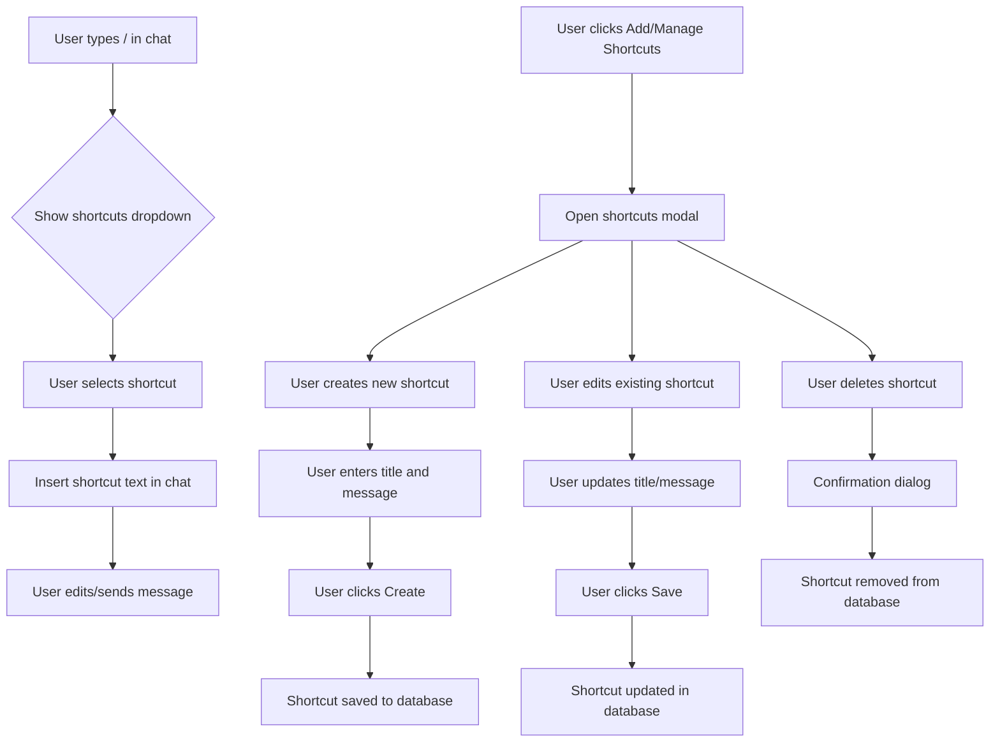
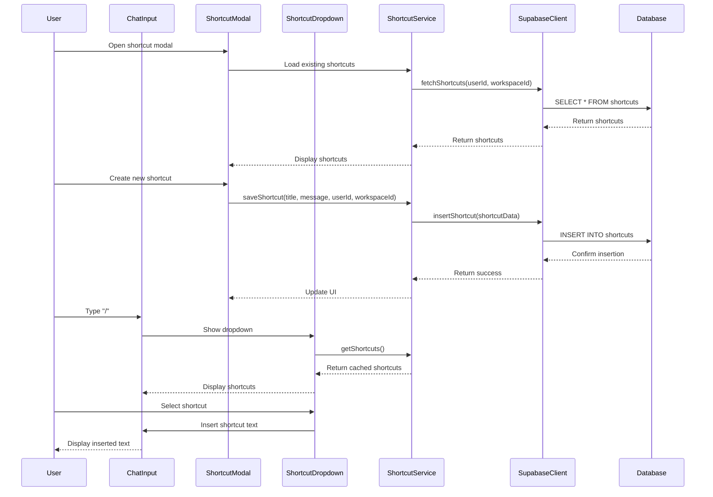

# Livechat Shortcuts Implementation

## 1. Overview

### Purpose & Scope
This feature implements a shortcut system for the livechat component that allows users to create, manage, and use text shortcuts in chat conversations. When typing "/" in the chat input area, users will see a dropdown of available shortcuts they've created, allowing them to quickly insert frequently used messages.

### Stakeholders
- Customer service representatives using the livechat system
- Team managers who want to create workspace-level shortcuts
- End users who will benefit from faster response times

## 2. What It Does (Capabilities)

- **Create personal shortcuts**: Users can create their own text shortcuts with a title and message content
- **Create workspace shortcuts**: Workspace admins can create shortcuts available to all users in a workspace
- **Access shortcuts with "/"**: Typing "/" in the chat input area shows available shortcuts
- **Select shortcuts**: Users can select a shortcut from the dropdown to insert its content
- **Edit/Delete shortcuts**: Users can manage their shortcuts through a dedicated interface
- **Shortcut management UI**: A modal interface for creating, editing, and deleting shortcuts
- **Error handling**: Proper validation and error handling for shortcut creation and usage

## 3. User Flow



ASCII Diagram:
```
User Chat Flow                         Shortcut Management Flow
+--------------+                       +------------------+
| Type / in    |                       | Click Add/Manage |
| chat input   |                       | Shortcuts button |
+------+-------+                       +--------+---------+
       |                                        |
       v                                        v
+------+-------+                       +--------+---------+
| View dropdown|                       | Open shortcuts   |
| of shortcuts |                       | modal            |
+------+-------+                       +--------+---------+
       |                                        |
       v                                        +------------+------------+
+------+-------+                       |                     |            |
| Select       |               +-------+------+     +--------+-------+    |
| shortcut     |               | Create new   |     | Edit existing  |    |
+------+-------+               | shortcut     |     | shortcut       |    |
       |                       +-------+------+     +--------+-------+    |
       v                               |                     |            |
+------+-------+                       v                     v            v
| Shortcut text|               +-------+------+     +--------+-------+  +-+------------+
| inserted in  |               | Enter title  |     | Update title   |  | Delete       |
| chat input   |               | and message  |     | and message    |  | shortcut     |
+------+-------+               +-------+------+     +--------+-------+  +-+------------+
       |                               |                     |            |
       v                               v                     v            v
+------+-------+               +-------+------+     +--------+-------+  +-+------------+
| Edit/send    |               | Click Create |     | Click Save     |  | Confirm      |
| message      |               | button       |     | button         |  | deletion     |
+--------------+               +-------+------+     +--------+-------+  +-+------------+
                                       |                     |            |
                                       v                     v            v
                               +-------+------+     +--------+-------+  +-+------------+
                               | Shortcut     |     | Shortcut       |  | Shortcut     |
                               | saved to DB  |     | updated in DB  |  | removed      |
                               +--------------+     +----------------+  +--------------+
```

## 4. Front-end & Back-end Flow



ASCII Diagram:
```
User        ChatInput      ShortcutModal   ShortcutService   SupabaseClient   Database
 |              |               |                |                |              |
 |              |               |                |                |              |
 |------------->|               |                |                |              |
 | Type "/"     |               |                |                |              |
 |              |-------------->|                |                |              |
 |              | Show dropdown |                |                |              |
 |              |               |--------------->|                |              |
 |              |               | Get shortcuts  |                |              |
 |              |               |                |--------------->|              |
 |              |               |                | Query shortcuts|              |
 |              |               |                |                |------------->|
 |              |               |                |                | SELECT query |
 |              |               |                |                |<-------------|
 |              |               |                |                | Return data  |
 |              |               |                |<---------------|              |
 |              |               |                | Return data    |              |
 |              |               |<---------------|                |              |
 |              |<--------------|                |                |              |
 |              | Show shortcuts|                |                |              |
 |------------->|               |                |                |              |
 | Select item  |               |                |                |              |
 |              |---------------|                |                |              |
 |              | Insert text   |                |                |              |
 |<-------------|               |                |                |              |
 | See text     |               |                |                |              |
 |              |               |                |                |              |
```

## 5. File Structure

```
frontend/src/
├── components/
│   ├── livechat/
│   │   ├── ChatArea.js                  # Modified to support shortcut detection
│   │   ├── ShortcutDropdown.js          # New component for shortcut selection
│   │   ├── ShortcutModal/               # New directory for shortcut management
│   │   │   ├── index.js                 # Main modal component
│   │   │   ├── ShortcutForm.js          # Form for creating/editing shortcuts
│   │   │   ├── ShortcutList.js          # List of existing shortcuts
│   │   │   └── ShortcutListItem.js      # Individual shortcut item
│   │   └── livechat.js                  # Modified to include shortcut button
├── services/
│   └── shortcutService.js               # Service for shortcut operations
├── hooks/
│   └── useShortcuts.js                  # Custom hook for shortcut functionality
└── contexts/
    └── ShortcutContext.js               # Context for sharing shortcuts
```

## 6. Data & Logic Artifacts

### Database Tables

**shortcuts**
- `id` (uuid, primary key): Unique identifier for the shortcut
- `title` (varchar): Title/name of the shortcut (used in dropdown)
- `message` (text): The message content to insert
- `user_id` (uuid, foreign key): User who created the shortcut (null for workspace shortcuts)
- `workspace_id` (uuid, foreign key): Workspace the shortcut belongs to
- `is_workspace_level` (boolean): Whether this is a workspace-level shortcut
- `created_at` (timestamptz): Creation timestamp
- `updated_at` (timestamptz): Last update timestamp

### Functions

**ShortcutService**
- `fetchShortcuts(userId, workspaceId)`: Retrieves shortcuts for a user
- `createShortcut(title, message, userId, workspaceId, isWorkspaceLevel)`: Creates a new shortcut
- `updateShortcut(id, title, message)`: Updates an existing shortcut
- `deleteShortcut(id)`: Deletes a shortcut
- `getFilteredShortcuts(query)`: Filters shortcuts based on search query

**useShortcuts Hook**
- `shortcuts`: Array of available shortcuts
- `loading`: Loading state
- `error`: Error state
- `createShortcut`: Function to create a shortcut
- `updateShortcut`: Function to update a shortcut
- `deleteShortcut`: Function to delete a shortcut
- `filterShortcuts`: Function to filter shortcuts by title

**ShortcutDropdown Component**
- `filterByQuery(query)`: Filters shortcuts based on input
- `insertShortcut(shortcut)`: Inserts shortcut text into input
- `handleKeyNavigation(event)`: Handles keyboard navigation in dropdown

## 7. User Stories

1. **As a customer service rep**, I want to create shortcuts for common responses, so that I can respond to customers more quickly.
2. **As a team manager**, I want to create workspace-level shortcuts, so that my team can use consistent messaging.
3. **As a user**, I want to type "/" and see my shortcuts, so that I can quickly insert them into my messages.
4. **As a user**, I want to edit my existing shortcuts, so that I can update their content as needed.
5. **As a user**, I want to delete shortcuts I no longer need, so that my shortcut list stays organized.
6. **As a user**, I want to search through my shortcuts, so that I can find the right one quickly.
7. **As a new team member**, I want to see workspace shortcuts, so that I can use company-approved messaging.
8. **As a user**, I want to see a preview of the shortcut content, so that I select the right one.
9. **As a user**, I want to use keyboard navigation in the shortcut dropdown, so that I can select shortcuts without using the mouse.
10. **As a user**, I want to be notified if a shortcut creation fails, so that I can try again or troubleshoot the issue.

## 8. Implementation Stages

### Stage 1: Database Schema
- [x] Create SQL script for shortcuts table in Supabase
- [x] Set up RLS policies for security
- [ ] Execute SQL script in Supabase
- [ ] Test database access and permissions

### Stage 2: Backend Services
- [x] Create shortcutService.js for CRUD operations
- [x] Implement useShortcuts custom hook
- [ ] Test service functions

### Stage 3: UI Components
- [x] Create ShortcutDropdown component
- [x] Create ShortcutModal component with tabs
- [x] Create ShortcutForm component
- [x] Create ShortcutList component
- [x] Integrate components with ChatArea

### Stage 4: Testing and Refinement
- [ ] Test shortcut creation and management
- [ ] Test shortcut insertion in chat
- [ ] Fix any bugs and edge cases
- [ ] Optimize performance
- [ ] Add final polish

## Implementation Progress Update (July 17, 2025)

### Completed Tasks
1. **Database Schema**
   - Created SQL script for shortcuts table with proper foreign key constraints
   - Set up RLS policies for user-specific and workspace-level shortcuts
   - Fixed SQL script to use workspace_members table instead of workspace_users
   - Fixed syntax error in SQL function creation
   - Script ready for execution in Supabase SQL editor

2. **Backend Services**
   - Implemented shortcutService.js with CRUD operations for shortcuts
   - Created useShortcuts custom hook for state management and operations

3. **UI Components**
   - Created ShortcutDropdown component for displaying shortcuts when typing '/'
   - Implemented ShortcutModal with tabs for personal and workspace shortcuts
   - Created ShortcutForm for creating and editing shortcuts
   - Created ShortcutList for displaying and managing shortcuts
   - Integrated all components with ChatArea
   - Fixed ESLint errors and React Hook rules violations
   - Ensured proper keyboard navigation in dropdown

### Pending Tasks
1. **Database Setup**
   - Execute the SQL script in Supabase to create the shortcuts table
   - Verify RLS policies are working correctly

2. **Testing**
   - Test end-to-end functionality
   - Verify shortcut creation, editing, and deletion
   - Test shortcut insertion in chat messages
   - Check keyboard navigation in dropdown

3. **Refinement**
   - Address any bugs or edge cases
   - Optimize performance
   - Add final polish to UI components

### Next Steps
1. Execute the SQL script in Supabase SQL editor
2. Test the shortcut functionality end-to-end
3. Make any necessary refinements based on testing results

## Latest Updates (July 17, 2025)

### Fixed Issues
1. **SQL Script**
   - Fixed syntax error in the `DO $$` block by using `CREATE OR REPLACE FUNCTION` instead
   - Updated table references from `workspace_users` to `workspace_members` to match the actual database schema
   - Created a simplified step-by-step SQL script for easier troubleshooting

2. **Frontend Code**
   - Fixed ESLint errors in ChatArea.js:
     - Added missing imports (FaSlash, useShortcuts)
     - Added missing handleSendMessage implementation
     - Removed undefined variables (showShortcuts, setShowShortcuts)
   - Fixed React Hook rules violation in ShortcutDropdown.js:
     - Moved useColorModeValue call outside conditional rendering
     - Used pre-defined color variables consistently

### Ready for Testing
The shortcut feature implementation is now complete and ready for testing once the database table is created. All components are properly integrated and ESLint errors have been resolved.
- Create shortcut categories
- Add analytics for shortcut usage
- Estimated effort: 3-4 days

## 9. Future Roadmap

- **Shortcut Categories**: Allow users to organize shortcuts into categories
- **Shortcut Variables**: Support variables in shortcuts (e.g., {customer_name})
- **Shortcut Sharing**: Allow users to share shortcuts with specific team members
- **Usage Analytics**: Track which shortcuts are most frequently used
- **Shortcut Import/Export**: Allow users to import/export shortcuts
- **Rich Text Shortcuts**: Support formatting, links, and images in shortcuts
- **AI-Generated Shortcuts**: Suggest shortcuts based on frequently sent messages
- **Shortcut Hotkeys**: Assign keyboard shortcuts to frequently used shortcuts
