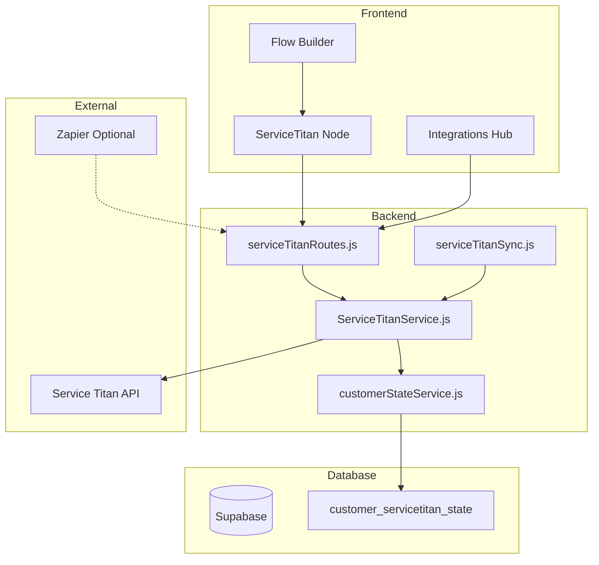

# Service Titan Integration for Flow Builder Actions

## Overview

This implementation plan outlines the integration of Service Titan into the Chou system, enabling users to use Service Titan actions in the Flow Builder. Based on the Figma workflow and meeting requirements, this integration will track customer states (0-6) linked by **Customer ID** and trigger automated email sequences based on Service Titan events.

## Customer State Workflow

The integration tracks these customer states:

| State | Description | Trigger Flow | API Endpoint |
|-------|-------------|--------------|--------------|
| 0 | Contact Record | N/A | Get all Contacts |
| 1 | Lead | Email Followup | Leads API |
| 2 | Sales Appointment Booked | What to Expect | `/{tenant}/appointments` |
| 2.5 | Sales Appointment Canceled | Sorry We missed you | Jobs API (cancel status) |
| 3 | Estimates Created | Unsold Estimates | Estimates API |
| 4 | Estimates Sold | Scheduled the Install | Estimates API (sold status) |
| 5 | Install Job Scheduled | What to Expect install | `/{tenant}/appointments` |
| 5.5 | Install Job Canceled | Lets reschedule | Jobs API (cancel status) |
| 6 | Install Complete | Install Job Done | Jobs API (completed status) |

## Service Titan API Details

### Authentication
- **OAuth 2.0 Client Credentials Grant**
- **Token Endpoint (Production)**: `https://auth.servicetitan.io/connect/token`
- **Token Endpoint (Integration)**: `https://auth-integration.servicetitan.io/connect/token`
- **Token Expiry**: 15 minutes (900 seconds)
- **Required Credentials**: Client ID, Client Secret, Tenant ID, App Key

### Required API Endpoints

| Endpoint | Method | Purpose | Use Case |
|----------|--------|---------|----------|
| `/crm/v2/tenant/{tenant}/customers` | GET/POST | Get/Create customers | State 0, linking |
| `/crm/v2/tenant/{tenant}/customers/{id}` | GET | Get customer by ID | All states |
| `/crm/v2/tenant/{tenant}/bookings` | POST | Create booking | Lead → Job |
| `/crm/v2/tenant/{tenant}/leads` | GET/POST | Manage leads | State 1 |
| `/jpm/v2/tenant/{tenant}/appointments` | GET | Get appointments | State 2, 5 |
| `/jpm/v2/tenant/{tenant}/jobs` | GET | Get jobs with status | State 2.5, 5.5, 6 |
| `/sales/v2/tenant/{tenant}/estimates` | GET | Get estimates | State 3, 4 |

---

## Proposed Changes

### Component 1: Service Titan Integration Core

#### [NEW] [ServiceTitanIntegration.js](file:///Users/benjiemalinao/Documents/deepseek-test-livechat/integrations/crm/servicetitan/ServiceTitanIntegration.js)
Main integration class extending `BaseIntegration`:
- OAuth 2.0 token management with auto-refresh
- Tenant-specific API calls
- Health check implementation
- Error handling with retry logic

#### [NEW] [ServiceTitanService.js](file:///Users/benjiemalinao/Documents/deepseek-test-livechat/integrations/crm/servicetitan/ServiceTitanService.js)
Service layer for API operations:
- `getCustomer(customerId)` - Get customer by ID
- `createCustomer(data)` - Create new customer
- `getAppointments(filters)` - Get appointments with filters
- `getJobs(filters)` - Get jobs with status filtering
- `getEstimates(filters)` - Get estimates by customer
- `createBooking(data)` - Create new booking
- `getLeads(filters)` - Get leads for follow-up

#### [NEW] [ServiceTitanConfig.js](file:///Users/benjiemalinao/Documents/deepseek-test-livechat/integrations/crm/servicetitan/ServiceTitanConfig.js)
Configuration schema and validation:
- Tenant IDs (SOCAL: `410387862`, DFW: `1116148646`)
- Client credentials storage
- Environment configuration

---

### Component 2: Flow Builder Actions

#### [NEW] [ServiceTitanNode.js](file:///Users/benjiemalinao/Documents/deepseek-test-livechat/frontend/src/components/flow-builder/nodes/ServiceTitanNode.js)
New flow builder node for Service Titan actions:
- Visual node component matching existing ActionNode pattern
- Service Titan-specific icon and styling
- Configuration panel for action selection

#### [MODIFY] [ActionNode.js](file:///Users/benjiemalinao/Documents/deepseek-test-livechat/frontend/src/components/flow-builder/nodes/ActionNode.js)
Add Service Titan action types:
- `servicetitan_get_customer`
- `servicetitan_create_customer`
- `servicetitan_get_appointments`
- `servicetitan_get_jobs`
- `servicetitan_get_estimates`
- `servicetitan_create_booking`
- `servicetitan_update_state`

---

### Component 3: Backend Routes & Handlers

#### [MODIFY] [integrationsRoutes.js](file:///Users/benjiemalinao/Documents/deepseek-test-livechat/backend/src/routes/integrationsRoutes.js)
Add Service Titan to available integrations list with:
- `id: 'servicetitan'`
- `name: 'Service Titan'`
- `category: 'crm'`
- `auth_type: 'oauth2'`

#### [NEW] [serviceTitanRoutes.js](file:///Users/benjiemalinao/Documents/deepseek-test-livechat/backend/src/routes/serviceTitanRoutes.js)
Dedicated routes for Service Titan operations:
- `POST /api/servicetitan/auth` - OAuth token generation
- `GET /api/servicetitan/customers/:id` - Get customer
- `POST /api/servicetitan/customers` - Create customer
- `GET /api/servicetitan/appointments` - Get appointments
- `GET /api/servicetitan/jobs` - Get jobs
- `GET /api/servicetitan/estimates` - Get estimates
- `POST /api/servicetitan/bookings` - Create booking
- `POST /api/servicetitan/sync` - Sync customer data

---

### Component 4: Customer State Management

#### [NEW] [customerStateService.js](file:///Users/benjiemalinao/Documents/deepseek-test-livechat/backend/src/services/customerStateService.js)
Service for managing customer state transitions:
- Track current state per customer ID
- Trigger flow sequences based on state changes
- Handle state 0 reset after 90 days

#### [NEW] Database Migration
```sql
CREATE TABLE customer_servicetitan_state (
    id UUID PRIMARY KEY,
    workspace_id UUID REFERENCES workspaces(id),
    contact_id UUID REFERENCES contacts(id),
    servicetitan_customer_id BIGINT NOT NULL,
    current_state DECIMAL(2,1) NOT NULL DEFAULT 0,
    job_id BIGINT,
    previous_state DECIMAL(2,1),
    state_changed_at TIMESTAMPTZ DEFAULT NOW(),
    created_at TIMESTAMPTZ DEFAULT NOW(),
    updated_at TIMESTAMPTZ DEFAULT NOW()
);
```

---

### Component 5: Scheduled Sync (Cron Jobs)

#### [NEW] [serviceTitanSync.js](file:///Users/benjiemalinao/Documents/deepseek-test-livechat/trigger/src/serviceTitanSync.js)
Scheduled job for syncing Service Titan data:
- Poll for appointment changes
- Poll for job status changes
- Poll for new estimates
- Update customer states accordingly

---

## User Review Required

> [!IMPORTANT]
> **Tenant Configuration**: The implementation supports multiple tenants (SOCAL: `410387862`, DFW: `1116148646`). Please confirm if these should be configurable per workspace or hardcoded.

> [!WARNING]
> **No Webhooks**: Service Titan does not support outbound webhooks for real-time events. The integration will rely on scheduled polling (recommendation: every 5-15 minutes) or Zapier as an intermediary.

> [!CAUTION]
> **Token Expiry**: Service Titan tokens expire in 15 minutes. The system will need to cache and auto-refresh tokens. Ensure API credentials are stored securely.

---

## Verification Plan

### Automated Tests

Since this is a new integration, I'll create integration tests following the existing pattern.

#### Test 1: Service Titan Authentication
```bash
# Run from backend directory
npm test -- --grep "ServiceTitan"
```

Test file: `backend/test/integrations/servicetitan.test.js`
- Mock OAuth token endpoint
- Verify token caching and refresh logic
- Test error handling for invalid credentials

#### Test 2: API Endpoint Tests
```bash
# Run from backend directory  
npm test -- --grep "servicetitan routes"
```

Test file: `backend/test/routes/serviceTitanRoutes.test.js`
- Test each endpoint with mock responses
- Verify request/response formats
- Test authentication middleware

### Manual Verification

1. **Integration Setup Flow**
   - Navigate to Settings → Integrations
   - Look for "Service Titan" card in CRM category
   - Click "Connect" and enter test credentials
   - Verify connection status shows as "Connected"

2. **Flow Builder Action Test**
   - Create new flow in Flow Builder
   - Add Action node
   - Verify Service Titan actions appear in dropdown
   - Configure "Get Customer" action with test customer ID
   - Execute flow and verify customer data is returned

3. **Customer State Tracking**
   - Create a test contact in the system
   - Link to Service Titan customer ID
   - Manually trigger state changes via API
   - Verify state transitions are logged correctly

---

## Architecture Diagram

### System Architecture (ASCII)

```
┌─────────────────────────────────────────────────────────────────────────────────┐
│                                   FRONTEND                                       │
│  ┌─────────────────┐    ┌─────────────────────┐    ┌─────────────────────┐      │
│  │   Flow Builder  │───▶│  ServiceTitan Node  │    │  Integrations Hub   │      │
│  └─────────────────┘    └──────────┬──────────┘    └──────────┬──────────┘      │
└────────────────────────────────────┼───────────────────────────┼────────────────┘
                                     │                           │
                                     ▼                           ▼
┌─────────────────────────────────────────────────────────────────────────────────┐
│                                   BACKEND                                        │
│  ┌─────────────────────────────────────────────────────────────────────┐        │
│  │                     serviceTitanRoutes.js                            │        │
│  │  POST /auth  │  GET /customers  │  GET /jobs  │  GET /estimates     │        │
│  └──────────────────────────────────┬──────────────────────────────────┘        │
│                                     │                                            │
│  ┌──────────────────────────────────┼──────────────────────────────────┐        │
│  │                    ServiceTitanService.js                            │        │
│  │  • OAuth Token Management (15min expiry, auto-refresh)              │        │
│  │  • API Request Handler with retry logic                              │        │
│  │  • Response mapping to internal format                               │        │
│  └──────────────────────────────────┬──────────────────────────────────┘        │
│                                     │                                            │
│  ┌────────────────────┐     ┌───────┴───────┐     ┌────────────────────┐        │
│  │ customerStateService│◀────│               │────▶│ serviceTitanSync   │        │
│  │ (State 0-6 tracking)│     │               │     │ (Cron: every 5min) │        │
│  └─────────┬──────────┘     └───────────────┘     └────────────────────┘        │
└────────────┼────────────────────────────────────────────────────────────────────┘
             │                        │
             ▼                        ▼
┌─────────────────────────┐  ┌─────────────────────────────────────────────────────┐
│       SUPABASE          │  │                SERVICE TITAN API                    │
│  ┌───────────────────┐  │  │  Production: https://api.servicetitan.io            │
│  │ customer_service- │  │  │  Auth: https://auth.servicetitan.io/connect/token  │
│  │ titan_state       │  │  │                                                     │
│  │ ─────────────     │  │  │  Endpoints:                                         │
│  │ • contact_id      │  │  │  • /crm/v2/tenant/{id}/customers                   │
│  │ • st_customer_id  │  │  │  • /jpm/v2/tenant/{id}/appointments                │
│  │ • current_state   │  │  │  • /jpm/v2/tenant/{id}/jobs                        │
│  │ • job_id          │  │  │  • /sales/v2/tenant/{id}/estimates                 │
│  └───────────────────┘  │  └─────────────────────────────────────────────────────┘
└─────────────────────────┘
                                     │
                                     │ (Optional)
                                     ▼
                          ┌─────────────────────┐
                          │       ZAPIER        │
                          │  Webhook Triggers   │
                          └─────────────────────┘
```

### Customer State Flow (ASCII)

```
                                    ┌─────────────┐
                                    │   START     │
                                    │  New Lead   │
                                    └──────┬──────┘
                                           │
                                           ▼
                              ┌────────────────────────┐
                              │     STATE 0            │
                              │   Contact Record       │
                              │   (Get all contacts)   │
                              └───────────┬────────────┘
                                          │
                                          ▼
                              ┌────────────────────────┐
                              │     STATE 1            │
                              │       Lead             │
                              │  "Email Followup"      │──────┐
                              └───────────┬────────────┘      │
                                          │                   │
                                          ▼                   │
                  ┌───────────────────────────────────────┐   │
                  │           STATE 2                      │   │
                  │   Sales Appointment Booked             │   │
                  │   "What to Expect" + Save Job ID       │   │
                  └─────────────┬───────────────┬─────────┘   │
                                │               │             │
               Cancelled ◀──────┘               │             │
                    │                           ▼             │
       ┌────────────┴─────────┐    ┌────────────────────────┐ │
       │    STATE 2.5         │    │     STATE 3            │ │
       │  Appt Canceled       │    │   Estimates Created    │ │
       │  "Sorry we missed"   │    │   "Unsold Estimates"   │ │
       └──────────────────────┘    └───────────┬────────────┘ │
                                               │              │
                                               ▼              │
                                   ┌────────────────────────┐ │
                                   │     STATE 4            │ │
                                   │   Estimates Sold       │ │
                                   │ "Scheduled the Install"│ │
                                   └───────────┬────────────┘ │
                                               │              │
                                               ▼              │
                  ┌───────────────────────────────────────┐   │
                  │           STATE 5                      │   │
                  │     Install Job Scheduled              │   │
                  │     "What to Expect Install"           │   │
                  └─────────────┬───────────────┬─────────┘   │
                                │               │             │
               Cancelled ◀──────┘               │             │
                    │                           ▼             │
       ┌────────────┴─────────┐    ┌────────────────────────┐ │
       │    STATE 5.5         │    │     STATE 6            │ │
       │  Job Canceled        │    │   Install Complete     │ │
       │  "Lets reschedule"   │    │   "Install Job Done"   │ │
       └──────────────────────┘    └───────────┬────────────┘ │
                                               │              │
                                               ▼              │
                                    ┌─────────────────────┐   │
                                    │     STATE 0         │◀──┘
                                    │  Reset after 90 days│
                                    └─────────────────────┘
```

### Data Flow Diagram (ASCII)

```
┌──────────────────┐         ┌──────────────────┐         ┌──────────────────┐
│   FACEBOOK       │         │    ZAPIER        │         │  SERVICE TITAN   │
│   Lead Form      │────────▶│   (Optional)     │────────▶│     CRM          │
└──────────────────┘         └────────┬─────────┘         └────────┬─────────┘
                                      │                            │
                                      │  Webhook                   │  API Poll
                                      ▼                            ▼
                           ┌──────────────────────────────────────────────────┐
                           │                    CHOU                          │
                           │  ┌─────────────────────────────────────────────┐ │
                           │  │              Inbound Webhook                │ │
                           │  │         (Receive lead data)                 │ │
                           │  └────────────────────┬────────────────────────┘ │
                           │                       │                          │
                           │                       ▼                          │
                           │  ┌─────────────────────────────────────────────┐ │
                           │  │         Create/Link Customer                │ │
                           │  │  1. Check if customer exists (by phone/email)│ │
                           │  │  2. Create in ST if not exists              │ │
                           │  │  3. Store ST Customer ID in contact         │ │
                           │  └────────────────────┬────────────────────────┘ │
                           │                       │                          │
                           │                       ▼                          │
                           │  ┌─────────────────────────────────────────────┐ │
                           │  │         Customer State Service              │ │
                           │  │  • Track state changes (0-6)                │ │
                           │  │  • Trigger email sequences                  │ │
                           │  │  • Store job_id for tracking                │ │
                           │  └────────────────────┬────────────────────────┘ │
                           │                       │                          │
                           │                       ▼                          │
                           │  ┌─────────────────────────────────────────────┐ │
                           │  │           Flow Builder                      │ │
                           │  │  • Execute email sequences                  │ │
                           │  │  • Apply delays (2d, 4d, 20d, 90d)         │ │
                           │  │  • Reset state to 0 after completion       │ │
                           │  └─────────────────────────────────────────────┘ │
                           └──────────────────────────────────────────────────┘
```

---



---

## Implementation Priority

1. **Phase 1 (Core)**: Integration class, OAuth, basic customer endpoints
2. **Phase 2 (Flow Builder)**: Action node, configurable actions
3. **Phase 3 (State Management)**: Customer state tracking, triggers
4. **Phase 4 (Sync)**: Scheduled polling, state updates

---

## Files to Create/Modify Summary

| Action | File | Description |
|--------|------|-------------|
| NEW | `integrations/crm/servicetitan/ServiceTitanIntegration.js` | Core integration class |
| NEW | `integrations/crm/servicetitan/ServiceTitanService.js` | API service layer |
| NEW | `integrations/crm/servicetitan/ServiceTitanConfig.js` | Configuration |
| NEW | `frontend/src/components/flow-builder/nodes/ServiceTitanNode.js` | Flow builder node |
| MODIFY | `frontend/src/components/flow-builder/nodes/ActionNode.js` | Add ST actions |
| MODIFY | `backend/src/routes/integrationsRoutes.js` | Add to integrations list |
| NEW | `backend/src/routes/serviceTitanRoutes.js` | API routes |
| NEW | `backend/src/services/customerStateService.js` | State management |
| NEW | `supabase/migrations/xxx_customer_servicetitan_state.sql` | DB migration |
| NEW | `trigger/src/serviceTitanSync.js` | Scheduled sync |
